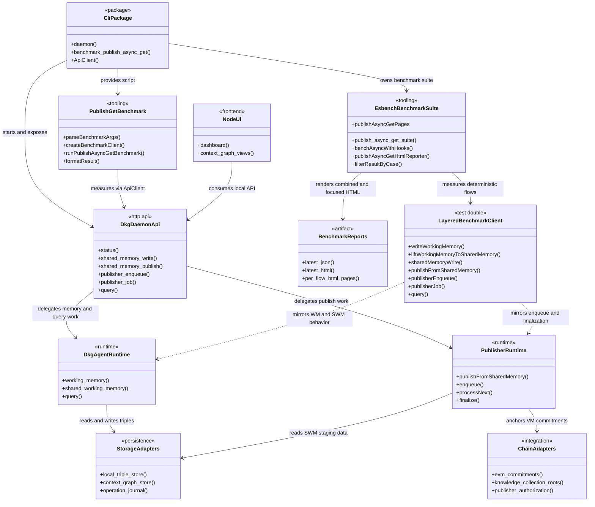
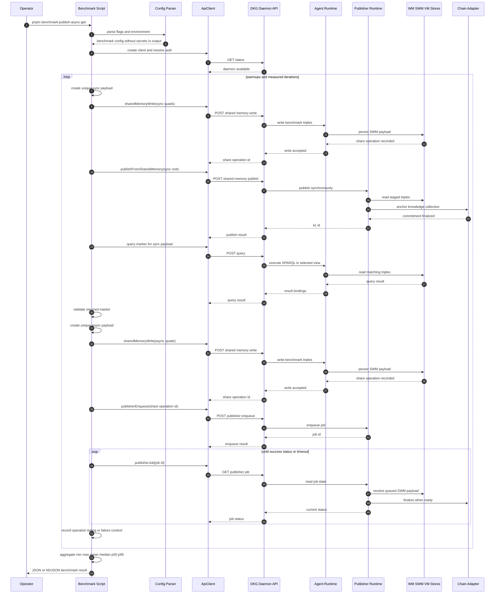
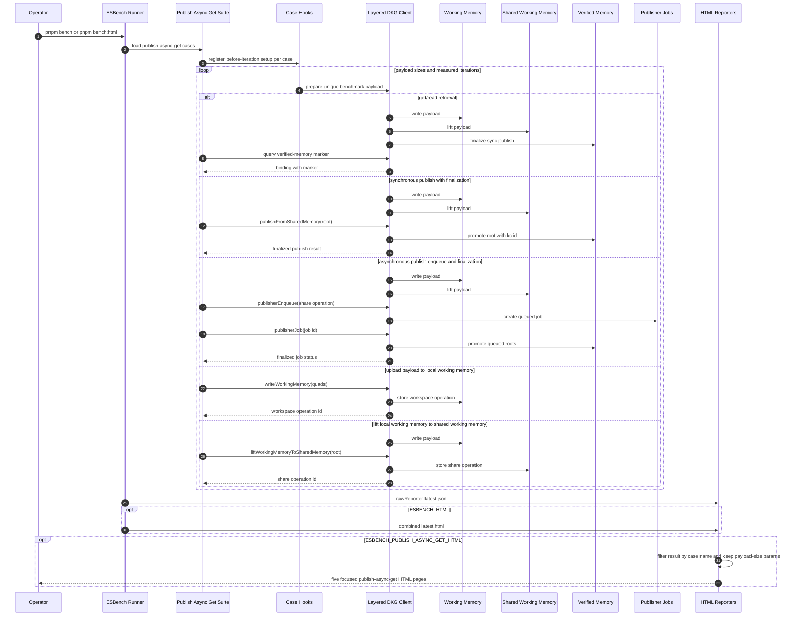
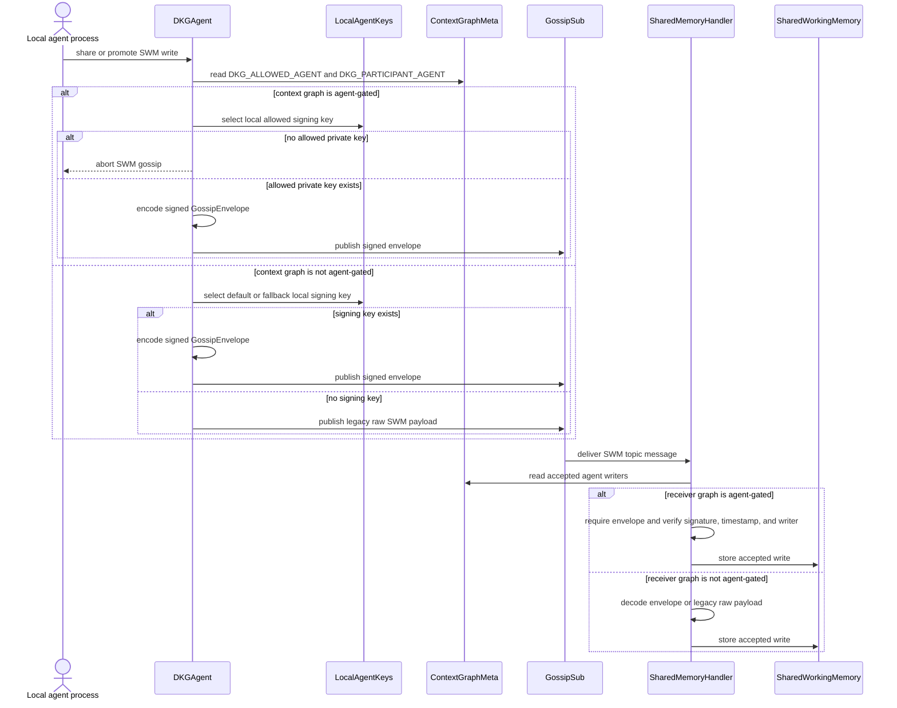
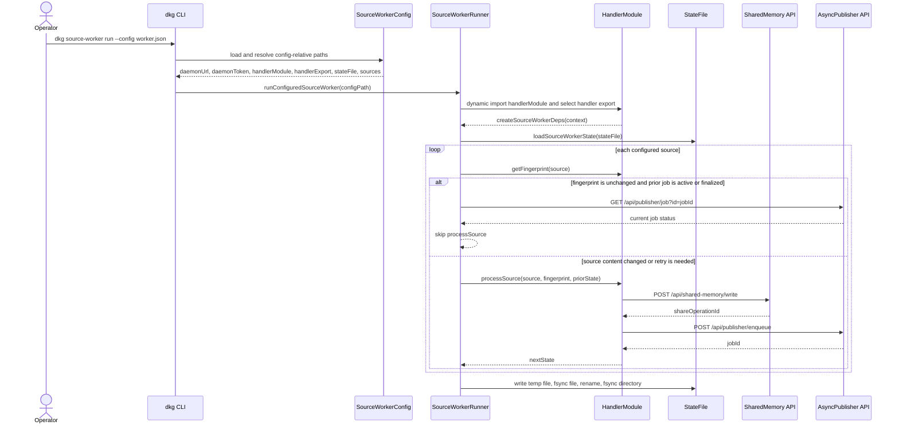

# Architecture

This repository contains the DKG V10 node monorepo: the CLI daemon, agent runtime,
publisher, storage, chain adapters, dashboard UI, and local tooling used to write,
share, publish, and query knowledge assets.

The local publish/async/get benchmark lives inside the CLI package. It is a
developer/operator workflow, not a daemon subsystem: the benchmark runner connects
to an already running DKG daemon, writes unique benchmark payloads to shared
memory, exercises synchronous and asynchronous publish paths, queries the
published marker, and reports timings plus failures. The repository ESBench
workflow for the same feature stays local to benchmark tooling: it uses a
deterministic layered DKG client to measure focused WM, SWM, VM, publish, and
read flows, then renders both the combined report and per-flow HTML pages.

## Top-Level Components



## Publish/Async/Get Benchmark Flow

The benchmark command is exposed from `packages/cli` as
`benchmark:publish-async-get`. Configuration is read from CLI flags and matching
environment variables. `DKG_API_PORT` and loopback `DKG_API_URL` targets load the
normal local auth token; non-loopback API URLs require an explicit auth token.

Each warmup and measured iteration gets distinct root entity and marker values so
warmup writes cannot collide with measured payloads. Warmups are recorded but
excluded from summary statistics.



## ESBench Focused Report Flow

The repository-level ESBench suite in `bench/publish-async-get.bench.ts` keeps the
benchmark feature split into named cases. The normal `pnpm bench` workflow writes
the raw ESBench result. `pnpm bench:html` enables the standard combined HTML
report and a publish/async/get reporter that filters the same result into one
HTML page per DKG memory, publish, or read flow.

The focused reporter boundary is the benchmark config: it exports the suite id,
the five case-to-file page mapping, and `filterResultByCase()`. That filter keeps
the payload-size parameter records stable while removing measurements for other
cases from each focused page.

The ESBench path does not call a live daemon. Instead,
`LayeredDkgBenchmarkClient` models the memory layers explicitly: payloads are
written to working memory, lifted to shared working memory, promoted to verified
memory by sync or async publish, and queried from a selected view. This keeps
benchmark report generation deterministic and avoids secrets or
machine-specific daemon paths in the generated pages.



## Codex Architecture Documentation Workflow

The repository architecture documentation is maintained as a docs-only step after
implementation, tests, and code review have passed. That keeps architecture
updates tied to actual code changes while preserving the code and test diff from
documentation-only mutations.

```mermaid
sequenceDiagram
  autonumber
  participant Planner as Codex Workflow
  participant Engineer as Implementation Agent
  participant Tests as Validation and Review
  participant Docs as Mermaid Docs Agent
  participant Arch as ARCHITECTURE.md

  Planner->>Engineer: assign focused implementation subtask
  Engineer->>Engineer: update scoped source files and tests
  Engineer->>Tests: run focused validation and code review
  Tests-->>Planner: implementation accepted
  Planner->>Docs: provide changed files and architecture context
  Docs->>Docs: decide whether architecture changed
  alt architecture update needed
    Docs->>Arch: create or update Mermaid diagrams and prose
    Arch-->>Docs: docs-only architecture diff
  else no architecture update needed
    Docs-->>Planner: leave working tree unchanged
  end
  Docs-->>Planner: report documentation outcome
# DKG V10 Architecture

This document captures the top-level runtime boundaries for the node, CLI, and
source-worker integration surfaces. Source workers are part of the CLI-operated
ingestion path used to turn configured source content into Shared Working Memory
writes and async publisher jobs.

## Component Model

```mermaid
classDiagram
direction LR
class CLI {
  +sourceWorkerRun(configPath)
}
class SourceWorkerConfig {
  +daemonUrl
  +daemonToken
  +handlerModule
  +handlerExport
  +stateFile
  +sources
}
class SourceWorkerRunner {
  +runConfiguredSourceWorker(configPath)
  +loadHandlerModule(config)
}
class SourceWorkerHandlerModule {
  +createSourceWorkerDeps(context)
}
class SourceWorkerDeps {
  +getFingerprint(source)
  +processSource(source, fingerprint, state)
  +getJobStatus(jobId)
}
class SourceWorkerStateStore {
  +loadSourceWorkerState(path)
  +saveSourceWorkerState(path, state)
}
class SharedMemoryWriteClient {
  +share(contextGraphId, quads, options)
}
class AsyncLiftJobClient {
  +lift(request)
  +getJobStatus(jobId)
}
class DaemonHTTPAPI {
  +postSharedMemoryWrite()
  +postPublisherEnqueue()
  +getPublisherJob()
}
class DKGAgent {
  +writeWorkingMemory()
  +promoteSharedMemory()
  +encodeWorkspaceGossipMessage()
  +publishWorkspaceGossip()
}
class AgentKeyStore {
  +selectDefaultOrFallbackSigner()
  +selectAllowedSigner(contextGraphId)
}
class AgentGateMetadata {
  +DKG_ALLOWED_AGENT
  +DKG_PARTICIPANT_AGENT
}
class GossipEnvelope {
  +version
  +type
  +contextGraphId
  +agentAddress
  +timestamp
  +signature
  +payload
}
class SharedMemoryHandler {
  +handle(data, from)
  +verifyAgentEnvelope()
}
class AsyncPublisher {
  +enqueue()
  +processNext()
}
class WorkingMemory
class SharedWorkingMemory
class VerifiedMemory

CLI --> SourceWorkerRunner : invokes
SourceWorkerRunner --> SourceWorkerConfig : loads
SourceWorkerRunner ..> SourceWorkerHandlerModule : dynamically imports
SourceWorkerHandlerModule --> SourceWorkerDeps : provides hooks
SourceWorkerRunner --> SourceWorkerDeps : executes
SourceWorkerRunner --> SourceWorkerStateStore : reads and writes state
SourceWorkerRunner --> SharedMemoryWriteClient : wires into handler context
SourceWorkerRunner --> AsyncLiftJobClient : wires into handler context
SharedMemoryWriteClient --> DaemonHTTPAPI : bearer token request
AsyncLiftJobClient --> DaemonHTTPAPI : bearer token request
DaemonHTTPAPI --> DKGAgent : delegates memory writes
DaemonHTTPAPI --> AsyncPublisher : delegates lift jobs
DKGAgent --> WorkingMemory : owns
DKGAgent --> SharedWorkingMemory : gossips
DKGAgent --> AgentKeyStore : selects local signing agent
DKGAgent --> AgentGateMetadata : reads agent gates
DKGAgent --> GossipEnvelope : wraps signed SWM gossip
GossipEnvelope --> SharedMemoryHandler : delivered on SWM topic
SharedMemoryHandler --> AgentGateMetadata : authorizes gated writers
SharedMemoryHandler --> SharedWorkingMemory : stores accepted writes
AsyncPublisher --> SharedWorkingMemory : reads source data
AsyncPublisher --> VerifiedMemory : publishes
```

## Shared Memory Gossip Authentication

Shared Working Memory gossip is authenticated at the agent layer when a local
agent private key is available. For non-agent-gated context graphs, the sender
prefers the configured default agent key and falls back to another local signing
agent; if no local signing key exists, the legacy raw SWM payload remains valid.

For agent-gated context graphs, `DKG_ALLOWED_AGENT` and
`DKG_PARTICIPANT_AGENT` metadata define the accepted writer set. Outgoing SWM
gossip must be signed by one of those local agents, otherwise the write is not
broadcast. Receivers accept legacy raw SWM only when the graph is not
agent-gated. For gated graphs, `SharedMemoryHandler` requires a current signed
`GossipEnvelope`, verifies the claimed agent address against the recovered
signature, checks that the envelope context graph matches the payload, and
rejects writers outside the allowed or participant agent set.



## Source Worker Workflow

Source-worker configuration is sensitive operator material. It contains the
daemon bearer token and selects a handler module that the CLI dynamically imports
and executes in the worker process, so it must be protected like the daemon
`auth.token` and must not be committed to source control.

The handler module exposes `createSourceWorkerDeps(context)` either through the
named `handlerExport` selected by config, `default`, `sourceWorker`, or the
module namespace itself. The CLI passes the resolved config plus daemon clients
for Shared Working Memory writes and async publisher lift jobs. The selected
handler returns the source-specific `getFingerprint` and `processSource` hooks.

`getFingerprint(source)` is the content identity contract. Source content that
affects emitted triples or assets must produce a different fingerprint, and
unchanged content must keep the same fingerprint across runs. Fingerprints must
exclude wall-clock time, random values, transient job status, and polling noise.

Worker state is durable process state. Saves use a temp file in the state file's
directory, fsync the file, rename over the target, and fsync the parent directory
where the platform supports it. A failed save removes the temp file and preserves
the previous state file.



## Main Codex Workflow

The repository workflow uses Codex stages to keep implementation, validation,
review, architecture documentation, and local commit creation separated. This
architecture documentation stage only updates declared architecture write
targets and does not modify code, tests, generated files, dependency files, or
local deployment state.


