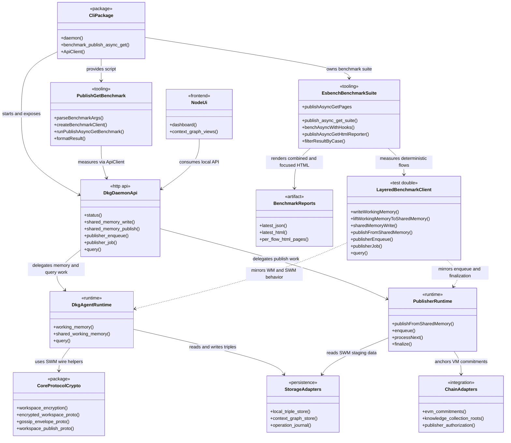
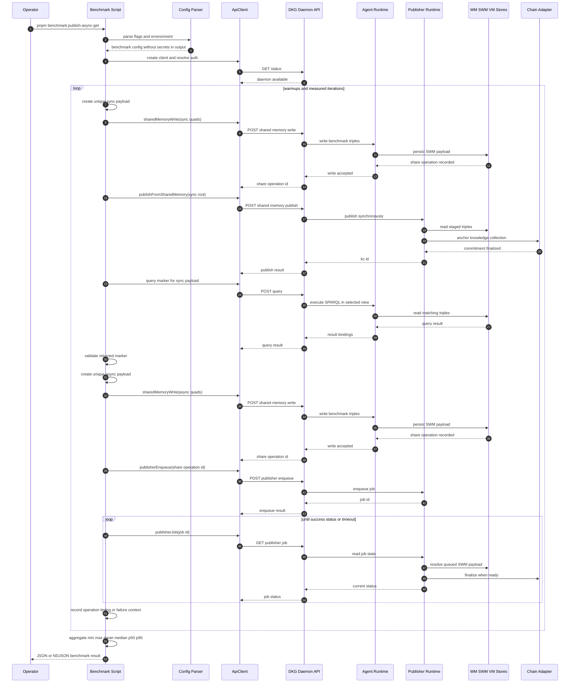
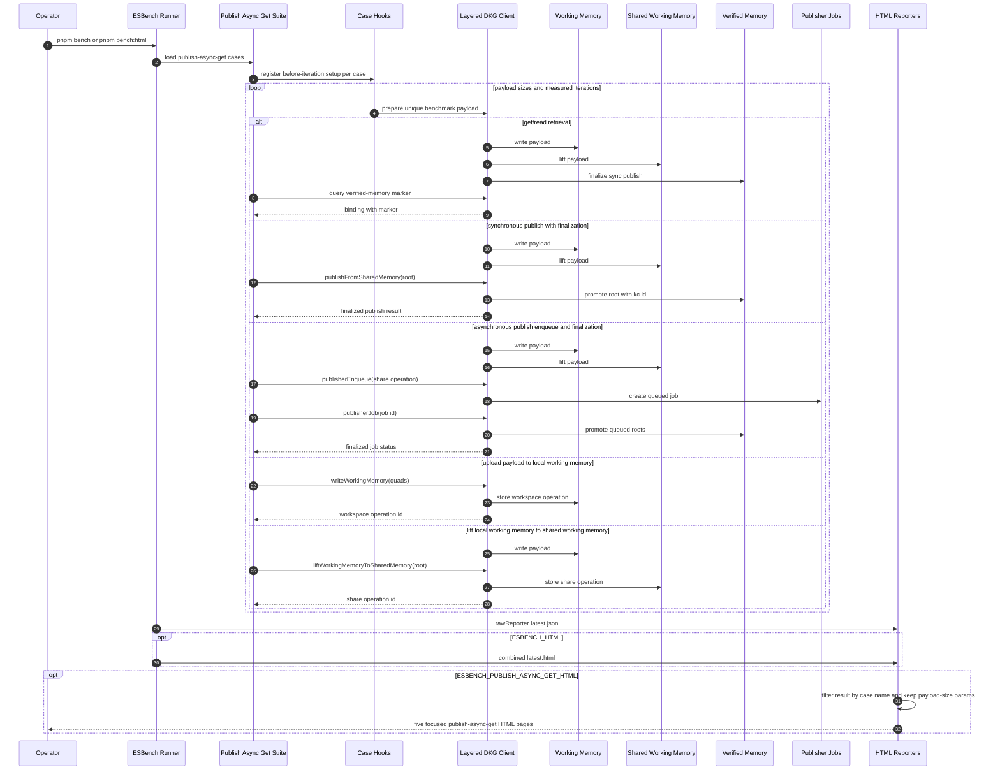
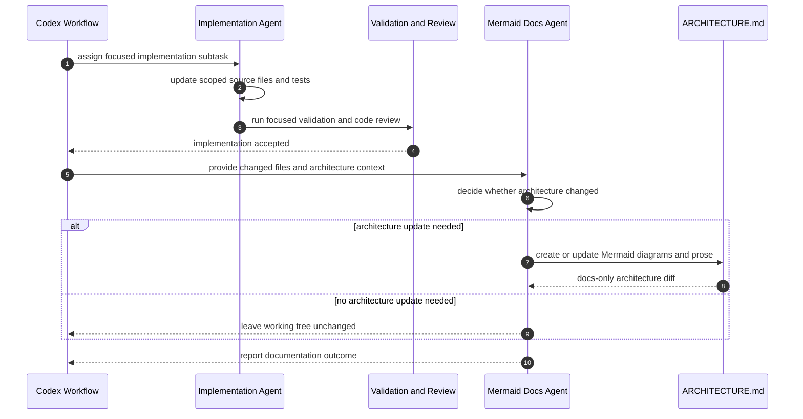
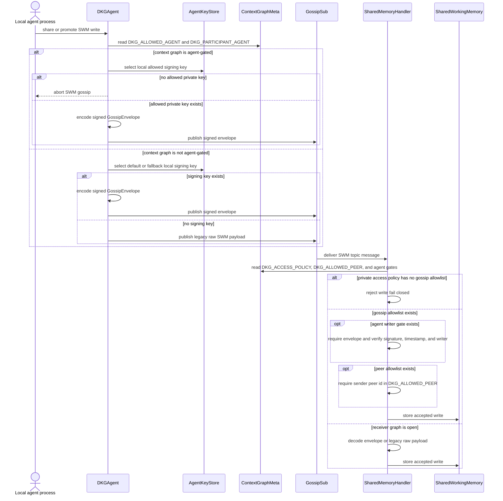
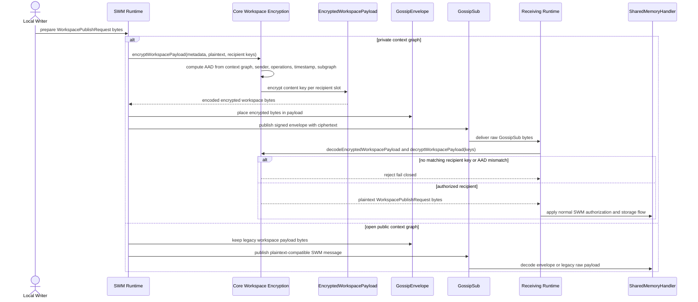
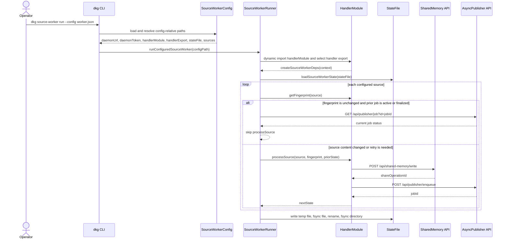

# Architecture

This repository contains the DKG V10 node monorepo: the CLI daemon, agent runtime,
publisher, storage, chain adapters, dashboard UI, and local tooling used to write,
share, publish, and query knowledge assets.

The local publish/async/get benchmark lives inside the CLI package. It is a
developer/operator workflow, not a daemon subsystem: the benchmark runner connects
to an already running DKG daemon, writes unique benchmark payloads to shared
memory, exercises synchronous and asynchronous publish paths, queries the
published marker, and reports timings plus failures. The repository ESBench
workflow for the same feature stays local to benchmark tooling: it uses a
deterministic layered DKG client to measure focused WM, SWM, VM, publish, and
read flows across generated `10kb`, `100kb`, `2mb`, and `200mb` payloads, then
renders both the combined report and per-flow HTML pages.

## Top-Level Components



## Publish/Async/Get Benchmark Flow

The benchmark command is exposed from `packages/cli` as
`benchmark:publish-async-get`. Configuration is read from CLI flags and matching
environment variables. `DKG_API_PORT` and loopback `DKG_API_URL` targets load the
normal local auth token; non-loopback API URLs require an explicit auth token.

Each warmup and measured iteration gets distinct root entity and marker values so
warmup writes cannot collide with measured payloads. Warmups are recorded but
excluded from summary statistics.



## ESBench Focused Report Flow

The repository-level ESBench suite in `bench/publish-async-get.bench.ts` keeps the
benchmark feature split into named cases. The normal `pnpm bench` workflow writes
the raw ESBench result. `pnpm bench:html` enables the standard combined HTML
report and a publish/async/get reporter that filters the same result into one
HTML page per DKG memory, publish, or read flow.

The focused reporter boundary is the benchmark config: it exports the suite id,
the five case-to-file page mapping, and `filterResultByCase()`. That filter keeps
the payload-size parameter records stable while removing measurements for other
cases from each focused page.

The ESBench path does not call a live daemon. Instead,
`LayeredDkgBenchmarkClient` models the memory layers explicitly: payloads are
written to working memory, lifted to shared working memory, promoted to verified
memory by sync or async publish, and queried from a selected view. This keeps
benchmark report generation deterministic and avoids secrets or
machine-specific daemon paths in the generated pages.



## Codex Architecture Documentation Workflow

The repository architecture documentation is maintained as a docs-only step after
implementation, tests, and code review have passed. That keeps architecture
updates tied to actual code changes while preserving the code and test diff from
documentation-only mutations.



# DKG V10 Architecture

This document captures the top-level runtime boundaries for the node, CLI, and
source-worker integration surfaces. Source workers are part of the CLI-operated
ingestion path used to turn configured source content into Shared Working Memory
writes and async publisher jobs.

## Protocol Surface — V10 only

The DKG protocol is V10-only as of PR #500 (`archive-non-V10-contracts`).
Legacy V8/V9 contracts, deploy scripts, tests, and chain-adapter methods
live under `archive/` subdirectories — preserved for forensics, not in
the live deploy or build path. Fresh V10 deploys never register the V8
`Staking` / `KnowledgeAssets` / `KnowledgeCollection`, V9
`PublishingConvictionAccount` / `Paymaster` / `PaymasterManager` /
`DelegatorsInfo` / `ContextGraphNameRegistry` / `KnowledgeAssetsStorage`
contracts. The chain-adapter SDK targets the V10 contract family
(`KnowledgeAssetsV10`, `StakingV10`, `DKGStakingConvictionNFT`,
`DKGPublishingConvictionNFT`, `RandomSampling`, `StakingKPI`,
`ContextGraphs`, V10 storages, plus shared `Hub` / `Token` / `Profile` /
`Identity` / `Ask`). Trust model: `Hub.owner` = TracLabs multisig.

## Component Model

```mermaid
classDiagram
direction LR
class CLI {
  +sourceWorkerRun(configPath)
}
class SourceWorkerConfig {
  +daemonUrl
  +daemonToken
  +handlerModule
  +handlerExport
  +stateFile
  +sources
}
class SourceWorkerRunner {
  +runConfiguredSourceWorker(configPath)
  +loadHandlerModule(config)
}
class SourceWorkerHandlerModule {
  +createSourceWorkerDeps(context)
}
class SourceWorkerDeps {
  +getFingerprint(source)
  +processSource(source, fingerprint, state)
  +getJobStatus(jobId)
}
class SourceWorkerStateStore {
  +loadSourceWorkerState(path)
  +saveSourceWorkerState(path, state)
}
class SharedMemoryWriteClient {
  +share(contextGraphId, quads, options)
}
class AsyncLiftJobClient {
  +lift(request)
  +getJobStatus(jobId)
}
class DaemonHTTPAPI {
  +postSharedMemoryWrite()
  +postPublisherEnqueue()
  +getPublisherJob()
}
class DKGAgent {
  +writeWorkingMemory()
  +promoteSharedMemory()
  +encodeWorkspaceGossipMessage()
  +publishWorkspaceGossip()
}
class AgentKeyStore {
  +selectDefaultOrFallbackSigner()
  +selectAllowedSigner(contextGraphId)
}
class ContextGraphAccessMetadata {
  +DKG_ACCESS_POLICY
  +DKG_ALLOWED_PEER
  +DKG_ALLOWED_AGENT
  +DKG_PARTICIPANT_AGENT
}
class GossipEnvelope {
  +version
  +type
  +contextGraphId
  +agentAddress
  +timestamp
  +signature
  +payload
}
class WorkspacePublishRequest {
  +paranetId
  +nquads
  +manifest
  +publisherPeerId
  +workspaceOperationId
  +operationId
  +subGraphName
}
class EncryptedWorkspacePayload {
  +version
  +type
  +contextGraphId
  +senderIdentity
  +operationId
  +workspaceOperationId
  +timestampMs
  +subGraphName
  +ciphertext
  +recipients
}
class WorkspaceEncryption {
  +generateWorkspaceRecipientEncryptionKey()
  +encryptWorkspacePayload()
  +decryptWorkspacePayload()
  +computeEncryptedWorkspaceAAD()
}
class WorkspaceRecipientEncryptionKey {
  +purpose
  +recipientId
  +recipientKeyId
  +keyBytes
}
class SharedMemoryHandler {
  +handle(data, from)
  +verifyAgentEnvelope()
  +contextGraphHasPrivateAccessPolicy()
  +getContextGraphAllowedPeers()
}
class AsyncPublisher {
  +enqueue()
  +processNext()
}
class WorkingMemory
class SharedWorkingMemory
class VerifiedMemory

CLI --> SourceWorkerRunner : invokes
SourceWorkerRunner --> SourceWorkerConfig : loads
SourceWorkerRunner ..> SourceWorkerHandlerModule : dynamically imports
SourceWorkerHandlerModule --> SourceWorkerDeps : provides hooks
SourceWorkerRunner --> SourceWorkerDeps : executes
SourceWorkerRunner --> SourceWorkerStateStore : reads and writes state
SourceWorkerRunner --> SharedMemoryWriteClient : wires into handler context
SourceWorkerRunner --> AsyncLiftJobClient : wires into handler context
SharedMemoryWriteClient --> DaemonHTTPAPI : bearer token request
AsyncLiftJobClient --> DaemonHTTPAPI : bearer token request
DaemonHTTPAPI --> DKGAgent : delegates memory writes
DaemonHTTPAPI --> AsyncPublisher : delegates lift jobs
DKGAgent --> WorkingMemory : owns
DKGAgent --> SharedWorkingMemory : gossips
DKGAgent --> AgentKeyStore : selects local signing agent
DKGAgent --> ContextGraphAccessMetadata : reads agent gates
DKGAgent --> GossipEnvelope : wraps signed SWM gossip
DKGAgent ..> WorkspaceEncryption : private SWM payload primitive
WorkspacePublishRequest --> WorkspaceEncryption : plaintext input and output
WorkspaceEncryption --> EncryptedWorkspacePayload : creates and opens
WorkspaceEncryption --> WorkspaceRecipientEncryptionKey : requires dedicated keys
EncryptedWorkspacePayload --> GossipEnvelope : nests as payload bytes
GossipEnvelope --> SharedMemoryHandler : delivered on SWM topic
SharedMemoryHandler --> ContextGraphAccessMetadata : reads access policy and gates
SharedMemoryHandler --> SharedWorkingMemory : stores accepted writes
AsyncPublisher --> SharedWorkingMemory : reads source data
AsyncPublisher --> VerifiedMemory : publishes
```



## Shared Memory Gossip Authentication

Shared Working Memory gossip is authenticated at the agent layer when a local
agent private key is available. For non-agent-gated context graphs, the sender
prefers the configured default agent key and falls back to another local signing
agent; if no local signing key exists, the legacy raw SWM payload remains valid.

For agent-gated context graphs, `DKG_ALLOWED_AGENT` and
`DKG_PARTICIPANT_AGENT` metadata define the accepted writer set. Outgoing SWM
gossip must be signed by one of those local agents, otherwise the write is not
broadcast. Receivers accept legacy raw SWM only when the graph is not
agent-gated. For gated graphs, `SharedMemoryHandler` requires a current signed
`GossipEnvelope`, verifies the claimed agent address against the recovered
signature, checks that the envelope context graph matches the payload, and
rejects writers outside the allowed or participant agent set.

Receiver-side access checks also treat explicit `DKG_ACCESS_POLICY = "private"`
metadata in either the context graph `_meta` graph or the ontology graph as
private context graph metadata. If such a graph has no `DKG_ALLOWED_PEER`,
`DKG_ALLOWED_AGENT`, or `DKG_PARTICIPANT_AGENT` gate, `SharedMemoryHandler`
fails closed and rejects received SWM gossip rather than accepting it as open.
`DKG_ALLOWED_PEER` remains a libp2p peer-id allowlist, while the agent gates
remain signed-envelope checks.

`GossipEnvelope` signing authenticates the SWM writer and binds the signed
payload bytes to the claimed context graph, but signatures do not provide
GossipSub payload confidentiality. Open public context graphs therefore retain
the legacy plaintext-compatible `WorkspacePublishRequest` path. Private context
graphs use the separate encrypted workspace payload primitive described below so
raw GossipSub bytes do not expose the plaintext N-Quads or workspace request
fields to non-recipients.



## Encrypted SWM Envelope Primitives

Encrypted Shared Working Memory payloads are defined in `@origintrail-official/dkg-core`
as a nested protocol layer, not as a replacement for the existing
`GossipEnvelope` or `WorkspacePublishRequest` wire schemas. The plaintext
workspace request is encrypted into an `EncryptedWorkspacePayload` with
versioned type constants, AES-256-GCM payload encryption, AES-256-GCM recipient
key slots, and deterministic authenticated data bound to `contextGraphId`,
envelope version and type, sender identity, `operationId`,
`workspaceOperationId`, timestamp, and optional `subGraphName`.

Recipient keys are dedicated workspace encryption keys identified by
`recipientId` and `recipientKeyId`; they are intentionally separate from
Ethereum signing keys. The receiving side recomputes the authenticated data from
decoded metadata and only releases plaintext when a matching recipient key slot
decrypts successfully. Missing recipient keys, unsupported envelope constants,
or metadata tampering fail closed. Open public graphs keep the legacy plaintext
path for backward compatibility, while private graph integration rejects
plaintext fallback.



## Source Worker Workflow

Source-worker configuration is sensitive operator material. It contains the
daemon bearer token and selects a handler module that the CLI dynamically imports
and executes in the worker process, so it must be protected like the daemon
`auth.token` and must not be committed to source control.

The handler module exposes `createSourceWorkerDeps(context)` either through the
named `handlerExport` selected by config, `default`, `sourceWorker`, or the
module namespace itself. The CLI passes the resolved config plus daemon clients
for Shared Working Memory writes and async publisher lift jobs. The selected
handler returns the source-specific `getFingerprint` and `processSource` hooks.

`getFingerprint(source)` is the content identity contract. Source content that
affects emitted triples or assets must produce a different fingerprint, and
unchanged content must keep the same fingerprint across runs. Fingerprints must
exclude wall-clock time, random values, transient job status, and polling noise.

Worker state is durable process state. Saves use a temp file in the state file's
directory, fsync the file, rename over the target, and fsync the parent directory
where the platform supports it. A failed save removes the temp file and preserves
the previous state file.



## Main Codex Workflow

The repository workflow uses Codex stages to keep implementation, validation,
review, architecture documentation, and local commit creation separated. This
architecture documentation stage only updates declared architecture write
targets and does not modify code, tests, generated files, dependency files, or
local deployment state.


---

## V10 Publishing Conviction NFT — SDK + daemon wiring (#519)

The V10 `DKGPublishingConvictionNFT` write+read surface is wired
end-to-end through the SDK. Prior to this, the contract was deployed and
invoked by `KnowledgeAssetsV10.publish()` on-chain, but the SDK exposed
only read shims and the daemon `/api/pca/*` routes returned HTTP 503
(the V9 `PublishingConvictionAccount` predecessor was archived in #500).

**Call path (operator → chain):**

```
operator/CLI ─▶ daemon /api/pca/*  ─▶ DKGAgent facade ─▶ ChainAdapter ─▶ DKGPublishingConvictionNFT
                (cli/src/daemon)      (agent/src)        (chain/src)      (evm-module)
publisher  ───────────────────────────────────────────▶ ChainAdapter (read: agentToAccountId, lockDuration)
KnowledgeAssetsV10.publish() ─▶ DKGPublishingConvictionNFT.coverPublishingCost()  (contract-to-contract; NOT in SDK surface)
```

**ChainAdapter V10 PCA surface** (`packages/chain/src/chain-adapter.ts`,
impl `evm-adapter.ts`, parity in `mock-adapter.ts` /
`no-chain-adapter.ts`): `createPublishingConvictionAccount(committedTRAC)`,
`topUpPublishingConvictionAccount(accountId, amount)`,
`registerPublishingConvictionAgent(accountId, agent)`,
`deregisterPublishingConvictionAgent(accountId, agent)`,
`isPublishingConvictionAgent(accountId, agent)`,
`settlePublishingConvictionAccount(accountId)`,
`getPublishingConvictionAccountInfo(accountId)` (V10 12-tuple shape). The dead V9
`publishingConvictionAccount` cache slot was removed.

**V9 → V10 semantic break** (not a rename — DTOs changed shape across
facade / daemon / api-client):

| Concern | V9 (archived) | V10 (wired) |
|---|---|---|
| Lock duration | per-account `lockEpochs` arg | global protocol param (`publishingConvictionEpochs()`); no caller arg |
| Authorization | `authorizedKeys` + `admin` | `registerAgent` + `agentToAccountId` reverse map (one account per agent) |
| Ownership | `admin` field | ERC-721 `ownerOf(accountId)` |
| Funding | `addFunds` → raw balance | `topUp` → persistent `topUpBalance` buffer |
| Settlement | implicit per publish | explicit lazy `settle()` + active sink in `coverPublishingCost` |
| `getAccountInfo` | 6-tuple `(admin,balance,initialDeposit,lockEpochs,conviction,discountBps)` | 12-tuple `(owner,committedTRAC,baseEpochAllowance,createdAtEpoch,expiresAtEpoch,createdAtTimestamp,expiresAtTimestamp,discountBps,topUpBuffer,agentCount,lastSettledWindow,fullySwept)` |

**Owner-gating** (curation trust model): `createPublishingConvictionAccount`
mints to the signer; `topUp` / `registerPublishingConvictionAgent` /
`deregisterPublishingConvictionAgent` are owner-only on chain
(`msg.sender == ownerOf(accountId)`). The SDK surfaces the on-chain
owner revert (`NotAccountOwner`) rather than swallowing it; the daemon
maps it to HTTP **403** (distinct from **503** = no-chain adapter).
Agents publish only — they never mutate the account.

**Daemon HTTP contract** (`packages/cli/src/daemon/routes/pca.ts`,
typed in `packages/cli/src/api-client.ts`): `POST /api/pca`
(`{tokens}`, no `lockEpochs`), `POST /api/pca/:id/funds` (→ `topUp`),
`POST /api/pca/:id/agent` (register) + `DELETE /api/pca/:id/agent/:addr`
(deregister) — replacing the V9 `:id/authorize` key route —
`POST /api/pca/:id/settle`, `GET /api/pca/:id` (V10-shaped body).

**Test coverage:** `packages/chain/test/` exercises the adapter +
mock↔EVM parity; `packages/evm-module/test/v10-pca-lifecycle.test.ts`
covers create → topUp → registerAgent → discounted publish via the real
`KnowledgeAssetsV10.publish()` → expiry revert; the devnet smoke
(`.devnet/run.mjs`) force-boots a **clean** devnet and runs a live
HTTP `/api/pca` round-trip asserting `0 < discountedCost < baseCost`
**on chain** (guards the silent-demotion risk: KAv10 takes the discount
branch only when `publishEpochs == lockDurationEpochs`).

---

## Daemon HTTP Router & Extension Surfaces

The DKG daemon lives in `packages/cli/src/daemon/`. `lifecycle.ts`
(~2,086 LOC) owns process boot — config load, agent/publisher/dashDb
init, Node UI mounting, CORS preflight, and the single global auth
gate. `handle-request.ts` (~446 LOC) owns the per-request HTTP router
and is the file forks historically had to edit to add their own
endpoints. The split between the two is load-bearing for the
route-plugin work: auth and operator-state loading stay in
`lifecycle.ts`, while *dispatch* is a thin sequential chain inside
`handle-request.ts`.

### Request lifecycle

```
HTTP request
  → CORS preflight                                    (lifecycle.ts)
  → httpAuthGuard()        ← single global auth gate  (lifecycle.ts:1865)
  → handleNodeUIRequest()  ← Node UI static + dashboard
  → handleRequest(ctx)     ← per-request router       (handle-request.ts)
      → handleStatusRoutes(ctx)
      → handleAgentChatRoutes(ctx)
      → handleOpenclawRoutes(ctx)
      → handleHermesRoutes(ctx)
      → handleMemoryRoutes(ctx)
      → handlePublisherRoutes(ctx)
      → handleContextGraphRoutes(ctx)
      → handleAssertionRoutes(ctx)
      → handleQueryRoutes(ctx)
      → handleLocalAgentsRoutes(ctx)
      → handleEpcisRoutes(ctx)
      → handlePcaRoutes(ctx)
      → handlePluginRoutes(ctx)   ← route plugins (ADR 0001, slice 1)
      → jsonResponse(res, 404, …)
```

Every dispatcher has the signature
`(ctx: RequestContext) => Promise<void>`. The implicit `next` is
`ctx.res.writableEnded` — whichever dispatcher writes a response first
claims the request; the rest short-circuit at the next
`if (res.writableEnded) return;` check. There is no Express/Koa/Fastify
abstraction; the daemon is bare `node:http`.

### RequestContext — the shared bag

`RequestContext` is defined in `packages/cli/src/daemon/routes/context.ts`
and ferries 24 runtime singletons plus 4 per-request derived locals into
every route group. The fields fall into three buckets:

- **Long-lived runtime handles**: `agent` (DKGAgent), `publisherControl`,
  `publisherRuntime`, `dashDb`, `tracker`, `memoryManager`, `fileStore`,
  `vectorStore`, `embeddingProvider`, `extractionRegistry`,
  `catchupTracker`, `opWallets`, `network`.
- **Configuration & identity**: `config` (DkgConfig), `bridgeAuthToken`,
  `nodeVersion`, `nodeCommit`, `apiHost`, `apiPortRef`, `validTokens`,
  `startedAt`, `assertionImportLocks`, `extractionStatus`.
- **Per-request derived**: `req`, `res`, `url`, `path`, `requestToken`,
  `requestAgentAddress` — the last computed by
  `agent.resolveAgentAddress(requestToken)` so route bodies see a
  uniform agent identity whether the bearer was a node-level token or
  a per-agent token. `emitMemoryGraphChanged` is the SSE fan-out for
  Node UI updates.

The `apiHost` + `apiPortRef` pair exists specifically for
`manifestSelfClient()` to build a self-pointing URL from trusted
server state rather than request headers — SSRF defence carried in
the context.

### Auth boundary — `httpAuthGuard`

The auth boundary is a **single, global, upstream-of-dispatch** check
at `packages/cli/src/daemon/lifecycle.ts:1865`. It runs after CORS
preflight (which short-circuits `OPTIONS`) and before `handleRequest()`,
rejecting with 401 if the bearer token is missing or not in
`validTokens`.

There is one carve-out: a **narrow, GET-only public allowlist** in
`packages/cli/src/auth.ts` lets unauthenticated requests through for
specific read-only surfaces:

- `PUBLIC_PATHS` (exact match): `/api/status`, `/api/chain/rpc-health`,
  `/.well-known/skill.md`, `/ui`.
- `PUBLIC_PREFIXES` (trailing-slash anchored): `/ui/`, `/apps/`.
- `PUBLIC_SAFE_METHODS`: `GET` only. Any non-GET method on those exact
  paths (including `POST /api/status`, `PUT /.well-known/skill.md`,
  `HEAD /api/status`) goes through auth like everything else.

Built-in route groups for those public paths therefore can see
unauthenticated GET requests. The route-plugin dispatcher
(`handlePluginRoutes`) is the **trailing** step in the chain — it only
runs after every built-in handler has had a chance to claim the
request. A plugin reached by an unauthenticated request would be one
whose path+method overlapped a public allowlist entry that no built-in
claimed. The combination of the GET-only safe-method allowlist + exact
path matching + trailing-slash anchored prefixes is designed to make
that overlap empty in practice; route plugins reached after a public
fall-through still see the same `ctx.requestToken` /
`ctx.requestAgentAddress` (empty for unauthenticated) so they can apply
finer-grained policy if needed.

For everything outside the allowlist, **every** route group — built-in
or route-plugin — sees only authenticated requests; there is no
per-route auth surface to re-implement.

### Two distinct extension surfaces

The repo deliberately keeps two extension surfaces, with different
trust models and different runtime endpoints. Calling the wrong one a
"plugin" is the most common confusion — see
`packages/cli/src/daemon/CONTEXT.md` for the glossary.

| Surface | Mechanism | Lives in | Trust model | Adds HTTP routes? |
|---|---|---|---|---|
| **`dkg integration`** | Curated registry installer (`InstallCli` / `InstallMcp` / `InstallService` / `InstallAgentPlugin` / `InstallManual`) | `packages/cli/src/integrations/` (`commands.ts`, `schema.ts`, `install-cli.ts`, `install-mcp.ts`, `registry-client.ts`, `verify-npm-provenance.ts`) | Registry-mediated `community` / `verified` / `featured` trust tiers; npm provenance check available | **No** — installs CLI binaries, MCP servers, Docker services, and ElizaOS agent plugins; never mounts daemon endpoints |
| **Route plugin** | npm package exporting `{ name, handle(ctx) }`, named in `config.routePlugins` and loaded once at daemon boot | `packages/cli/src/daemon/plugin-api.ts`, `plugin-loader.ts`, `routes/plugins.ts` (ADR 0001) | Operator-trust (slice 1); npm provenance verification reuses the integrations verifier in v2 | **Yes** — dispatched as the trailing step in the `handleRequest` chain |

The two surfaces may converge later (a new `InstallSpec` kind could
carry a route plugin spec), but slice 1 keeps them separate so fork
authors can ship route plugins without a registry review cycle.

### Route plugin mechanism (ADR 0001)

Approved 2026-05-20 (`docs/adr/0001-daemon-route-plugins.md`, design
`docs/superpowers/specs/2026-05-20-daemon-route-plugins-design.md`):

- **Public contract.** `plugin-api.ts` re-exports `RequestContext` and
  the small set of `http-utils` helpers (`jsonResponse`, `readBody`,
  `readBodyBuffer`, `MAX_BODY_BYTES`, `SMALL_BODY_BYTES`) and defines
  `interface RoutePlugin { name: string; handle(ctx): Promise<void> | void; }`.
  Exposed via a new `./daemon/plugin-api` subpath export on
  `@origintrail-official/dkg`'s `package.json`. Breaking changes are
  semver-major.
- **Startup load.** `loadRoutePlugins(specs, logger)` in
  `plugin-loader.ts` runs once during `lifecycle.ts` boot (after
  agent/publisher init, before `server.listen()`). Absolute paths are
  imported directly; bare specifiers go through
  `createRequire(import.meta.url).resolve`. Validation requires a
  non-empty `name` and a function `handle`. **Fail-soft**: a bad
  plugin is logged (`route-plugin-load-failed`) and skipped; the
  daemon still boots, emitting `route-plugins-loaded { loaded, configured }`
  so operators see the count delta.
- **Per-request dispatch.** `routes/plugins.ts` exports
  `handlePluginRoutes(ctx)` — the thirteenth chain step. It iterates
  `ctx.routePlugins` and calls each plugin's `handle(ctx)` in order.
  An unhandled throw mid-request emits
  `500 { error: 'PluginError', plugin, message }` (only if the
  response hasn't started) and stops the chain. Conflict detection
  between plugins claiming the same path is intentionally absent:
  first plugin in config-list order wins via the same
  `res.writableEnded` short-circuit the built-in chain uses.
- **Operator state, not package state.** `routePlugins?: string[]`
  lives on `DkgConfig` and is read from `~/.dkg/config.json`
  (per-install operator state) so daemon upgrades don't overwrite a
  fork's plugin list. Hot reload is out of scope — restart to pick up
  changes.
- **Footprint.** Adds three files (`plugin-api.ts`, `plugin-loader.ts`,
  `routes/plugins.ts`) and edits five (`handle-request.ts` — one
  import, one parameter, one chain step; `routes/context.ts` — one
  `RoutePlugin[]` field; `lifecycle.ts` — one `loadRoutePlugins` call
  + the new `handleRequest` argument; `config.ts` — one optional
  field; `package.json` — `exports` field). Forks stop conflicting on
  `handle-request.ts` upstream syncs.

EPCIS migration to a route plugin is explicitly out of scope; EPCIS
stays a hard-coded chain step and only moves if/when it needs a code
change for an unrelated reason.
