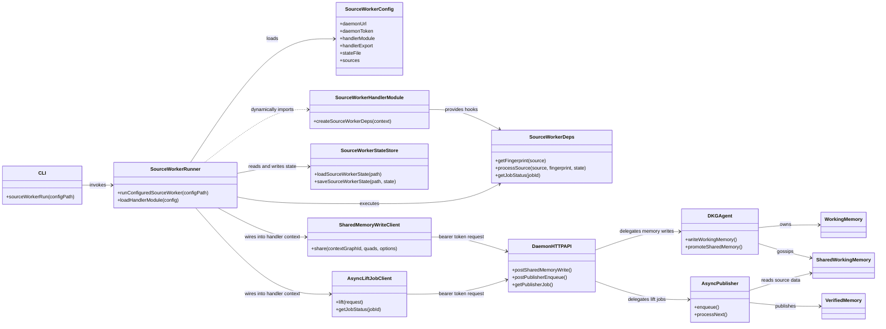
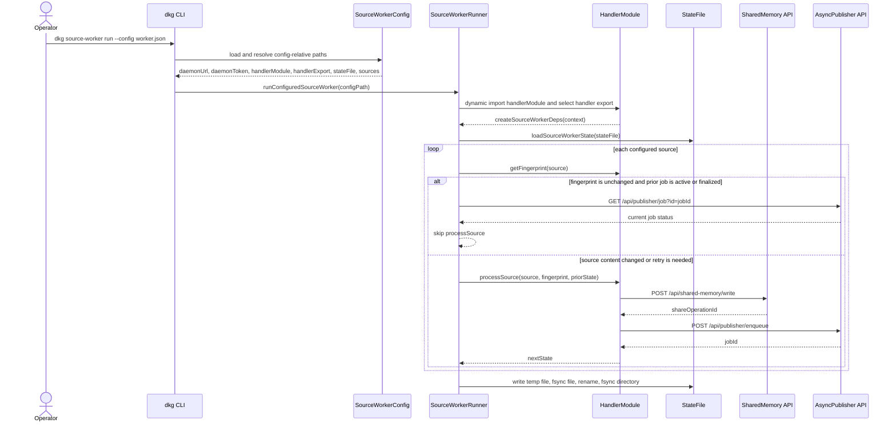
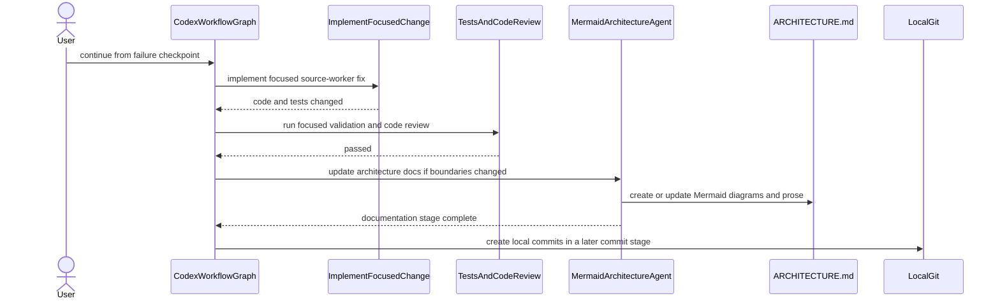

# DKG V10 Architecture

This document captures the top-level runtime boundaries for the node, CLI, and
source-worker integration surfaces. Source workers are part of the CLI-operated
ingestion path used to turn configured source content into Shared Working Memory
writes and async publisher jobs.

## Component Model

## Source Worker Workflow

Source-worker configuration is sensitive operator material. It contains the
daemon bearer token and selects a handler module that the CLI dynamically imports
and executes in the worker process, so it must be protected like the daemon
`auth.token` and must not be committed to source control.

The handler module exposes `createSourceWorkerDeps(context)` either through the
named `handlerExport` selected by config, `default`, `sourceWorker`, or the
module namespace itself. The CLI passes the resolved config plus daemon clients
for Shared Working Memory writes and async publisher lift jobs. The selected
handler returns the source-specific `getFingerprint` and `processSource` hooks.

`getFingerprint(source)` is the content identity contract. Source content that
affects emitted triples or assets must produce a different fingerprint, and
unchanged content must keep the same fingerprint across runs. Fingerprints must
exclude wall-clock time, random values, transient job status, and polling noise.

Worker state is durable process state. Saves use a temp file in the state file's
directory, fsync the file, rename over the target, and fsync the parent directory
where the platform supports it. A failed save removes the temp file and preserves
the previous state file.

## Main Codex Workflow

The repository workflow uses Codex stages to keep implementation, validation,
review, architecture documentation, and local commit creation separated. This
architecture documentation stage only updates declared architecture write
targets and does not modify code, tests, generated files, dependency files, or
local deployment state.

