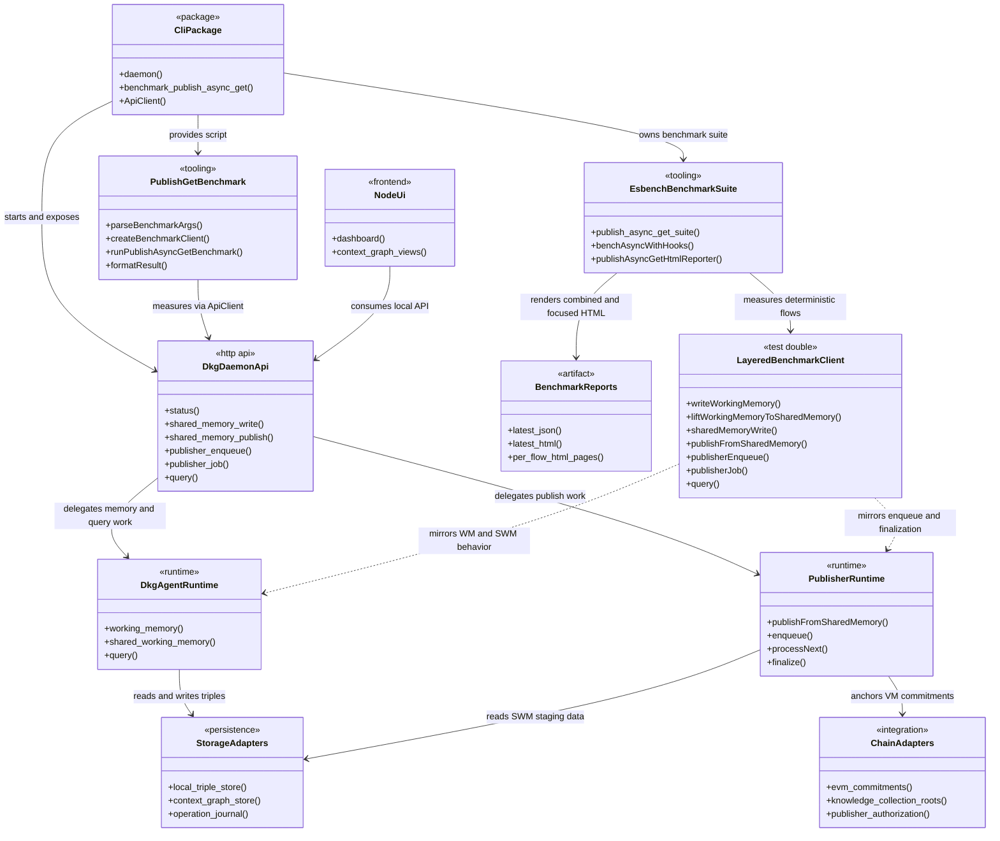
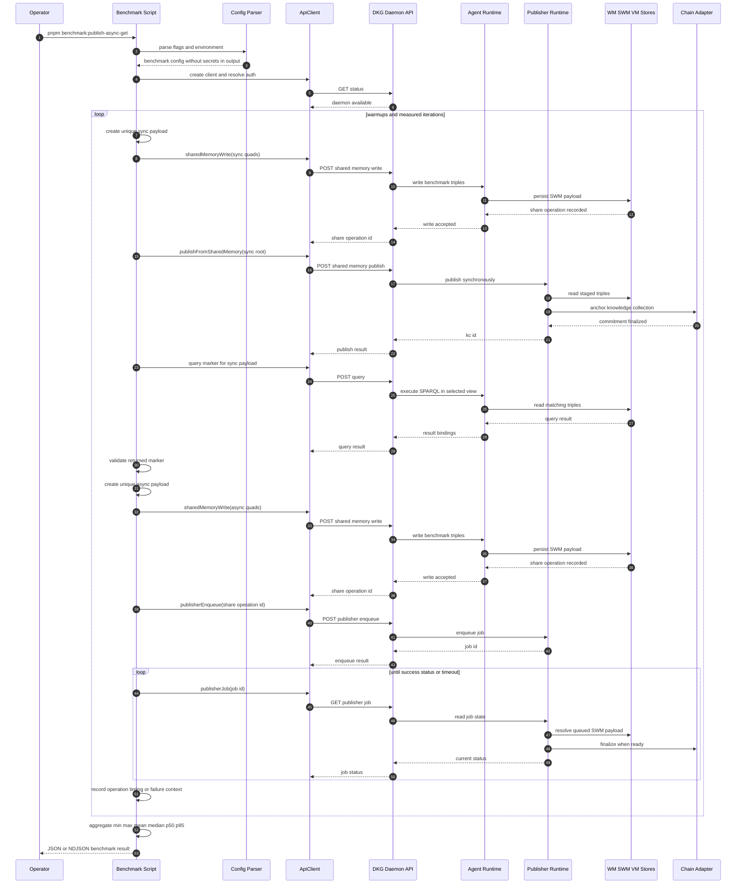
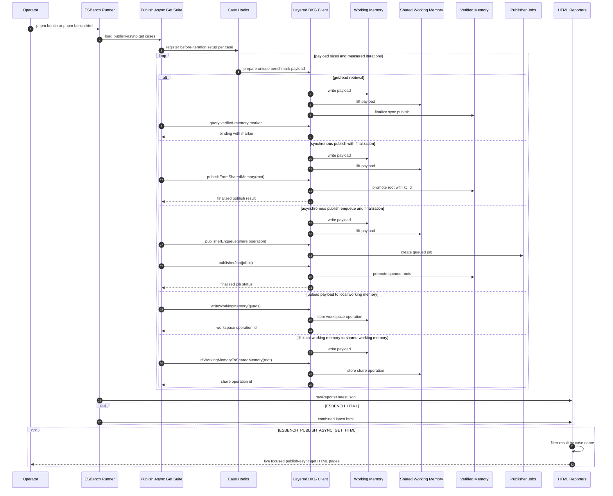
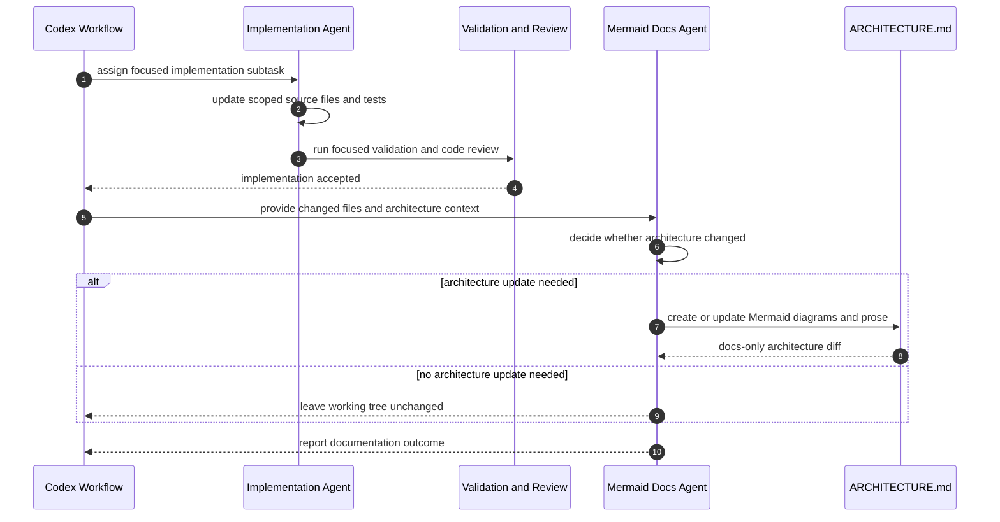

# Architecture

This repository contains the DKG V10 node monorepo: the CLI daemon, agent runtime,
publisher, storage, chain adapters, dashboard UI, and local tooling used to write,
share, publish, and query knowledge assets.

The local publish/async/get benchmark lives inside the CLI package. It is a
developer/operator workflow, not a daemon subsystem: the benchmark runner connects
to an already running DKG daemon, writes unique benchmark payloads to shared
memory, exercises synchronous and asynchronous publish paths, queries the
published marker, and reports timings plus failures. The repository ESBench
workflow for the same feature stays local to benchmark tooling: it uses a
deterministic layered DKG client to measure focused WM, SWM, VM, publish, and
read flows, then renders both the combined report and per-flow HTML pages.

## Top-Level Components

## Publish/Async/Get Benchmark Flow

The benchmark command is exposed from `packages/cli` as
`benchmark:publish-async-get`. Configuration is read from CLI flags and matching
environment variables. `DKG_API_PORT` and loopback `DKG_API_URL` targets load the
normal local auth token; non-loopback API URLs require an explicit auth token.

Each warmup and measured iteration gets distinct root entity and marker values so
warmup writes cannot collide with measured payloads. Warmups are recorded but
excluded from summary statistics.

## ESBench Focused Report Flow

The repository-level ESBench suite in `bench/publish-async-get.bench.ts` keeps the
benchmark feature split into named cases. The normal `pnpm bench` workflow writes
the raw ESBench result. `pnpm bench:html` enables the standard combined HTML
report and a publish/async/get reporter that filters the same result into one
HTML page per DKG memory, publish, or read flow.

The ESBench path does not call a live daemon. Instead,
`LayeredDkgBenchmarkClient` models the memory layers explicitly: payloads are
written to working memory, lifted to shared working memory, promoted to verified
memory by sync or async publish, and queried from a selected view. This keeps
benchmark report generation deterministic and avoids secrets or
machine-specific daemon paths in the generated pages.

## Codex Architecture Documentation Workflow

The repository architecture documentation is maintained as a docs-only step after
implementation, tests, and code review have passed. That keeps architecture
updates tied to actual code changes while preserving the code and test diff from
documentation-only mutations.

