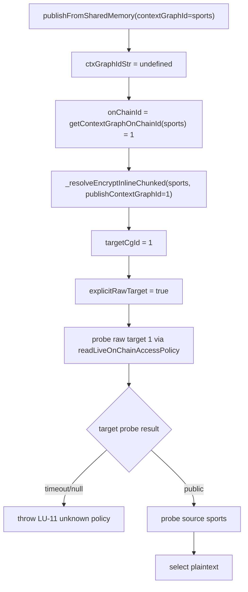
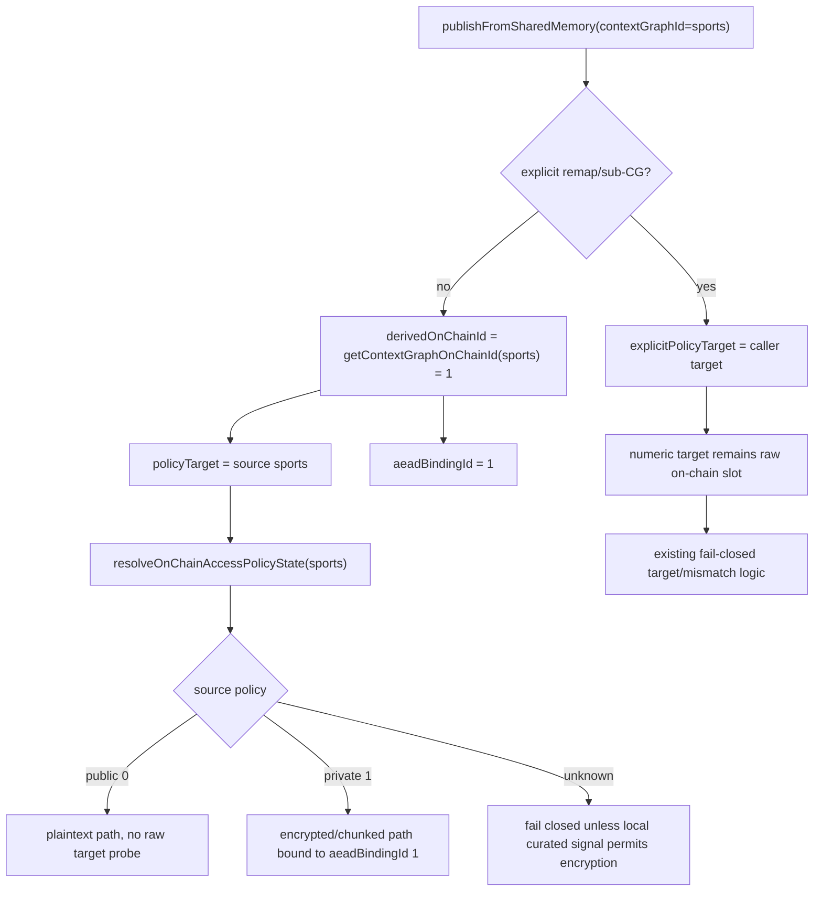

# Issue 1309 Plan: Preserve Derived Same-CG Target Provenance

## Executive Summary

Issue: [OriginTrail/dkg#1309](https://github.com/OriginTrail/dkg/issues/1309)

Publishing a finalized/shared-memory public context graph can fail under slow or rate-limited RPC because the agent loses the distinction between two different meanings of a numeric context graph id:

- explicit caller/remap intent, such as publishing source data into raw on-chain CG `1`
- internally derived same-CG binding, such as local CG `sports` resolving to its own on-chain id `1`

The current LU-5/LU-11 encryption-policy resolver receives both forms through `publishContextGraphId`. Since it treats any numeric `publishContextGraphId` as an explicit raw remap target, a normal same-CG publish of `sports` can trigger a redundant live policy probe for raw target `1`. If that redundant target probe times out, the publish fails closed even when the source CG policy already proved public.

Selected fix: split policy-resolution target intent from AEAD/ACK/on-chain binding id. Explicit or unproven numeric targets remain policy targets and keep the existing fail-closed raw-slot behavior. Numeric ids become binding-only inputs only when the agent derived or verified them as the source CG's own on-chain id. Verified same-CG ids still bind AEAD, ACK digests, on-chain publish params, and finalization gossip to the numeric id, but they do not force a second raw-target policy decision.

Risk classification: High. The change touches publish encryption policy selection. The implementation must preserve plaintext for chain-confirmed public CGs, encryption for curated/private CGs, and fail-closed behavior for unknown or explicit remap targets.

## Team Findings

### Issue Analyst

- Root cause is provenance loss. The publisher layer already distinguishes `publishContextGraphId` as remap signal from `onChainContextGraphId` as ACK/chain target.
- The agent encryption resolver collapses them into one positional parameter.
- Same-CG policy must be source-based: `resolveOnChainAccessPolicyState(contextGraphId)`.
- Derived numeric ids must still be used for AEAD binding when encryption is required.
- Explicit numeric remaps must continue to probe the raw on-chain slot and fail closed on unknown target policy.

### Codebase Mapper

Primary code:

- `packages/agent/src/dkg-agent-publish.ts`
  - `_publish`
  - `update`
  - `_resolveCuratedChainKeyContext`
  - `_resolveEncryptInlinePayload`
  - `_resolveEncryptInlineChunked`
  - `publishFromSharedMemory`
  - `publishFromFinalizedAssertion`
- `packages/publisher/src/dkg-publisher.ts`
  - `publishFromSharedMemory` already separates remap `publishContextGraphId` from `onChainContextGraphId`

Important layer distinction:

- Agent SWM wrapper:
  - `publishContextGraphId` means explicit remap or sub-CG target
  - `onChainContextGraphId` means ACK/tx target without remap
- Publisher inner publish:
  - `publishContextGraphId` means ACK/tx target

### QA/Repro

Best targeted tests:

- `packages/agent/test/encrypt-inline-policy.test.ts`
- optional supporting checks in `packages/agent/test/swm-public-cg-plaintext.test.ts`

Useful verification commands:

```powershell
pnpm --filter @origintrail-official/dkg-agent exec vitest run test/encrypt-inline-policy.test.ts test/swm-public-cg-plaintext.test.ts test/dkg-agent-on-chain-policy.test.ts
```

If publisher code changes:

```powershell
pnpm --filter @origintrail-official/dkg-publisher exec vitest run test/v10-remap-wire.test.ts test/storage-ack-handler.test.ts
```

## Root Cause

Current resolver shape:

```ts
const targetCgId = publishContextGraphId ?? contextGraphId;
const explicitRawTarget = publishContextGraphId !== undefined && /^\d+$/.test(targetCgId.trim());
```

For `contextGraphId = "sports"` and internally derived `onChainId = "1"`:

1. `publishFromSharedMemory` computes `ctxGraphIdStr = undefined`.
2. It resolves `onChainId = await getContextGraphOnChainId("sports")`, yielding `"1"`.
3. It calls `_resolveEncryptInlinePayload("sports", ..., "1")`.
4. It calls `_resolveEncryptInlineChunked("sports", ..., "1")`.
5. `_resolveCuratedChainKeyContext` sees numeric `publishContextGraphId`.
6. It treats `"1"` as an explicit raw target and probes target policy separately.
7. If target live policy probe times out, LU-11 throws:

```text
source CG "sports" curated=false, target CG "1" curated=unknown
```

The second target probe is unnecessary for same-CG publishes because the source policy resolver already binds local `sports` to its on-chain slot before trusting policy.

## Behavioral Requirements

- Same-CG public publish:
  - source `sports` resolves on-chain policy `0`
  - derived on-chain id `1` must not trigger raw target policy probing
  - plaintext path must be selected

- Same-CG private publish:
  - source resolves policy `1`
  - encryption and chunked LU-11 path must remain active
  - AEAD must bind to numeric id `1` when available

- Explicit numeric remap:
  - caller-provided raw target `1` must still be treated as raw on-chain slot
  - unknown target policy must fail closed
  - source/target policy mismatch must still throw

- Caller-supplied or provenance-erased numeric target:
  - must not be downgraded to binding-only unless it is verified against `getContextGraphOnChainId(contextGraphId)`
  - if verification is unavailable or mismatched, keep the id as an explicit policy target

- Unknown same-CG source policy:
  - must fail closed unless existing positive local curated signal safely chooses encryption

- No publisher ACK or on-chain semantics should change:
  - ACK digest target remains numeric on-chain id
  - on-chain publish target remains numeric on-chain id
  - finalization gossip still carries the resolved numeric target
  - remap root-copy behavior remains governed by explicit remap only

## Current Flow



Problem: `C -> D -> F` treats an internally derived same-CG binding id as an explicit raw remap.

## Desired Flow



## Approaches Considered

### Approach A: Stop Passing Derived On-Chain IDs To The Resolver

Pass `undefined` to `_resolveEncryptInlinePayload` and `_resolveEncryptInlineChunked` when the id was internally derived.

Pros:

- Smallest immediate diff.
- Prevents redundant raw target policy probe.

Cons:

- Private same-CG publishes would bind AEAD to the local label instead of the canonical numeric id unless another parameter is added.
- Risks reintroducing prior undecryptable payload behavior when consumers verify/decrypt by numeric on-chain id.

Rejected.

### Approach B: Add Boolean Provenance To Existing `publishContextGraphId`

Keep passing the numeric id, but add an option such as `publishContextGraphIdIsDerived: true`. The resolver would treat target policy as source policy when the flag is true.

Pros:

- Minimal code churn.
- Preserves AEAD binding id.

Cons:

- Keeps one parameter overloaded with two meanings.
- Future call sites can still accidentally pass a numeric id without provenance.

Acceptable fallback, but not selected.

### Approach C: Split Explicit Policy Target From Binding ID

Treat the existing fourth resolver argument as explicit policy/remap target only, and add a final options object for binding-only ids:

```ts
type ResolveCuratedChainKeyContextOptions = {
  /**
   * Used only for AEAD associated-data binding. Never used for policy lookup.
   */
  aeadBindingContextGraphId?: string;
};
```

For normal same-CG publish:

```ts
_resolveEncryptInlineChunked(contextGraphId, subGraphName, author, undefined, {
  aeadBindingContextGraphId: onChainId ?? undefined,
});
```

For explicit remap:

```ts
_resolveEncryptInlineChunked(contextGraphId, subGraphName, author, ctxGraphIdStr, {
  aeadBindingContextGraphId: onChainId ?? ctxGraphIdStr,
});
```

Pros:

- Names the two responsibilities directly.
- Removes numeric-shape inference for internally derived ids.
- Preserves old explicit remap behavior.
- Keeps private same-CG AEAD bound to canonical numeric id.

Cons:

- Requires call-site and test updates.
- Existing helper tests that assert positional call arguments must be updated.

Selected.

## Selected Implementation Plan

1. Update resolver API in `packages/agent/src/dkg-agent-publish.ts`.
   - Add a local type for resolver options:

```ts
type ResolveCuratedChainKeyContextOptions = {
  /**
   * Binding-only id for AEAD associated data. This value must never affect
   * plaintext/encrypted policy selection.
   */
  aeadBindingContextGraphId?: string;
};
```

   - Add optional `options?: ResolveCuratedChainKeyContextOptions` to:
     - `_resolveCuratedChainKeyContext`
     - `_resolveEncryptInlinePayload`
     - `_resolveEncryptInlineChunked`
   - Interpret the fourth argument as `explicitPolicyTargetContextGraphId`.
   - Compute:

```ts
const targetCgId = explicitPolicyTargetContextGraphId ?? contextGraphId;
const aeadCgId = options?.aeadBindingContextGraphId ?? explicitPolicyTargetContextGraphId ?? contextGraphId;
```

2. Update agent call sites.
   - `_publish`:
     - always distinguish caller-supplied `opts.onChainContextGraphId` from the locally resolved id
     - if the target id came from `getContextGraphOnChainId(contextGraphId)`, pass no explicit policy target and pass it as `aeadBindingContextGraphId`
     - if `opts.onChainContextGraphId` is supplied, verify it equals the locally resolved id before treating it as binding-only
     - if verification is unavailable or mismatched, pass the supplied id as the explicit policy target so existing fail-closed target/mismatch logic remains active
   - `update`:
     - pass no explicit policy target
     - pass `updateOnChainId` as `aeadBindingContextGraphId`
   - `publishFromSharedMemory`:
     - pass `ctxGraphIdStr` as explicit target only when explicit remap/sub-CG exists
     - pass `onChainId` as `aeadBindingContextGraphId`
   - CLI async publisher encryption factory:
     - extract `resolveDaemonPublishEncryption` so the async publisher split is directly testable
     - treat `publishOptions.publishContextGraphId` as binding-only in this path because the async lift resolves it from the source workspace slice before generic `PublishOptions`
     - document that future explicit async remaps need a separate provenance field instead of reusing this derived value

3. Preserve publisher behavior.
   - Do not change `DKGPublisher.publishFromSharedMemory` unless tests reveal mismatch.
   - It already passes:
     - `publishContextGraphId: ctxGraphIdStr` for remap behavior
     - `onChainContextGraphId: onChainId` for ACK/tx target

4. Add regression tests in `packages/agent/test/encrypt-inline-policy.test.ts`.
   - Same-CG public derived numeric binding:
     - model `sports -> 1` and source policy `0`
     - call resolver with explicit target `undefined` and `aeadBindingContextGraphId: "1"`
     - poison `readLiveOnChainAccessPolicy("1")` so a redundant raw-target probe would fail the test
     - assert raw target `1` is not consulted for policy
     - expect plaintext path
   - Explicit numeric remap unknown:
     - call resolver with explicit target `"1"`
     - target raw probe unknown
     - expect fail-closed LU-5/LU-11 error
   - Explicit numeric remap mismatch:
     - source public, target private throws the existing mismatch error
     - source private, target public throws the existing mismatch error
   - Same-CG private derived numeric binding:
     - source policy/private signal selects encryption
     - result must use `aeadCgId: "2"`
     - poison policy/existence/private lookups for `"2"` to prove the binding id is not authoritative for policy
   - Update routing tests for `_publish` and add/adjust SWM routing coverage:
     - same-CG path calls resolver with no explicit target plus binding options
     - explicit remap path still supplies explicit policy target
     - caller-supplied `onChainContextGraphId` mismatch stays explicit policy target
   - Add LU-11 wrapper parity coverage:
     - LU-11 receives the same explicit-target/options split as LU-5
     - explicit numeric remap unknown still throws with `LU-11`
   - Add interface fallout coverage:
     - update private-helper calls/types in `swm-sender-key-pending-by-agent.test.ts`

5. Add or update async/publisher boundary tests.
   - Add a focused test for the CLI async `publishEncryptionFactory` split if a suitable existing test can reach it.
   - Always run publisher remap wire tests to pin ACK/tx target semantics even if publisher code is unchanged.

6. Run verification.
   - First targeted agent tests.
   - Then type/build checks if targeted tests pass.
   - Always run publisher remap wire tests to verify ACK/tx target semantics.

## Adversarial Review Questions

- Can a caller-supplied `onChainContextGraphId` be an implicit remap that now bypasses target policy checks?
- Does async lift ever carry an explicit remap in `publishOptions.publishContextGraphId`, or is it always derived from source workspace resolution?
- Do LU-5 and LU-11 remain perfectly aligned after signature changes?
- Does a private same-CG publish still bind AEAD/chunked encryption to the numeric target id?
- Does any explicit raw numeric target still use `readLiveOnChainAccessPolicy` and fail closed?
- Do error messages remain useful enough to diagnose source vs target policy failures?

## Verification Plan

Primary:

```powershell
pnpm --filter @origintrail-official/dkg-agent exec vitest run test/encrypt-inline-policy.test.ts
```

Secondary:

```powershell
pnpm --filter @origintrail-official/dkg-agent exec vitest run test/encrypt-inline-policy.test.ts test/swm-public-cg-plaintext.test.ts test/dkg-agent-on-chain-policy.test.ts
```

If publisher boundary changes:
Required publisher boundary check:

```powershell
pnpm --filter @origintrail-official/dkg-publisher exec vitest run test/v10-remap-wire.test.ts
```

Optional if ACK handler behavior is touched:

```powershell
pnpm --filter @origintrail-official/dkg-publisher exec vitest run test/storage-ack-handler.test.ts
```

Build/type check:

```powershell
pnpm --filter @origintrail-official/dkg-agent run build
```

## Rollback / Mitigation

The rollback is limited to `packages/agent/src/dkg-agent-publish.ts` and targeted tests. Because publisher ACK/on-chain behavior is intended to remain unchanged, reverting the resolver signature and call-site updates should restore prior behavior.

Operational mitigation remains independent: use a dedicated RPC endpoint instead of public `https://mainnet.base.org` to reduce 429 and timeout frequency.

## Production-Readiness Gate

A staff engineer should approve only if:

- same-CG public derived-id publish no longer performs an explicit raw target policy decision
- explicit numeric remap remains fail-closed on unknown target
- same-CG private publish still encrypts and binds to numeric id
- tests cover both LU-5 and LU-11 paths or prove the shared resolver covers both
- no ACK/tx/finalization target semantics change
- caller-supplied or unverified numeric ids do not bypass target policy checks

## Plan Review Status

Adversarial review completed. Required updates applied:

- binding-only ids are limited to agent-derived or verified same-CG provenance
- caller-supplied `onChainContextGraphId` remains explicit unless verified
- async publisher runtime is an implementation and verification target
- option naming changed to `aeadBindingContextGraphId`
- tests must poison binding-id policy probes to avoid false positives
- explicit remap mismatch and LU-11 parity coverage are required

## Implementation Review Status

Adversarial implementation review completed with GPT 5.5 xhigh teammates. Findings and fixes:

- Public-source/private-target explicit remaps originally bypassed the mismatch check because the source probe was skipped when the raw target was curated. Fixed by probing the source whenever the raw target policy is known, and added both mismatch-direction tests.
- The async daemon helper originally attempted to re-resolve the on-chain id, which could reintroduce the same degraded dependency that issue 1309 exposed. Fixed by treating the current async-lift value as binding-only and documenting that future explicit async remaps require a separate provenance field.
- Update routing did not have direct regression coverage. Added a test proving update passes the derived numeric id as AEAD binding-only while preserving the publisher target.
- Private same-CG sender-key setup did not directly assert the returned AEAD id. Added coverage that verifies `aeadCgId` uses the resolver binding option.
- The extracted daemon helper initially used `Pick<DKGAgent, ...>`, which failed TypeScript because the private resolver methods declare `this: DKGAgent`. Fixed by typing the helper parameter as `DKGAgent`.

## Verification Results

Final verification after review fixes:

```powershell
pnpm exec vitest run --config vitest.config.ts test/encrypt-inline-policy.test.ts
# packages/agent: 20 passed

pnpm exec vitest run --config vitest.config.ts test/encrypt-inline-policy.test.ts test/swm-public-cg-plaintext.test.ts test/dkg-agent-on-chain-policy.test.ts
# packages/agent: 73 passed

pnpm exec vitest run --config vitest.config.ts test/swm-sender-key-pending-by-agent.test.ts
# packages/agent: 26 passed

pnpm exec vitest run test/daemon-publish-encryption-factory.test.ts
# packages/cli: 1 passed

pnpm --filter @origintrail-official/dkg-agent run build
# passed

pnpm --filter @origintrail-official/dkg-publisher exec vitest run test/v10-remap-wire.test.ts
# 3 passed

pnpm --filter @origintrail-official/dkg run build
# passed
```

One attempted parallel verification run failed because two agent suites raced the shared Hardhat harness on the same local port/nonce. The same tests passed when rerun sequentially.
