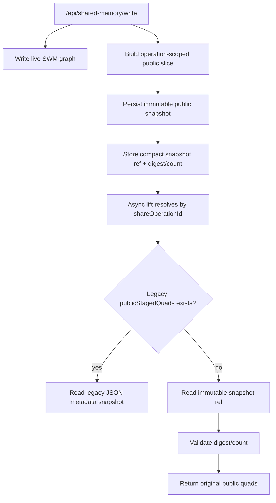
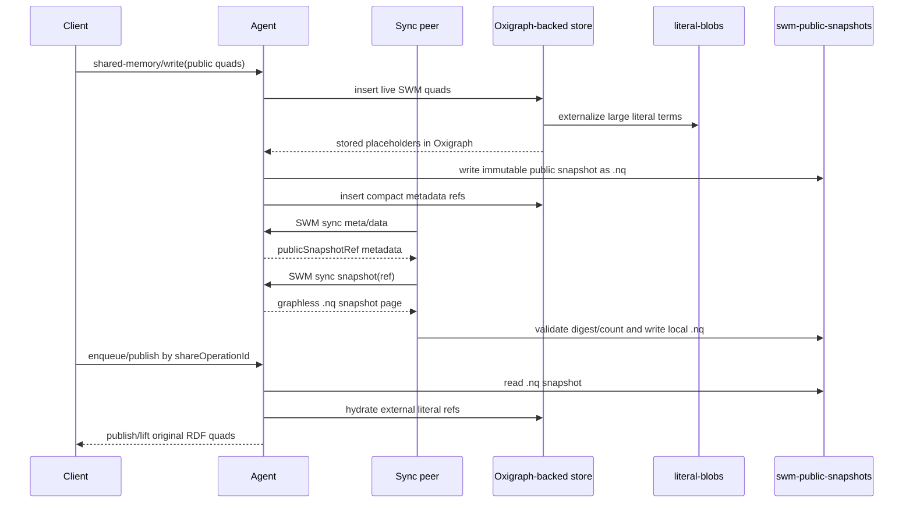

# PR Description: Fix SWM Large Payload Storage Amplification

## Summary

This PR fixes the Shared Working Memory large-payload storage amplification path
that pushed Oxigraph WASM into `RuntimeError: unreachable` / `table index is out
of bounds` failures during replicated public SWM writes.

The change keeps the public SWM API unchanged while moving large bytes out of
Oxigraph metadata and out of Oxigraph literal storage where possible:

- New SWM share metadata no longer writes full public payloads as
  `dkg:publicStagedQuads` JSON literals.
- Async lift/publish resolution uses immutable per-operation public snapshots,
  so an older queued `shareOperationId` does not silently read the root's newer
  live SWM state.
- Large public SWM literal object terms are externalized into content-addressed
  blob files and hydrated back on query/lift results.
- Public operation snapshots are now stored as compact graphless N-Quads files
  instead of JSON quad arrays, with read compatibility for existing `.json`
  snapshot files.
- SWM catch-up sync transfers referenced snapshot blobs before inserting
  `dkg:publicSnapshotRef` metadata, so late peers do not receive dangling local
  file references.
- Daemon publisher control uses the same snapshot store as the agent runtime,
  so `/api/publisher/job-payload` can inspect ref-backed jobs.

## Implementation Details

### Compact Operation Metadata

`storeWorkspaceOperationPublicQuads()` now stores operation identity and
fingerprints instead of serialized public payload bytes:

- context graph id
- optional subgraph name
- share operation id
- root entities
- publisher peer id
- timestamp
- per-root public quad digest/count
- per-root immutable snapshot reference

Legacy `dkg:publicStagedQuads` records remain readable, but new writes do not
create them.

### Immutable Public Snapshots

Each share operation has an immutable public snapshot backing store. Lift
resolution checks the requested roots against the operation metadata, reads the
snapshot, recomputes digest/count, and fails if the snapshot is missing or
corrupt. It does not fall back to the current live SWM root state.

Catch-up sync treats snapshot refs as required backing data. When a peer fetches
SWM meta/data and sees `dkg:publicSnapshotRef`, it requests the referenced
snapshot over a dedicated sync phase, validates the received N-Quads against
`dkg:publicQuadsDigest` and `dkg:publicQuadsCount`, writes the local snapshot
file, and only then inserts the fetched RDF metadata. A missing or corrupt
remote snapshot fails that peer sync instead of leaving unusable metadata.



### Large Literal Externalization

Persistent Oxigraph-backed agent stores wrap the underlying triple store with
large-literal externalization for public SWM graphs. Large RDF literal object
terms are written to `<dataDir>/literal-blobs/<sha256>`, and Oxigraph stores a
small typed placeholder:

```text
"sha256:<hex>"^^<http://dkg.io/ontology/externalLiteralRef>
```

Queries and lift results hydrate placeholders back to the original RDF literal
term. Full SPARQL value semantics over externalized literal bytes are not
promised; filters/functions inside Oxigraph see the placeholder.

### N-Quads Public Snapshot Files

The file-backed public snapshot store now writes:

```text
<dataDir>/swm-public-snapshots/aa/bb/<sha>.nq
```

instead of:

```text
<dataDir>/swm-public-snapshots/aa/bb/<sha>.json
```

The `.nq` file contains one graphless N-Quads line per public quad. Reads first
try `.nq` and then fall back to legacy `.json`, so existing snapshot files stay
compatible.



## Verification

Focused checks run:

```bash
pnpm --filter @origintrail-official/dkg-storage exec vitest run test/storage.test.ts test/external-literal-store.test.ts
pnpm --filter @origintrail-official/dkg-publisher exec vitest run test/async-lift-workspace.test.ts
pnpm --filter @origintrail-official/dkg-agent exec vitest run test/swm-snapshot-sync.test.ts
pnpm --filter @origintrail-official/dkg exec vitest run test/publisher-route-snapshot.test.ts
pnpm --filter @origintrail-official/dkg exec vitest run test/swm-large-payload-benchmark.test.ts
pnpm --filter @origintrail-official/dkg exec vitest run test/swm-triple-volume-benchmark.test.ts
pnpm --filter @origintrail-official/dkg-storage build
pnpm --filter @origintrail-official/dkg-publisher build
git diff --check
```

Live 5-node verification after the N-Quads snapshot patch:

```bash
pnpm --filter @origintrail-official/dkg benchmark:swm-triple-volume -- \
  --ports 20501,20502,20503,20504,20505 \
  --target-gib-per-node 1 \
  --triples-per-write 1000 \
  --write-concurrency 5 \
  --max-writes 250 \
  --diagnostic-interval-ms 10000 \
  --output bench/results/swm-triple-volume-diagnostic-250w-nq-commit.json
```

Result:

- `250/250` writes completed.
- `250,000` triples converged on all five nodes.
- `dkg:publicStagedQuads = 0` on all five nodes.
- `dkg:publicSnapshotGraph = 0` on all five nodes.
- `dkg:publicSnapshotRef = 250` on all five nodes.
- No `RuntimeError: unreachable`.
- No `table index is out of bounds`.
- No Gossipsub payload-length failures.

The benchmark still shows write-throughput decline as RDF store/snapshot state
grows, but the run completes without data loss or Oxigraph WASM failure. The
remaining throughput work is separate from the storage-amplification fix.
