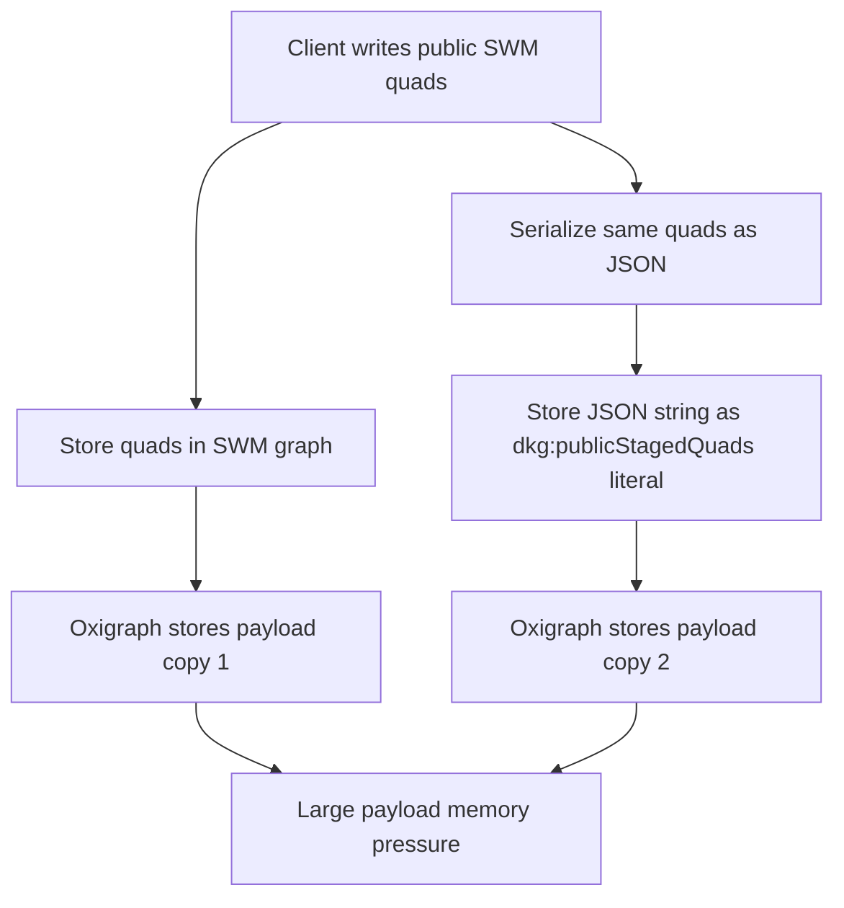
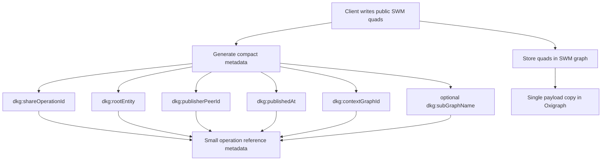
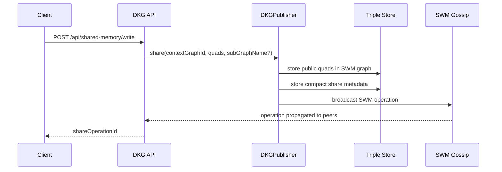
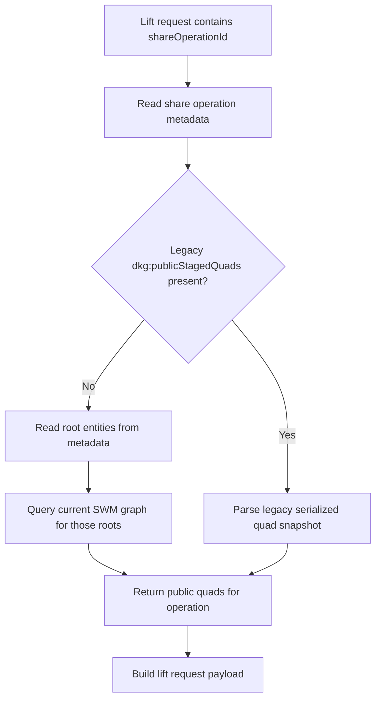
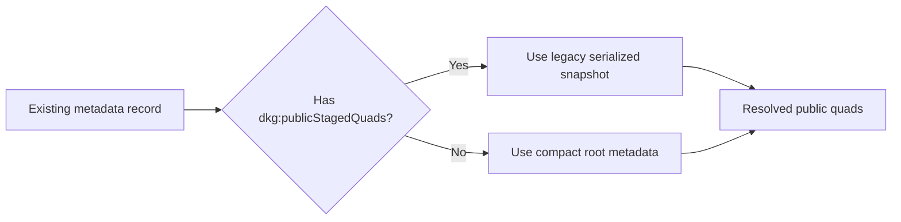
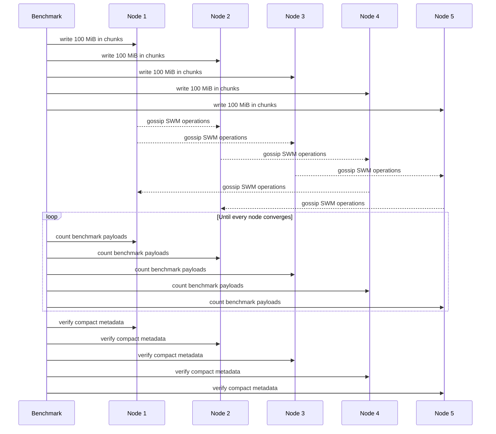

# Fix SWM Large Payload Storage Amplification

## Summary

This change fixes Shared Working Memory large-payload storage amplification.
Before this fix, each public SWM payload was stored twice per node:

1. Once as normal RDF quads in the SWM data graph.
2. Again as a JSON-stringified RDF literal in SWM metadata through
   `dkg:publicStagedQuads`.

For large replicated writes this doubled the effective Oxigraph payload and
pushed the WASM store into memory failures. In the reproduced benchmark, the
duplicated path failed around `202.5 MiB/store` with:

```text
RuntimeError: unreachable
Store.load(...)
```

After that failure, later queries could also fail with:

```text
table index is out of bounds
```

The fix replaces full-payload metadata snapshots with compact operation
metadata. New SWM writes store only references and provenance in
`_shared_memory_meta`, while the public payload remains in the SWM data graph.
Legacy metadata records that already contain `dkg:publicStagedQuads` remain
readable.

## Problem

The old SWM share path made metadata carry the entire public payload:



That metadata snapshot was useful for later lift/share resolution, but it made
the storage model scale with approximately `2x payload size` per node. The
failure was reproduced without private mode and without Sender Key encryption,
so the root cause was public SWM metadata amplification.

## New Model

New SWM writes store compact share-operation metadata:

- context graph id
- optional subgraph name
- share operation id
- root entities
- publisher peer id
- published timestamp

The public payload is not serialized into metadata. Resolution reconstructs the
operation payload by reading the current SWM graph for the operation roots.



## Write Path

The SWM write path still persists and gossips the public payload normally. The
change is only in the metadata generated for the operation.



The important behavior change is this:

```text
New writes no longer emit:
  <share-operation> dkg:publicStagedQuads "<serialized full payload>"
```

Instead they emit compact metadata that points to roots already present in the
SWM data graph.

## Resolution Path

Lift/share resolution now resolves the public payload from the graph itself
when compact metadata is present.



For compact metadata, the resolver validates the operation roots and then reads
the public quads from the current SWM graph. This keeps new writes small while
preserving the ability to lift and publish shared-memory content.

## Legacy Compatibility

Existing stores may already contain `dkg:publicStagedQuads`. Those records still
work. The compatibility rule is:



This means the fix is forward-looking for new writes, while old metadata remains
readable and does not need a migration before use.

## Benchmark

This PR adds a reusable live benchmark:

```bash
pnpm bench:swm-large-payload -- \
  --ports 19101,19102,19103,19104,19105 \
  --payload-mib-per-node 100 \
  --chunk-mib 0.5 \
  --output bench/results/swm-large-payload-500mib.json
```

The benchmark:

1. Writes large public SWM literals through each configured node.
2. Polls every node until all benchmark payloads are queryable.
3. Checks per-run metadata for `shareOperationId`, `rootEntity`,
   `publisherPeerId`, and `publishedAt`.
4. Verifies `dkg:publicStagedQuads` did not grow.
5. Optionally scans appended daemon logs for known Oxigraph and GossipSub
   failure signatures.



The reproduced 5-node regression case used `5 x 100 MiB = 500 MiB` total. With
the compact metadata model, all five nodes converged with:

```text
payload quads:        1000 per node
dkg:publicStagedQuads: 0 per node
shareOperationIds:    1000 per node
rootEntities:         1000 per node
```

No Oxigraph failure signatures were observed:

```text
RuntimeError: unreachable
table index is out of bounds
```

## Files Changed

- `packages/publisher/src/workspace-resolution.ts`
  - Stops writing new full-payload `dkg:publicStagedQuads` metadata snapshots.
  - Resolves compact share operations by reading root-scoped public quads from
    the SWM graph.
  - Keeps legacy snapshot reads for existing metadata.

- `packages/publisher/src/metadata.ts`
  - Extends share metadata with compact operation fields.
  - Emits `dkg:publishedAt`, `dkg:shareOperationId`, `dkg:rootEntity`,
    `dkg:publisherPeerId`, `dkg:contextGraphId`, and optional
    `dkg:subGraphName`.

- `packages/publisher/src/dkg-publisher.ts`
  - Routes SWM share metadata generation through the compact metadata helper.

- `packages/publisher/src/workspace-handler.ts`
  - Applies the same compact metadata model for received SWM operations.

- `packages/publisher/test/async-lift-workspace.test.ts`
  - Covers compact share-operation resolution.
  - Covers legacy `dkg:publicStagedQuads` compatibility.
  - Covers large literal writes without metadata payload duplication.

- `packages/publisher/test/metadata.test.ts`
  - Covers the new compact share metadata shape.

- `packages/cli/scripts/swm-large-payload-benchmark.cjs`
  - Adds the reusable live multi-node SWM payload benchmark.

- `packages/cli/test/swm-large-payload-benchmark.test.ts`
  - Covers benchmark argument parsing, chunk planning, and generated payload
    sizing.

- `packages/cli/README.md`
  - Documents the benchmark and the 5-node 500 MiB regression command.

## Validation

Focused validation run for this change:

```bash
pnpm --filter @origintrail-official/dkg exec vitest run test/swm-large-payload-benchmark.test.ts
```

Additional validation performed during the fix:

```bash
git diff --check
```

Live benchmark validation:

```bash
pnpm bench:swm-large-payload -- \
  --ports 19101,19102,19103,19104,19105 \
  --payload-mib-per-node 100 \
  --chunk-mib 0.5 \
  --auth-token <token> \
  --output bench/results/swm-large-payload-500mib.json
```

The full 500 MiB run verified that each node could query all benchmark payloads
and that `dkg:publicStagedQuads` remained at zero for the new writes.
