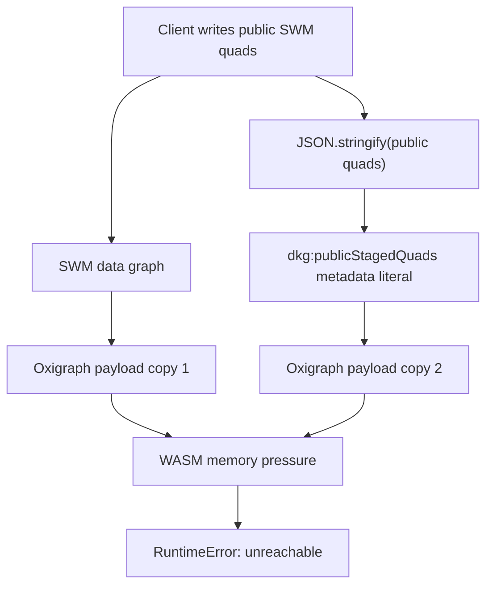
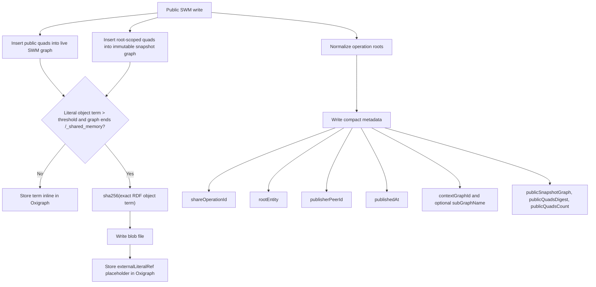
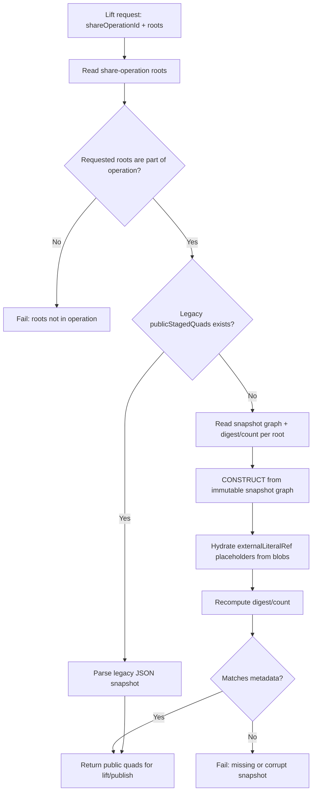
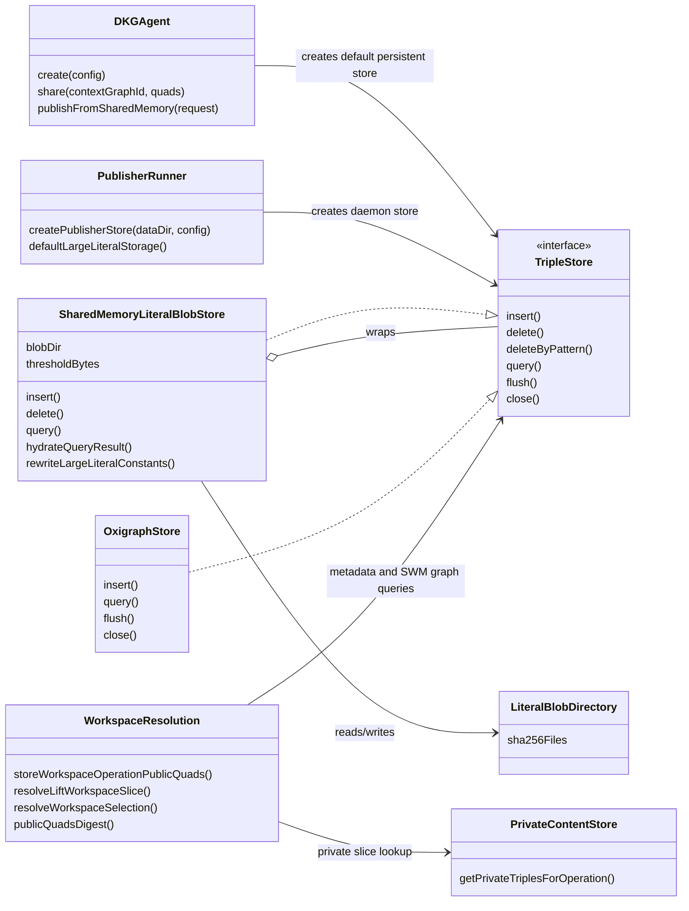
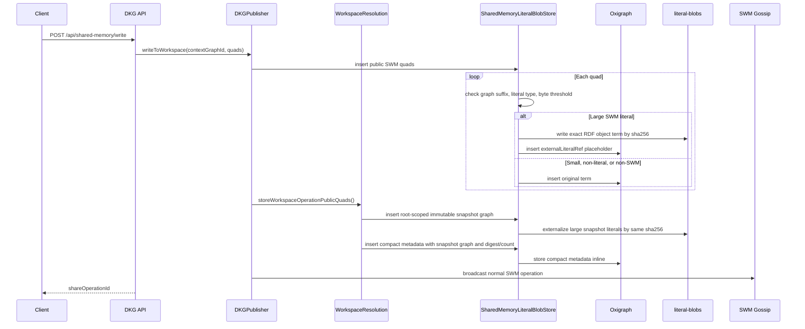
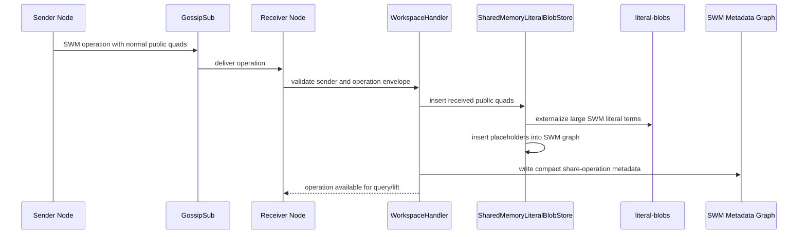
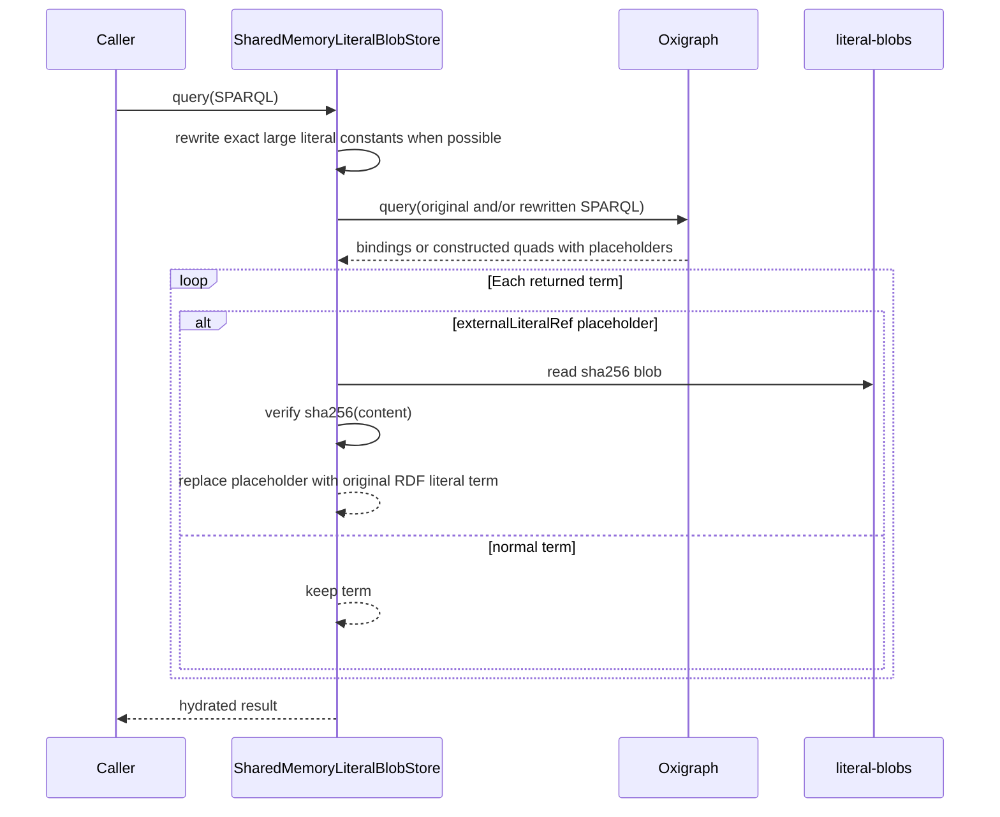
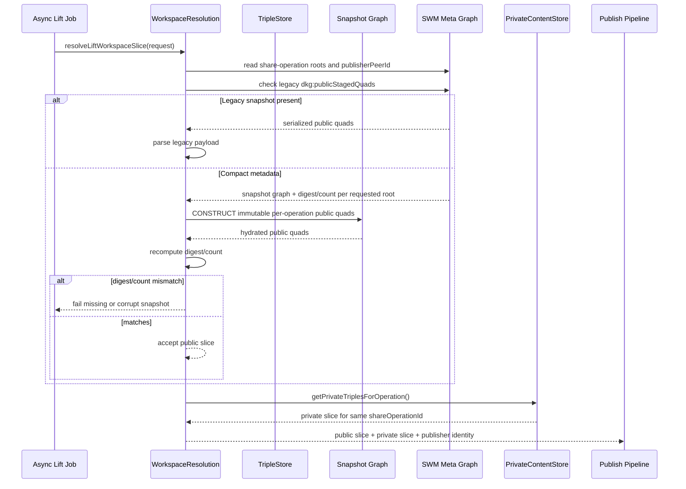
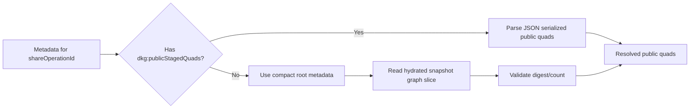
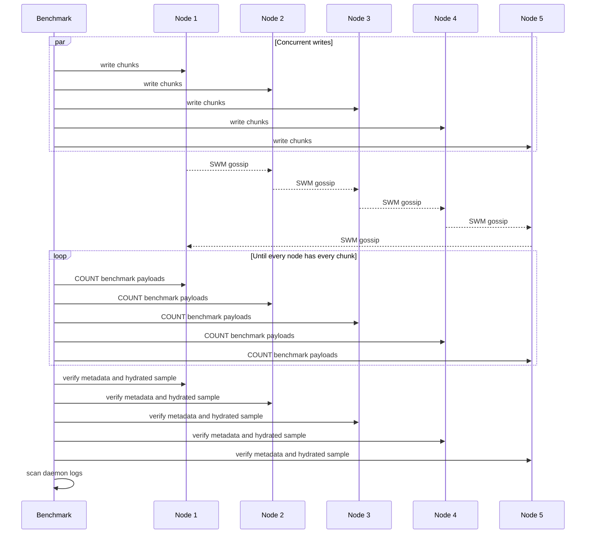

# Fix SWM Large Payload Storage Amplification

## PR Summary

This PR fixes the Shared Working Memory large-payload failure mode by removing
the two places where public SWM bytes were forced into Oxigraph WASM memory:

1. New share-operation metadata no longer stores full public quads as
   JSON-stringified `dkg:publicStagedQuads` literals.
2. Large public SWM literal object terms are stored out of line as
   content-addressed blob files, with only a small typed placeholder in
   Oxigraph.

The public SWM API surface stays the same. `/api/shared-memory/write`,
`/api/shared-memory/publish`, `/api/publisher/enqueue`, SWM gossip, lift
resolution, and publish-from-SWM callers still send and receive normal RDF
quads. The storage wrapper externalizes large literal bytes at the local
persistence boundary and hydrates them back on query/lift results.

Legacy metadata records that already contain `dkg:publicStagedQuads` remain
readable, but new metadata writes use compact immutable fingerprints.

## Root Cause

Before this change, a public SWM write stored large payload bytes twice per
node:

- once as normal RDF quads in the SWM graph;
- once again as a JSON string literal in SWM metadata through
  `dkg:publicStagedQuads`.

That doubled the effective Oxigraph payload. The reproduced public-SWM
benchmark failed before private mode or Sender Key encryption started:

```text
RuntimeError: unreachable
Store.load(...)
```

After that failure, later queries could also fail with:

```text
table index is out of bounds
```

The failing path was therefore public SWM payload amplification, not encryption.



## New Storage Model

New writes split operation identity from payload bytes:

- SWM metadata stores operation references and immutable fingerprints.
- SWM graph data stores normal quads.
- A per-operation public snapshot graph stores the immutable public slice for
  async lift/publish resolution.
- Large SWM literal bytes are externalized into `<dataDir>/literal-blobs`.
- Query and lift callers receive hydrated RDF literal terms.



## Implementation Details

### Compact Share Metadata

`storeWorkspaceOperationPublicQuads()` now keeps only operation metadata and
per-root public quad fingerprints. It does not write full serialized payloads
to `dkg:publicStagedQuads`.

For each share operation, metadata includes:

- `dkg:shareOperationId`
- `dkg:contextGraphId`
- `dkg:rootEntity`
- `prov:wasAttributedTo` publisher peer id
- `dkg:publishedAt`
- optional `dkg:subGraphName`
- per-root `dkg:publicSnapshotGraph`
- per-root `dkg:publicQuadsDigest`
- per-root `dkg:publicQuadsCount`

The snapshot graph is an immutable per-operation graph, not a metadata literal.
The digest is computed over the canonicalized hydrated public quads stored in
that graph for each root. This keeps the operation selector immutable without
putting the payload itself into metadata.

### Immutable Snapshot Graphs

The earlier compact-metadata fallback could have selected "whatever the root
looks like now" if a root changed between the original write and a later async
lift job. This PR fixes that by storing an immutable per-operation public
snapshot graph.

For non-legacy compact metadata:

1. Load the operation root metadata for the requested `shareOperationId`.
2. Read the `dkg:publicSnapshotGraph` for each requested root.
3. Query that snapshot graph, not the current live SWM root.
4. Recompute digest and count.
5. Return the public slice only when digest and count match metadata.
6. Throw only if snapshot metadata is missing or the snapshot graph is corrupt.

This preserves the old immutable-snapshot semantics. A queued async publish for
`write1` still resolves the `write1` public slice after the same root is later
rewritten by `write2`, while the private slice remains keyed by the same
`shareOperationId`.



### Large Literal Blob Store

`SharedMemoryLiteralBlobStore` wraps a normal `TripleStore` and externalizes
only large RDF literal object terms written to SWM graphs.

Default persistent configuration:

```ts
largeLiteralStorage: {
  enabled: true,
  thresholdBytes: 65536,
  directory: "<dataDir>/literal-blobs",
}
```

Externalization eligibility:

- graph URI must end in `/_shared_memory`;
- RDF object term must be a serialized literal;
- serialized UTF-8 term size must be greater than the threshold;
- the term must not already be an external literal reference.

Blob format:

```text
<dataDir>/literal-blobs/<sha256>
```

The `sha256` is computed over the exact serialized RDF object term string, not
over a decoded lexical value. Oxigraph stores this compact placeholder:

```text
"sha256:<hex>"^^<http://dkg.io/ontology/externalLiteralRef>
```

The wrapper verifies existing content-addressed files before reusing them and
fails loudly on missing or corrupt blobs during hydration.

### Query Hydration Semantics

After `store.query()` returns:

- `SELECT` bindings are hydrated back to the original RDF literal term.
- `CONSTRUCT` quads are hydrated back to the original RDF literal term.
- `ASK` results are passed through.
- deletes passed with the original large literal term are translated to the
  placeholder before reaching Oxigraph.
- simple exact large-literal constants in `SELECT`, `ASK`, and equality
  filters are translated to placeholder form before querying.

This PR does not claim full SPARQL value semantics for externalized large
literals inside Oxigraph. Functions and filters that execute inside Oxigraph
over the literal value still operate on the placeholder representation. The
intended contract is hydrated query/lift results plus exact-match support.

## UML Architecture



## Write Sequence



## Receive And Replication Sequence



## Query Hydration Sequence



## Lift / Publish Resolution Sequence



## Legacy Compatibility

Existing stores may already contain full serialized public snapshots. Those are
still supported:



This is intentionally asymmetric:

- old metadata remains readable;
- new writes never create large `dkg:publicStagedQuads` snapshots.

## Files Changed

- `packages/publisher/src/workspace-resolution.ts`
  - Replaces full-payload metadata writes with compact operation metadata.
  - Stores per-root public quad digest/count fingerprints.
  - Stores immutable per-operation public snapshot graphs for async lift
    resolution.
  - Keeps legacy `dkg:publicStagedQuads` reads.
  - Avoids falling back to live SWM root state when snapshot metadata is
    missing.

- `packages/publisher/src/metadata.ts`
  - Emits compact share-operation fields used by lift resolution.

- `packages/publisher/src/dkg-publisher.ts`
  - Routes local SWM writes through compact metadata persistence.

- `packages/publisher/src/workspace-handler.ts`
  - Applies the same compact metadata model for received SWM operations.

- `packages/storage/src/shared-memory-literal-blob-store.ts`
  - Adds content-addressed large SWM literal externalization.
  - Hydrates `SELECT` bindings and `CONSTRUCT` quads.
  - Translates deletes and exact large-literal constants.
  - Verifies missing/corrupt blob files.

- `packages/storage/src/triple-store.ts`
  - Adds `largeLiteralStorage` to `TripleStoreConfig`.
  - Wraps configured local stores with `SharedMemoryLiteralBlobStore`.

- `packages/agent/src/dkg-agent.ts`
  - Enables default large literal storage for persistent local Oxigraph stores
    created with `DKGAgent.create({ dataDir })`.

- `packages/cli/src/config.ts`
  - Adds the daemon config surface for `largeLiteralStorage`.

- `packages/cli/src/publisher-runner.ts`
  - Enables default large literal storage for persistent daemon stores.

- `packages/cli/scripts/swm-large-payload-benchmark.cjs`
  - Adds/updates the reusable live multi-node SWM payload benchmark.
  - Uses count queries for convergence and one hydrated sample literal per node
    instead of pulling the whole payload into memory.
  - Checks `dkg:publicStagedQuads` on both operation metadata subjects
    (`dkg:rootEntity`) and per-root slice metadata subjects
    (`dkg:publicSliceRootEntity`) so a regression on
    `urn:dkg:public-stage:*` records is not missed.

- Tests:
  - `packages/storage/test/external-literal-store.test.ts`
  - `packages/publisher/test/async-lift-workspace.test.ts`
  - `packages/agent/test/large-literal-storage.test.ts`
  - `packages/cli/test/swm-large-payload-benchmark.test.ts`

## Test Coverage

Focused tests cover:

- large SWM literals are externalized;
- small literals stay inline;
- non-SWM graph literals stay inline;
- `SELECT` hydration returns the original literal term;
- `CONSTRUCT` hydration returns original quads;
- exact large literal constants work for simple matching;
- deletes work when passed the original large literal term;
- reopening a persistent store hydrates from existing blobs;
- missing/corrupt blob files fail loudly;
- compact metadata does not contain serialized public payloads;
- share-operation resolution returns expected hydrated quads;
- superseded share operations resolve from immutable public snapshots;
- compact metadata without a snapshot graph does not fall back to live SWM;
- legacy `dkg:publicStagedQuads` metadata remains readable;
- compact digest/count detects missing or corrupt immutable snapshots;
- the benchmark detects per-run `dkg:publicStagedQuads` on public slice
  metadata subjects;
- persistent `DKGAgent.create({ dataDir })` uses literal blob storage by
  default.

Focused validation commands:

```bash
pnpm --filter @origintrail-official/dkg-storage exec vitest run test/storage.test.ts test/external-literal-store.test.ts
pnpm --filter @origintrail-official/dkg-publisher exec vitest run test/async-lift-workspace.test.ts
pnpm --filter @origintrail-official/dkg exec vitest run test/swm-large-payload-benchmark.test.ts
pnpm --filter @origintrail-official/dkg-agent exec vitest run test/large-literal-storage.test.ts
pnpm --filter @origintrail-official/dkg-storage build
pnpm --filter @origintrail-official/dkg-publisher build
git diff --check
```

## Live Benchmark

The reusable benchmark writes large public SWM literals through each configured
node, waits for all nodes to converge, validates compact metadata, hydrates one
sample literal per node, and scans daemon logs for known failure signatures.



### 1 GiB Total Regression Run

```bash
pnpm bench:swm-large-payload \
  --ports 19101,19102,19103,19104,19105 \
  --payload-mib-per-node 204.8 \
  --chunk-mib 0.5 \
  --write-concurrency 5 \
  --output bench/results/swm-large-payload-1gib.json
```

This validates the original target shape: `5 x 204.8 MiB = 1024 MiB` total.

### 1 GiB Per Node Verification

The larger verification requested after the implementation used:

```bash
pnpm bench:swm-large-payload \
  --ports 20101,20102,20103,20104,20105 \
  --payload-mib-per-node 1024 \
  --chunk-mib 0.5 \
  --write-concurrency 5 \
  --replication-timeout-ms 1200000 \
  --devnet-dir /private/tmp/dkg-v9-swm-1gib-devnet-5g \
  --auth-token <token> \
  --output bench/results/swm-large-payload-5gib.json
```

Result:

```text
ok: true
nodes: 5
payloadMiBPerNode: 1024
totalPayloadMiB: 5120
totalOperations: 10240
chunkMiB: 0.5
replication: converged
counts: 10240 on every node
publicStagedQuadsForRun: 0 on every node
publicStagedQuadsGlobalDelta: 0 on every node
samplePayloadBytes: 524288 on every node
logMatches: 0
```

No daemon log matches were found for:

```text
RuntimeError: unreachable
table index is out of bounds
```

Benchmark artifact:

```text
bench/results/swm-large-payload-5gib.json
```

## Operational Notes

- Default externalization is enabled for persistent local Oxigraph/worker
  stores when `dataDir` is available.
- Explicit stores supplied by callers are respected.
- Normal data graphs, Verified Memory, private encrypted staging, and file
  import blobs are not changed by this wrapper.
- Garbage collection for orphaned blob files is intentionally out of scope for
  this first pass.
- Content-addressed blob files make duplicate literal writes cheap because the
  same exact RDF object term maps to the same file.
- The query contract is hydrated results, not full in-engine SPARQL value
  semantics over externalized literal bytes.

## Reviewer Checklist

- Confirm new metadata writes do not contain serialized public payload literals.
- Confirm legacy `dkg:publicStagedQuads` reads still work.
- Confirm older queued async lift/publish jobs resolve from immutable snapshot
  graphs after the live root is rewritten.
- Confirm compact metadata without snapshot graph does not fall back to live
  SWM root state.
- Confirm large SWM literals are externalized only for `/_shared_memory`
  graphs.
- Confirm query/lift callers receive hydrated RDF literal terms.
- Confirm the 5-node `1024 MiB/node` benchmark artifact remains clean:
  convergence true, metadata amplification zero, and no Oxigraph failure logs.
