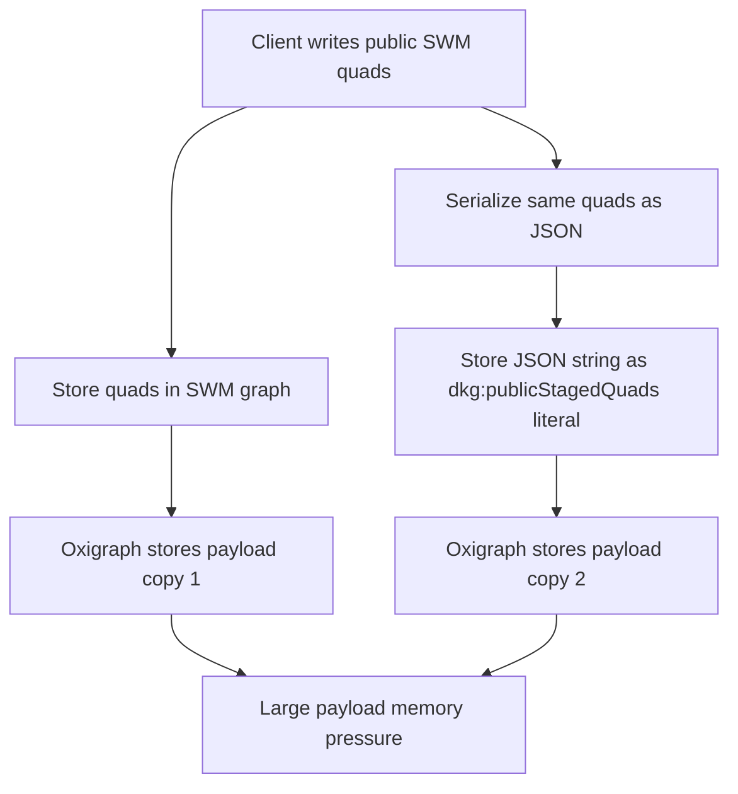
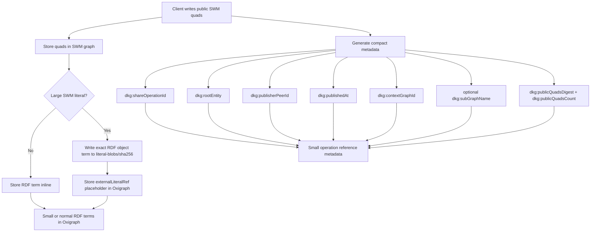
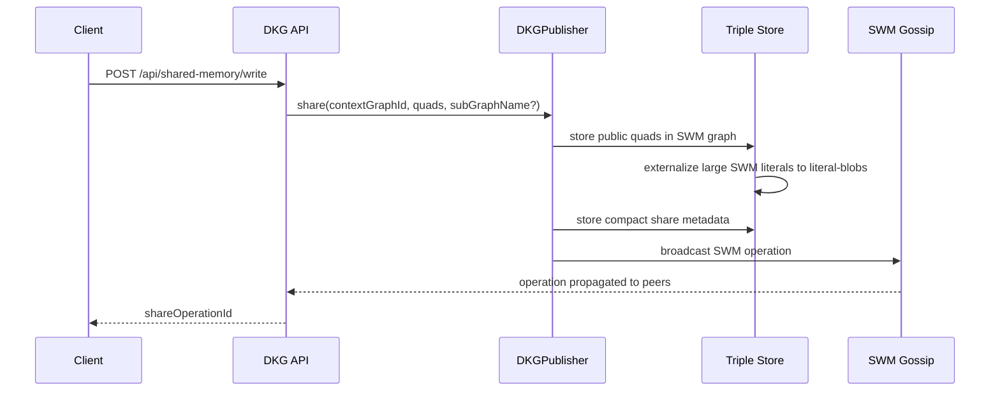
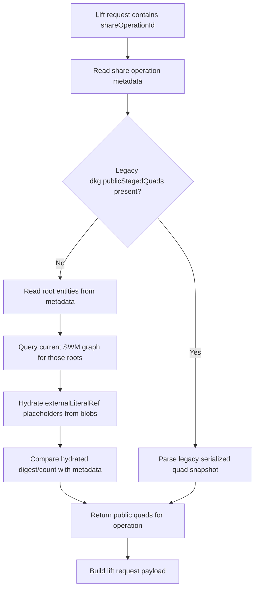
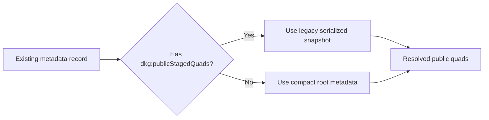
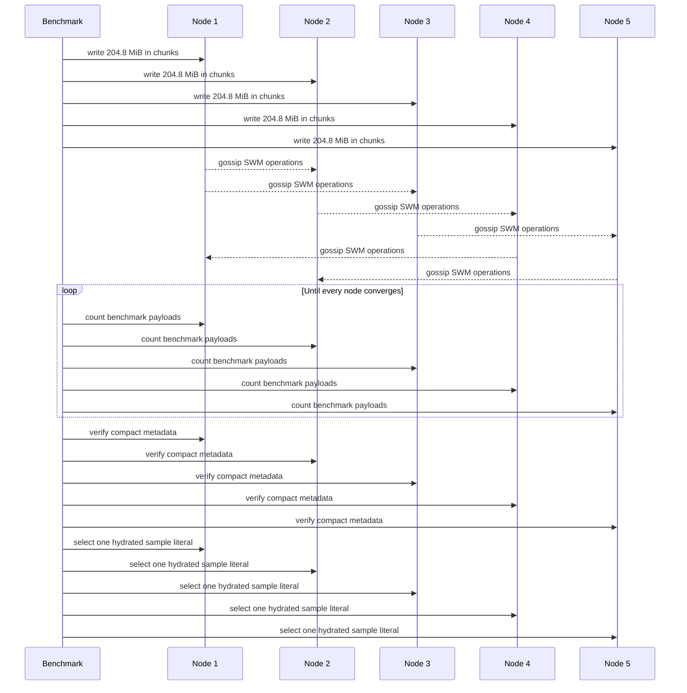

# Fix SWM Large Payload Storage Amplification

## Summary

This change fixes Shared Working Memory large-payload storage amplification.
Before this fix, each public SWM payload was stored twice per node:

1. Once as normal RDF quads in the SWM data graph.
2. Again as a JSON-stringified RDF literal in SWM metadata through
   `dkg:publicStagedQuads`.

For large replicated writes this doubled the effective Oxigraph payload and
pushed the WASM store into memory failures. In the reproduced benchmark, the
duplicated path failed around `202.5 MiB/store` with:

```text
RuntimeError: unreachable
Store.load(...)
```

After that failure, later queries could also fail with:

```text
table index is out of bounds
```

The fix has two layers:

1. Full-payload metadata snapshots are replaced by compact immutable
   share-operation metadata and per-root public quad fingerprints.
2. Large public SWM literal object terms are externalized into
   content-addressed blob files, leaving only a small placeholder literal in
   Oxigraph.

New SWM writes no longer serialize public payloads into
`dkg:publicStagedQuads`, and persistent nodes no longer ask Oxigraph WASM to
hold large literal bytes directly. Legacy metadata records that already contain
`dkg:publicStagedQuads` remain readable.

## Problem

The old SWM share path made metadata carry the entire public payload:



That metadata snapshot was useful for later lift/share resolution, but it made
the storage model scale with approximately `2x payload size` per node. The
failure was reproduced without private mode and without Sender Key encryption,
so the root cause was public SWM metadata amplification.

## New Model

New SWM writes store compact share-operation metadata:

- context graph id
- optional subgraph name
- share operation id
- root entities
- publisher peer id
- published timestamp
- public quad digest and count for each root

The public payload is not serialized into metadata. Resolution reconstructs and
validates the operation payload by reading the current SWM graph for the
operation roots, then comparing the hydrated quads to the stored digest/count.



## Large Literal Blob Storage

Local Oxigraph-backed agent stores now enable large SWM literal storage by
default when `dataDir` is configured. The default settings are:

```ts
largeLiteralStorage: {
  enabled: true,
  thresholdBytes: 65536,
  directory: "<dataDir>/literal-blobs",
}
```

Only RDF literal objects written to graphs ending in `/_shared_memory` are
eligible. Small literals, IRIs, blank nodes, non-SWM graphs, Verified Memory,
private encrypted staging, and file import blobs stay unchanged.

For each large SWM literal, the wrapper computes `sha256` over the exact
serialized RDF object term string and writes that string to:

```text
<dataDir>/literal-blobs/<sha256>
```

Oxigraph stores this placeholder instead of the full literal bytes:

```text
"sha256:<hex>"^^<http://dkg.io/ontology/externalLiteralRef>
```

Queries and lift resolution hydrate placeholders after Oxigraph returns
bindings or constructed quads, so normal callers receive the original RDF
literal term. Exact large-literal constants in simple `SELECT`, `ASK`, and
equality-filter queries are also translated to the placeholder form before
querying. Full SPARQL value semantics for functions over externalized literal
values are intentionally not promised; those expressions still execute inside
Oxigraph against the stored placeholder.

## Write Path

The SWM write path still accepts and gossips normal public RDF quads. The
storage wrapper externalizes large literal bytes at the local persistence
boundary, and compact metadata records only operation provenance plus
digest/count fingerprints.



The important behavior change is this:

```text
New writes no longer emit:
  <share-operation> dkg:publicStagedQuads "<serialized full payload>"
```

Instead they emit compact metadata that points to roots already present in the
SWM data graph and records immutable digest/count fingerprints for stale-write
detection.

## Resolution Path

Lift/share resolution now resolves the public payload from the graph itself
when compact metadata is present.



For compact metadata, the resolver validates the operation roots and then reads
hydrated public quads from the current SWM graph. If the current root slice no
longer matches the stored digest/count, resolution fails instead of silently
publishing a mismatched public/private asset.

## Legacy Compatibility

Existing stores may already contain `dkg:publicStagedQuads`. Those records still
work. The compatibility rule is:



This means the fix is forward-looking for new writes, while old metadata remains
readable and does not need a migration before use.

## Benchmark

This PR adds a reusable live benchmark:

```bash
pnpm bench:swm-large-payload -- \
  --ports 19101,19102,19103,19104,19105 \
  --payload-mib-per-node 204.8 \
  --chunk-mib 0.5 \
  --write-concurrency 5 \
  --output bench/results/swm-large-payload-1gib.json
```

The benchmark:

1. Writes large public SWM literals through each configured node.
2. Polls every node until all benchmark payloads are queryable.
3. Checks per-run metadata for `shareOperationId`, `rootEntity`,
   `publisherPeerId`, and `publishedAt`.
4. Verifies `dkg:publicStagedQuads` did not grow.
5. Selects one sample payload literal per node to prove hydration returns the
   original payload bytes.
6. Optionally scans appended daemon logs for known Oxigraph and GossipSub
   failure signatures.



The 1 GiB target case uses `5 x 204.8 MiB = 1024 MiB` total. Acceptance is:

```text
payload quads:        all benchmark chunks on every node
dkg:publicStagedQuads: 0 per node
shareOperationIds:    one per benchmark write
rootEntities:         one per benchmark write
sample literal bytes: expected chunk payload size on every node
```

No Oxigraph failure signatures were observed:

```text
RuntimeError: unreachable
table index is out of bounds
```

## Files Changed

- `packages/publisher/src/workspace-resolution.ts`
  - Stops writing new full-payload `dkg:publicStagedQuads` metadata snapshots.
  - Resolves compact share operations by reading root-scoped public quads from
    the SWM graph.
  - Keeps legacy snapshot reads for existing metadata.

- `packages/publisher/src/metadata.ts`
  - Extends share metadata with compact operation fields.
  - Emits `dkg:publishedAt`, `dkg:shareOperationId`, `dkg:rootEntity`,
    `dkg:publisherPeerId`, `dkg:contextGraphId`, and optional
    `dkg:subGraphName`.

- `packages/publisher/src/dkg-publisher.ts`
  - Routes SWM share metadata generation through the compact metadata helper.

- `packages/publisher/src/workspace-handler.ts`
  - Applies the same compact metadata model for received SWM operations.

- `packages/publisher/test/async-lift-workspace.test.ts`
  - Covers compact share-operation resolution.
  - Covers legacy `dkg:publicStagedQuads` compatibility.
  - Covers large literal writes without metadata payload duplication.
  - Covers compact digest/count resolution over hydrated external SWM literals.

- `packages/publisher/test/metadata.test.ts`
  - Covers the new compact share metadata shape.

- `packages/storage/src/shared-memory-literal-blob-store.ts`
  - Adds the content-addressed large SWM literal blob wrapper.
  - Hydrates `SELECT` bindings and `CONSTRUCT` quads back to the original RDF
    literal term.
  - Translates deletes and exact large-literal query constants to the
    placeholder representation.

- `packages/storage/src/triple-store.ts`
  - Adds the `largeLiteralStorage` configuration surface.

- `packages/storage/test/external-literal-store.test.ts`
  - Covers externalization, hydration, exact literal matching, deletes,
    corrupt/missing blob failures, and reopen-from-disk behavior.

- `packages/agent/src/dkg-agent.ts`
  - Enables large SWM literal storage by default for local Oxigraph-backed
    `DKGAgent.create({ dataDir })` stores.

- `packages/agent/test/large-literal-storage.test.ts`
  - Covers the default persistent agent store wiring.

- `packages/cli/scripts/swm-large-payload-benchmark.cjs`
  - Adds the reusable live multi-node SWM payload benchmark.
  - Uses hydrated sample literal selection instead of `STRLEN(STR(?o))`, so
    count queries remain cheap and sample checks exercise blob hydration.

- `packages/cli/test/swm-large-payload-benchmark.test.ts`
  - Covers benchmark argument parsing, chunk planning, and generated payload
    sizing.

- `packages/cli/README.md`
  - Documents the benchmark and the 5-node 500 MiB regression command.

## Validation

Focused validation run for this change:

```bash
pnpm --filter @origintrail-official/dkg exec vitest run test/swm-large-payload-benchmark.test.ts
pnpm --filter @origintrail-official/dkg-storage exec vitest run test/storage.test.ts test/external-literal-store.test.ts
pnpm --filter @origintrail-official/dkg-publisher exec vitest run test/async-lift-workspace.test.ts
pnpm --filter @origintrail-official/dkg-agent exec vitest run test/large-literal-storage.test.ts
```

Additional validation performed during the fix:

```bash
git diff --check
```

Live benchmark validation:

```bash
pnpm bench:swm-large-payload -- \
  --ports 19101,19102,19103,19104,19105 \
  --payload-mib-per-node 204.8 \
  --chunk-mib 0.5 \
  --write-concurrency 5 \
  --auth-token <token> \
  --output bench/results/swm-large-payload-1gib.json
```

The live 1 GiB run should verify that each node converges, hydrated sample
literals match the expected chunk size, `dkg:publicStagedQuads` remains zero,
and the logs contain no `RuntimeError: unreachable` or
`table index is out of bounds`.
