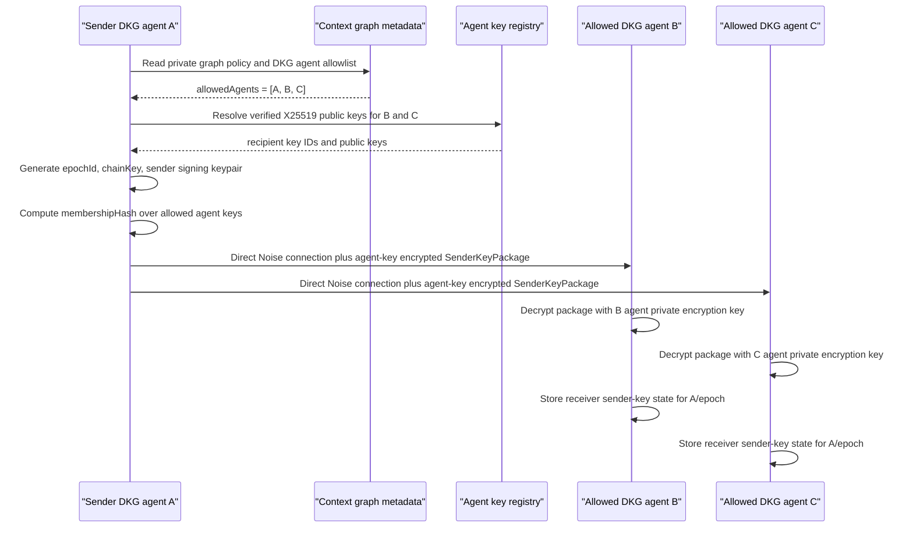
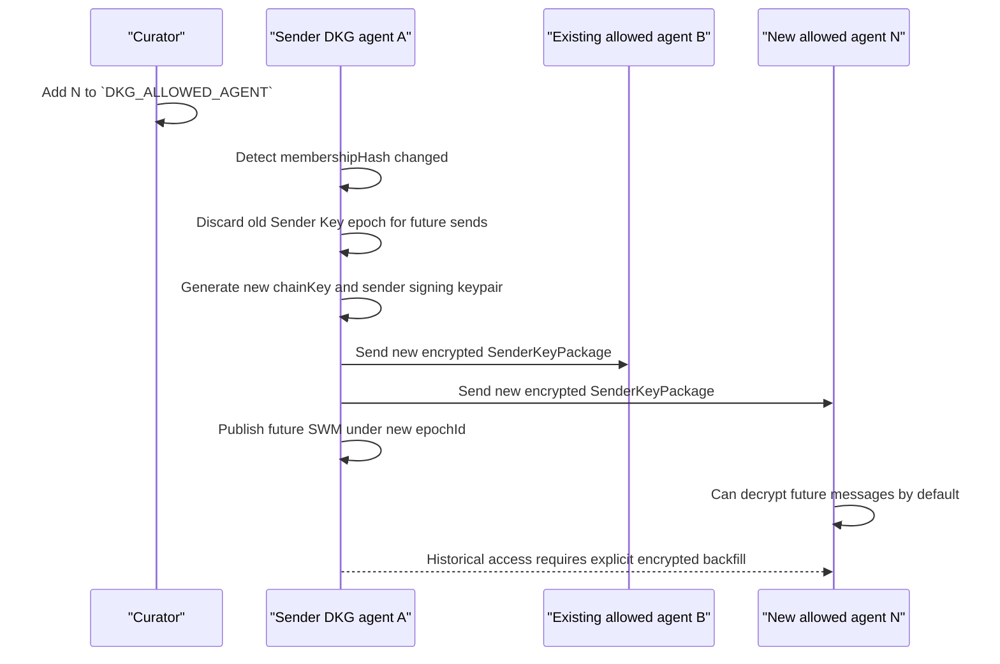

# SWM Sender Key Epoch Design

| Field | Value |
| --- | --- |
| Date | 2026-05-07 |
| Status | Design note / follow-up proposal |

## Purpose

This document describes a WhatsApp-style Sender Key design for Shared Working Memory (SWM) GossipSub confidentiality. It is a follow-up to the encrypted SWM envelope work already committed in `f2bb8f92 Encrypt private SWM gossip with agent keys`.

The committed work remains part of the design. It establishes the security contract that the Sender Key follow-up must keep:

| Contract | Required behavior |
| --- | --- |
| Private payload confidentiality | Private and agent-gated SWM payloads are encrypted before GossipSub publish. |
| Agent-only recipients | Recipients are DKG agents resolved from `DKG_ALLOWED_AGENT` and `DKG_PARTICIPANT_AGENT`. |
| No peer encryption identity | Peer IDs and peer-only allowlists are not encryption recipient inputs. |
| Fail closed | Missing, untrusted, spoofed, wrong-algorithm, or ambiguous agent encryption keys stop private SWM. |
| No private plaintext fallback | Private and agent-gated SWM reject plaintext fallback. |
| Public compatibility | Public/open SWM remains backward compatible. |

The Sender Key follow-up keeps that foundation and changes where the per-recipient encryption work happens:

| Step | Sender Key behavior |
| --- | --- |
| Setup | The sender distributes a per-sender, per-epoch secret to allowed DKG agents through individually encrypted setup messages. |
| Broadcast | Later SWM broadcasts carry one ciphertext for the group. |
| Receive | Each receiver advances the same ratchet state to derive the message key for that broadcast. |
| Membership change | The graph starts a new epoch and repeats setup with the current allowed DKG agents. |

The goal is still SWM payload confidentiality only. This does not redesign Knowledge Asset publishing, on-chain context graph policy, or historical key rotation.

## Source Pattern

WhatsApp's group messaging design uses the Signal Sender Keys pattern. In that model, the first group message from a sender causes the sender to create a random chain key and a sender signing key, distribute that sender key material to each group member through pairwise encrypted sessions, then send later group messages as a single fanout ciphertext derived from the chain key. When a member leaves, group participants clear sender keys and start over.

References:

- WhatsApp Encryption Overview, group messages / Sender Keys: <https://docslib.org/doc/4876008/whatsapp-encryption-overview>
- Meta Messenger end-to-end encryption overview, group messaging uses Sender Keys for efficient fanout: <https://engineering.fb.com/wp-content/uploads/2023/12/MessengerEnd-to-EndEncryptionOverview_12-6-2023.pdf>

## Key Correction

The private signing key should not encrypt the SWM payload.

The split should be:

| Material | Purpose |
| --- | --- |
| DKG agent identity key | Authenticates the agent and signs/binds its public encryption key. |
| DKG agent X25519 encryption key | Receives encrypted sender-key setup packages. |
| Sender chain key | Secret ratchet state used to derive per-message encryption keys. |
| Sender epoch signing key | Signs sender-key ciphertexts for that epoch. |
| Message key | Encrypts exactly one SWM gossip payload. |
| Message nonce/IV | AEAD nonce or IV derived per message; not the same thing as the chain key. |

The chain key is not merely a nonce. It is secret ratchet state. Each message advances it with a KDF so old message keys do not reveal future message keys.

## Committed Work That Stays

Commit `f2bb8f92 Encrypt private SWM gossip with agent keys` is the Phase 0 confidentiality foundation. The Sender Key follow-up keeps the same trust model and failure rules, then changes only how private broadcast keys are amortized.

### Preserved Security Contract

| Contract | Current behavior to keep |
| --- | --- |
| Payload confidentiality | Private and agent-gated SWM bytes are encrypted before GossipSub publish. |
| Agent-only recipients | Encryption recipients come only from `DKG_ALLOWED_AGENT` and `DKG_PARTICIPANT_AGENT`. |
| No peer-key model | `DKG_ALLOWED_PEER`, libp2p peer IDs, and peer-only allowlists are not encryption recipients. |
| Fail closed | Missing, untrusted, spoofed, wrong-algorithm, ambiguous, or absent DKG agent keys stop private publish/receive. |
| Private plaintext rejection | Private and agent-gated graphs reject legacy plaintext SWM payloads. |
| Public compatibility | Public/open SWM keeps the legacy plaintext-compatible path. |

### Kept Implementation Surface

| Area | What stays |
| --- | --- |
| Agent key model | DKG agent X25519 workspace keys, local private-key persistence, self-sovereign public-key registration, profile advertisement, and proof binding to the agent address. |
| Recipient resolution | Context graph metadata is resolved into verified DKG agent recipient key IDs. Invalid addresses, missing keys, RDF-only keys, unsupported algorithms, spoofed proofs, and ambiguous keys are rejected. |
| Crypto and envelope helpers | Versioned encrypted workspace envelopes, deterministic AAD framing, X25519 key agreement, AES-GCM payload encryption, key wrapping, key IDs, and key proof helpers remain reusable. |
| Publisher integration | Private or agent-gated remote SWM gossip is encrypted before publication and requires a sender DKG agent identity. |
| Receive handling | The receiver verifies/decrypts first, validates context binding, rejects private plaintext fallback, then passes the plaintext `WorkspacePublishRequest` into existing SWM handling. |
| Regression tests | Existing agent, core, and publisher tests remain the baseline for agent-only recipients, verified ownership, fail-closed private graphs, encrypted raw bytes, allowed decrypt, unauthorized no-store, and public compatibility. |

### Follow-Up Boundary

| Keep from Phase 0 | Change in Sender Key follow-up |
| --- | --- |
| DKG agent X25519 recipient keys remain the only encryption-recipient model. | Use those keys to distribute Sender Key setup packages once per sender epoch. |
| Existing recipient resolver remains the source of allowed recipient key IDs. | Use the resolver output to compute the Sender Key epoch membership hash. |
| Existing AAD/context binding remains the pattern. | Bind Sender Key setup packages and fanout messages to context graph, subgraph, sender, epoch, membership hash, and message index. |
| Existing receive gates remain in force after decryption. | Decrypt with receiver Sender Key state before handing plaintext to the existing SWM handler. |
| Existing encrypted-envelope path remains a valid Phase 0 design. | Replace per-message CEK wrapping for the Sender Key path with ratcheted one-ciphertext fanout. |

## Target Sender Key Model

Use one Sender Key state per scope:

| Scope field | Meaning |
| --- | --- |
| `contextGraphId` | Context graph whose SWM payloads are protected. |
| `subGraphName` | Optional SWM subgraph name, when the write is subgraph-scoped. |
| `senderAgentAddress` | DKG agent that owns this sender chain. |
| `epochId` | Membership/key epoch for this sender chain. |

Every writer has its own sender chain. There is no single shared group private key. If three allowed agents write to the same private graph, each of those agents has its own Sender Key epoch and distributes its own setup package before its first encrypted broadcast in that epoch.

### Epoch Inputs

An epoch is bound to:

| Input | Why it is bound into the epoch |
| --- | --- |
| `contextGraphId` | Prevents using the sender key outside the context graph. |
| `subGraphName` | Prevents cross-subgraph reuse when the write is subgraph-scoped. |
| Allowed DKG agent addresses | Defines the intended member set from `DKG_ALLOWED_AGENT` and `DKG_PARTICIPANT_AGENT`. |
| Verified recipient key IDs | Binds encryption to the exact DKG agent keys used during setup. |
| Sender agent address | Identifies the DKG agent that owns this sender chain. |
| Sender epoch public signing key | Lets receivers verify future fanout messages from this epoch. |
| Created timestamp | Makes the epoch auditable and freshness-checkable. |
| Membership hash | Gives every participant one compact value to compare before accepting messages. |

`DKG_ALLOWED_PEER` is not an encryption-recipient input. Peer allowlists may still be used for transport/admission checks, but Sender Key recipients are DKG agents only.

### Sender Key State

Suggested local sender state:

| Field | Purpose |
| --- | --- |
| `contextGraphId` | Context graph bound to this state. |
| `subGraphName` | Optional SWM subgraph binding. |
| `senderAgentAddress` | Local DKG agent that owns the sender chain. |
| `epochId` | Current epoch identifier. |
| `membershipHash` | Hash of allowed DKG agents and verified recipient key IDs. |
| `chainKey` | Secret ratchet state for deriving message keys. |
| `messageIndex` | Next message number to send. |
| `senderSigningPrivateKey` | Epoch signing key used to sign sender-key messages. |
| `senderSigningPublicKey` | Public key distributed to receivers in setup packages. |
| `createdAt` | Epoch creation timestamp. |

Suggested receiver state:

| Field | Purpose |
| --- | --- |
| `contextGraphId` | Context graph bound to this receiver state. |
| `subGraphName` | Optional SWM subgraph binding. |
| `senderAgentAddress` | Remote DKG agent whose sender chain is being tracked. |
| `epochId` | Remote sender epoch identifier. |
| `membershipHash` | Membership hash accepted for this epoch. |
| `chainKey` | Receiver copy of the secret ratchet state. |
| `nextMessageIndex` | Next expected message number from this sender. |
| `senderSigningPublicKey` | Epoch public key used to verify sender-key messages. |
| `createdAt` | Epoch setup timestamp. |
| `skippedMessageKeys[]` | Bounded cache for out-of-order GossipSub delivery. |

Receiver state is keyed by sender, because each sender ratchets independently.

## Setup Flow

The sender creates a Sender Key package and delivers it individually to every allowed agent. The direct connection may already be Noise-encrypted by libp2p, but the setup package should still be encrypted to the recipient DKG agent's X25519 key. Noise authenticates and encrypts the transport connection between libp2p peers; the SWM authorization model is agent-based.



The package should be signed or otherwise bound to the sender agent identity. A receiver must reject setup packages that are not signed by an agent allowed to write to the graph.

Suggested setup envelope:

| Field | Purpose |
| --- | --- |
| `version` | Sender Key package schema version. |
| `type` | Constant: `swm.sender-key.package`. |
| `contextGraphId` | Context graph this package belongs to. |
| `subGraphName` | Optional SWM subgraph binding. |
| `senderAgentAddress` | DKG agent distributing the sender chain. |
| `epochId` | New sender epoch being installed. |
| `membershipHash` | Hash of allowed agent addresses and recipient key IDs. |
| `senderSigningPublicKey` | Epoch public key receivers use for message verification. |
| `initialMessageIndex` | First message index for this epoch. |
| `chainKeyCiphertext` | Encrypted setup secret for this recipient. |
| `recipientAgentAddress` | DKG agent receiving this setup package. |
| `recipientKeyId` | Recipient X25519 key ID used for encryption. |
| `createdAt` | Setup package timestamp. |
| `signatureBySenderAgent` | Agent identity signature over the package metadata. |

The encrypted package plaintext contains at least:

| Field | Why it is inside the encrypted package |
| --- | --- |
| `chainKey` | Secret ratchet state; only allowed recipients should learn it. |
| `epochId` | Binds the secret to the epoch being installed. |
| `senderSigningPublicKey` | Lets the recipient verify future sender-key messages. |
| `messageIndex` | Initializes receiver ratchet position. |
| `membershipHash` | Prevents accepting the key under the wrong member set. |
| `contextGraphId` | Prevents cross-context setup confusion. |
| `subGraphName` | Prevents cross-subgraph setup confusion. |
| `senderAgentAddress` | Binds the secret to the sender agent. |

The encrypted setup package should use the existing DKG agent X25519 public key model and proof checks. Do not add a peer-key recipient model.

## Broadcast Flow

For each subsequent SWM message in the same epoch:

| Step | Actor | Action |
| --- | --- | --- |
| 1 | Sender | Derive a message key and nonce from the current chain key and message index. |
| 2 | Sender | Advance the chain key so later messages use fresh key material. |
| 3 | Sender | Encrypt the `WorkspacePublishRequest` once. |
| 4 | Sender | Sign the ciphertext and metadata with the epoch signing private key. |
| 5 | Sender | Publish one `SwmSenderKeyMessage` through GossipSub. |
| 6 | Receiver | Verify the sender-key signature, derive the same message key, decrypt, advance receiver chain state, and pass the plaintext request to `SharedMemoryHandler`. |

```mermaid
sequenceDiagram
    participant A as "Sender DKG agent A"
    participant G as "GossipSub mesh"
    participant B as "Allowed DKG agent B"
    participant U as "Unauthorized raw subscriber"
    participant S as "SharedMemoryHandler"

    A->>A: Build WorkspacePublishRequest
    A->>A: messageKey, nonce = KDF(chainKey, messageIndex)
    A->>A: chainKey = KDF(chainKey, ratchet step)
    A->>A: Encrypt payload once and sign ciphertext
    A->>G: Publish SwmSenderKeyMessage
    G-->>B: Deliver one ciphertext
    G-->>U: Deliver same ciphertext
    B->>B: Verify epoch signature and membership binding
    B->>B: Derive matching message key and decrypt
    B->>S: Process plaintext WorkspacePublishRequest
    U->>U: No sender-key state; cannot derive message key
    U--xS: Store nothing
```

Suggested broadcast envelope:

| Field | Purpose |
| --- | --- |
| `version` | Sender Key message schema version. |
| `type` | Constant: `swm.sender-key.message`. |
| `contextGraphId` | Context graph whose SWM payload is encrypted. |
| `subGraphName` | Optional SWM subgraph binding. |
| `senderAgentAddress` | DKG agent that owns the sender chain. |
| `epochId` | Sender Key epoch used for this message. |
| `membershipHash` | Member/key set expected by the receiver. |
| `messageIndex` | Ratchet position used to derive the message key. |
| `cipherAlgorithm` | AEAD used for payload encryption. |
| `nonce` | AEAD nonce or IV for this message. |
| `ciphertext` | Encrypted `WorkspacePublishRequest`. |
| `aadHash` | Digest of authenticated metadata. |
| `senderKeySignature` | Epoch signature over ciphertext and metadata. |
| `outerAgentSignature` | DKG agent identity signature for compatibility with existing gates. |

The authenticated data should bind:

| AAD field | Reason |
| --- | --- |
| `version` and `type` | Prevents parsing the ciphertext under the wrong envelope kind. |
| `contextGraphId` and `subGraphName` | Prevents cross-context or cross-subgraph replay. |
| `senderAgentAddress` | Binds the message to the sender chain owner. |
| `epochId` and `membershipHash` | Binds decryption to the accepted membership epoch. |
| `messageIndex` | Prevents replay under a different ratchet position. |
| `cipherAlgorithm` and `nonce` | Binds crypto parameters into authentication. |

The decrypted `WorkspacePublishRequest.paranetId` must still match `contextGraphId`.

## Ratchet Details

Use modern AEAD rather than copying WhatsApp's older AES-CBC shape directly.

Recommended construction:

| Derived value | Construction | Purpose |
| --- | --- | --- |
| `messageKeyMaterial` | `HKDF-SHA256(chainKey, "swm.sender-key.message", aad)` | Per-message key material bound to authenticated metadata. |
| `chainKeyNext` | `HMAC-SHA256(chainKey, "swm.sender-key.chain")` | Ratchet step for future messages. |
| `payloadKey` | First 32 bytes of `messageKeyMaterial` | AEAD payload key. |
| `nonce` | Next 12 or 24 bytes, depending on AEAD | Per-message AEAD nonce/IV. |

Recommended cipher options:

| Cipher | When to use it |
| --- | --- |
| `XChaCha20-Poly1305` | Prefer this when the dependency footprint is acceptable and nonce-misuse resistance is valuable. |
| `AES-256-GCM` | Prefer this when staying inside Node/WebCrypto primitives is more important. |

Avoid reusing a `(key, nonce)` pair. Include `messageIndex` in AAD and reject replayed indexes. Receivers may keep a bounded skipped-message-key cache so out-of-order GossipSub delivery does not break decryption.

## Membership Changes

Any membership-affecting change starts a new epoch:

| Change | Required Sender Key response |
| --- | --- |
| Allowed agent added | Generate a new epoch and send the new setup package to the updated member set. |
| Allowed agent removed | Generate a new epoch and exclude the removed agent from future setup packages. |
| Participant agent added | Recompute membership and rotate into a new epoch. |
| Participant agent removed | Recompute membership and rotate into a new epoch. |
| Recipient encryption public key changes | Treat the verified key set as changed and create a new epoch. |
| Sender agent rotates its sender signing key | Create a new sender epoch with the new epoch signing public key. |
| Context graph becomes private or agent-gated | Stop plaintext-compatible private SWM and start encrypted epoch setup. |



Removed agents cannot decrypt future epochs because they do not receive the new Sender Key package. They may still retain data they already decrypted before removal; no protocol can retroactively erase that.

## Late Join and Replay Behavior

Late joiners should not receive historical Sender Key state automatically for epochs where they were not members. By default, they get a setup package only for the new epoch created after they join.

Backfill can still be possible when the context graph policy allows the newly added agent to read historical SWM. That must be an explicit authorization path, not an accidental property of joining the current epoch.

| Path | Behavior | Security note |
| --- | --- | --- |
| Default late join | New agent receives only the new epoch setup package and decrypts future SWM. | This is the safe default and does not reveal historical epochs. |
| Authorized snapshot backfill | An already-authorized node reads historical SWM from local storage and sends a selected encrypted snapshot to the new DKG agent key. | Best for bounded history because it does not disclose old epoch chain keys. |
| Authorized epoch-key backfill | A sender or trusted key archive sends historical sender-key material for selected prior epochs to the new DKG agent key. | Grants access to the covered epoch/range; only use if policy explicitly permits that history disclosure. |
| Not allowed | Raw plaintext fallback, peer-key backfill, or passive decryption of old GossipSub bytes after simply joining. | Backfill must remain DKG-agent-key encrypted and policy-gated. |

If an already-allowed agent missed the setup package because it was offline, it may request a resend:

| Field | Purpose |
| --- | --- |
| `contextGraphId` | Context graph for the requested epoch. |
| `subGraphName` | Optional SWM subgraph binding. |
| `senderAgentAddress` | Sender whose epoch package is requested. |
| `epochId` | Epoch to resend. |
| `requesterAgentAddress` | DKG agent asking for the package. |
| `requesterKeyId` | Verified recipient key ID the resend should target. |
| `requestSignature` | Requester agent signature authorizing the resend request. |

The sender should resend only if the requester is still allowed and its verified recipient encryption key matches the epoch membership set. This is a convenience path, not a plaintext fallback.

Historical backfill has an extra state-retention question. A pure forward ratchet does not let a sender reconstruct old message keys unless it retained the relevant initial chain key, checkpointed chain state, cached message keys, or can read and re-encrypt stored plaintext SWM. The first implementation should prefer snapshot backfill for explicit historical grants, and treat epoch-key backfill as an optional later policy surface.

## Comparison With Kept Envelope Path

| Area | Kept encrypted-envelope path | Sender Key epoch design |
| --- | --- | --- |
| Per-message recipient work | Wrap CEK once per allowed agent. | None after setup; one ciphertext per message. |
| Setup ceremony | None beyond recipient-key resolution. | Required per sender per epoch. |
| Late join | Next message can include a wrapped CEK for the new agent if membership allows. | New epoch required for future messages; historical access requires explicit encrypted backfill. |
| Revocation | Exclude removed agent from future wrapped CEKs. | New epoch; removed agent does not receive new Sender Key package. |
| Out-of-order handling | Independent per message. | Needs message indexes and skipped-key cache. |
| Complexity | Lower. | Higher: epoch state, resend, ratchet, replay windows. |
| Good fit | Immediate committed confidentiality layer and small private graphs. | Larger groups or high-frequency SWM writes. |

## Reuse Boundary Summary

The follow-up should keep the previous work as the foundation:

| Keep | How the Sender Key follow-up uses it |
| --- | --- |
| DKG agent X25519 key model | Setup packages are encrypted only to verified DKG agent keys. |
| Agent-profile key advertisement and proof verification | Recipient keys remain agent-owned and signature-bound. |
| Recipient resolution from DKG agent allowlists | The same resolved agent set drives the epoch membership hash. |
| Fail-closed private behavior | Missing or unenforceable DKG agent recipients still stop private SWM. |
| Private plaintext rejection | Decrypt failure never falls back to plaintext in private or agent-gated graphs. |
| Public/open legacy compatibility | Public graphs can keep the existing plaintext-compatible path. |
| Encrypted protobuf/AAD helpers | Reuse the framing discipline for Sender Key package and message AAD. |
| Existing tests | Keep current confidentiality tests and add Sender Key-specific coverage beside them. |

The follow-up should change only the broadcast encryption shape: replace per-message CEK wrapping with per-epoch Sender Key setup packages and ratcheted message keys.

## Implementation Plan

| Phase | Scope | Work |
| --- | --- | --- |
| 1 | Sender Key schemas | Add `SwmSenderKeyPackage`, `SwmSenderKeyMessage`, `SwmSenderKeyResendRequest`, deterministic AAD serialization, and context/replay tests. |
| 2 | Epoch state store | Persist local sender epoch state, receiver state per remote sender epoch, message indexes, skipped-message-key cache, and keep private key material local-only. |
| 3 | Setup distribution | Resolve recipients from DKG agent allowlists only, resolve verified X25519 keys, use direct libp2p where possible, encrypt setup packages to DKG agent keys, sign them, and fail closed on missing keys. |
| 4 | Broadcast path | Ensure a valid epoch for the current membership hash, run setup when needed, derive message key/nonce, encrypt once, sign ciphertext, and gossip one `SwmSenderKeyMessage`. |
| 5 | Receive path | Verify outer agent signature, verify sender-key epoch signature, check sender authorization, find receiver state, derive/recover the message key, decrypt, validate `WorkspacePublishRequest.paranetId`, and store nothing on failure. |
| 6 | Membership rotation | Compute membership hash from sorted DKG agent addresses and verified recipient key IDs, invalidate old epochs for future sends, distribute a new epoch before the next SWM write, and retain old receiver state only within a bounded in-flight window. |
| 7 | Tests | Cover agent-only setup, one-ciphertext fanout, allowed decrypt/store, unauthorized no-store, no-recipient fail closed, missing key fail closed, revocation, late join, out-of-order delivery, replay rejection, cross-context rejection, and public compatibility. |

## Acceptance Criteria

The Sender Key follow-up is complete when:

| Area | Completion condition |
| --- | --- |
| Fanout shape | Private and agent-gated SWM no longer wrap a CEK per recipient on every broadcast. |
| Epoch model | Each sender uses a per-context-graph Sender Key epoch. |
| Agent-only setup | Setup packages are individually encrypted to DKG agent X25519 keys only. |
| No peer recipient model | Peer identity is never an encryption recipient. |
| Broadcast payload | Subsequent SWM messages are single ciphertext fanout messages. |
| Membership rotation | Membership/key changes force a new epoch. |
| Revocation | Removed agents cannot decrypt future SWM. |
| Late join | Added agents cannot decrypt historical SWM automatically; authorized historical access is delivered only through an explicit encrypted backfill path. |
| Private failure behavior | Plaintext fallback remains rejected for private or agent-gated SWM. |
| Public compatibility | Public/open SWM remains backward compatible. |
| Validation | Focused crypto, publisher, and agent SWM tests pass. |
| Build checks | Affected package builds pass and `git diff --check` passes. |

## Recommended Next Task

Create a follow-up implementation task titled **Implement SWM Sender Key epochs for private context graphs**.

Scope it to SWM GossipSub payload confidentiality and fanout efficiency. Keep DKG agent encryption keys as the only recipient key model. Do not add peer-key recipients, do not redesign KA publishing, and keep historical backfill as an explicit policy-gated follow-up surface rather than an implicit late-join side effect.
