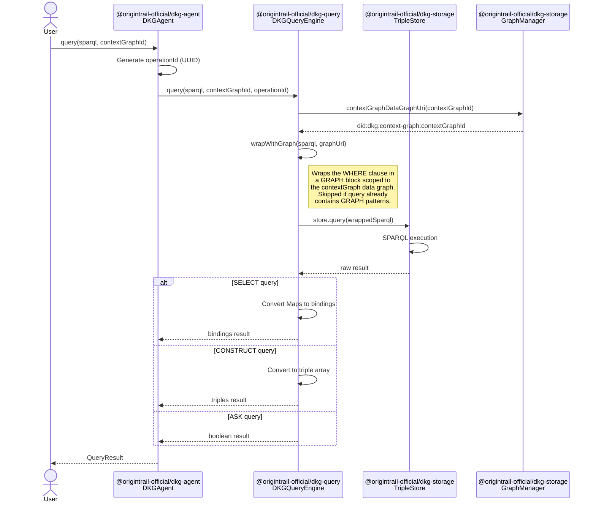
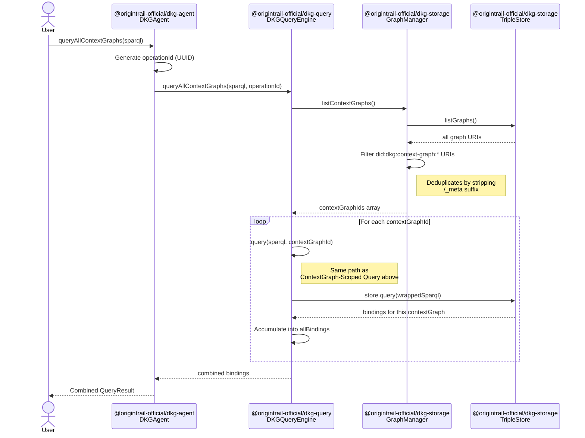
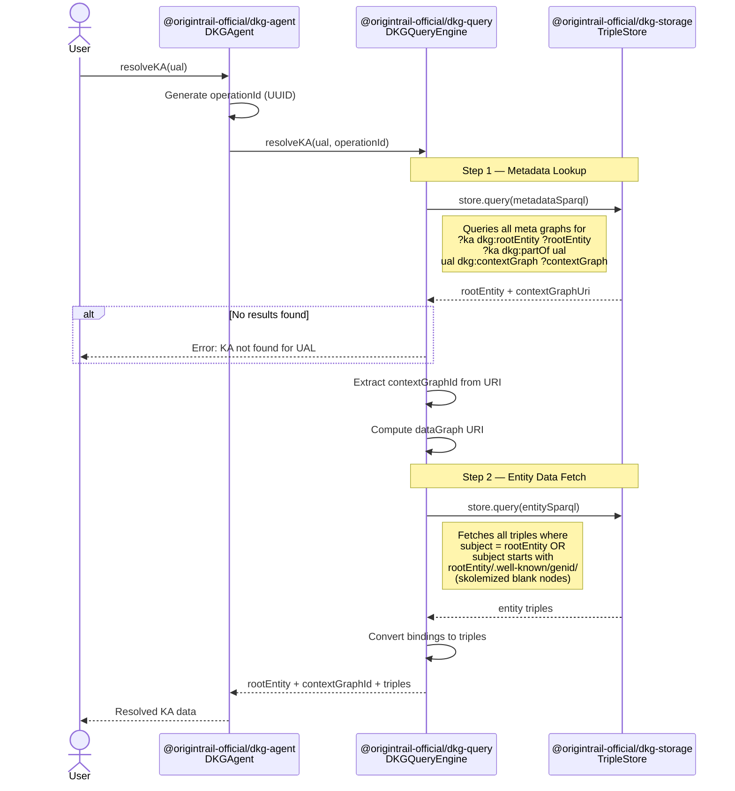

# Query Flow

Sequence diagrams for the three query paths in DKG V9: contextGraph-scoped queries,
cross-contextGraph queries, and entity resolution (resolveKA).

Every query generates an `operationId` (UUID) at the agent entry point. Log
format: `YYYY-MM-DD HH:MM:SS query <operationId> "message"`. This enables
cross-module tracing even though queries are local-only in Part 1.

## 1. ContextGraph-Scoped Query

The primary query path. All queries run against the local store — there is no
remote/federated querying in Part 1.



## 2. Cross-ContextGraph Query (queryAllContextGraphs)

Runs the same SPARQL against every known contextGraph and unions the results.



## 3. Entity Resolution (resolveKA)

Two-step lookup: find the KA's metadata in the meta graph, then fetch the
entity's data triples from the data graph.



## Data Flow Summary

```mermaid
flowchart LR
    subgraph User_API[User API]
        Q[query]
        QA[queryAllContextGraphs]
        R[resolveKA]
    end

    subgraph DKG_Query[@origintrail-official/dkg-query]
        QE[DKGQueryEngine]
    end

    subgraph DKG_Storage[@origintrail-official/dkg-storage]
        GM[GraphManager]
        TS[TripleStore]
    end

    Q --> QE
    QA --> QE
    R --> QE

    QE -->|graph scoping| GM
    QE -->|SPARQL| TS
    GM -->|listGraphs| TS
```
