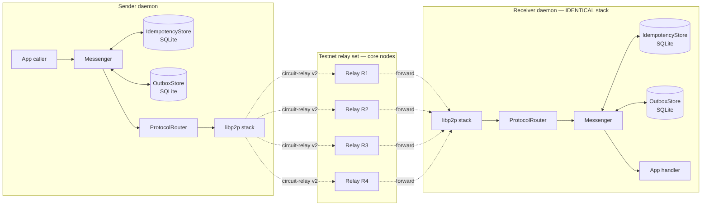
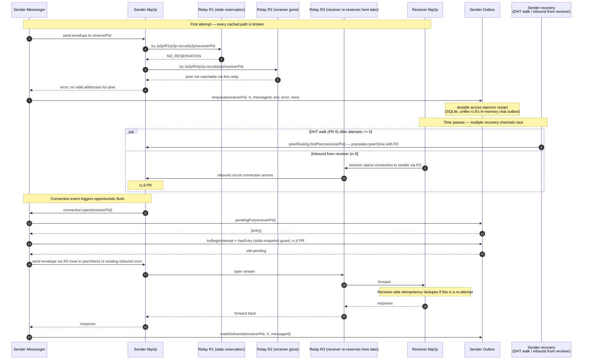

# Universal Messenger

> Status: shipping in `v10.0.0-rc.9`. All 8 short-message protocols now route through the substrate; per-message delivery + latency observable via `/api/slo`.

The Universal Messenger is the reliability substrate every short
peer-to-peer DKG protocol travels through. It generalises the chat-
specific outbox + receiver-dedup work from rc.8 (PRs #533, #534, #536,
#537, #538) into a single layer that wraps `ProtocolRouter.send` and
gives every caller — chat, skill request, query-remote, swm-sender-key,
private-access, join-request, storage-ack, verify-proposal — the same
delivery guarantees:

- **At-least-once delivery** with sender-side durable retry (survives
  daemon crash mid-retry).
- **Exactly-once application semantics** via receiver-side idempotency
  by `messageId`.
- **Stale-snapshot-safe retries** (the rc.9 #538 lesson, lifted into
  the generic substrate).
- **Caller-visible delivery state** — `{ delivered, queued, attempts,
  messageId }` so MCP / HTTP callers can surface "queued" vs "sent"
  to the operator.

This page is the architecture reference. Two siblings live alongside it:

- [`messenger-add-protocol.md`](./messenger-add-protocol.md) — recipe
  for migrating an existing protocol onto the Messenger, or adding a
  new short-message protocol.
- [`messenger-operator.md`](./messenger-operator.md) — how to read
  `/api/slo`, what `--relay-preferred` does, and how to debug a peer
  that "should be" reachable but isn't.

## Architecture

```
caller (chat, query, etc.)
  │
  ▼
Messenger.sendToPeer(peerId, protocol, payload, { messageId? })
  │  1. (sender-side) check `MessageIdempotencyStore` for direction='out':
  │       seen? → return cached response (re-issue path)
  │  2. wrap payload in `ReliableEnvelope { messageId, version, tsMs, payload }`
  │  3. ProtocolRouter.send (existing low-level wire I/O)
  │  4a. success → record `(peer, protocol, msgId, 'out')` in idempotency store
  │  4b. failure → enqueue in `ProtocolOutboxStore`; background tick + connect-flush retry
  ▼
ProtocolRouter.send  (unchanged; just wire I/O + path selection)
  │
  ▼
[ libp2p / circuit-relay / direct ]
  │
  ▼
ProtocolRouter receives
  │
  ▼
Messenger.register(protocol, handler)
  │  1. decode `ReliableEnvelope`
  │  2. check `MessageIdempotencyStore` for direction='in':
  │       seen + cached response → return cached response (no app handler call)
  │       seen + mark-only       → return RESPONSE_GONE
  │       not seen               → invoke handler(payload, peerId)
  │  3. record `(peer, protocol, msgId, 'in', responseBytes)`
  ▼
application handler (existing protocol-specific code)
```

The substrate is composed of:

1. **`ReliableEnvelope` proto** (`packages/core/src/proto/reliable-envelope.ts`)
   — uniform `{ messageId, version, tsMs, payload }` outer wrapper.
   The application payload (chat protobuf, JSON request, pipe-
   delimited frame) stays inside `payload` byte-identical.

2. **`MessageIdempotencyStore`** (interface in
   `packages/core/src/messenger-types.ts`; SQLite-backed in
   `packages/node-ui/src/db.ts`'s `SqliteMessageIdempotencyStore`) —
   keyed by `(peer, protocol, messageId, direction)`, with inline
   response cache up to 256 KiB and mark-only beyond.

3. **`ProtocolOutbox` + `ProtocolOutboxStore`**
   (`packages/core/src/protocol-outbox.ts`; SQLite-backed in
   `SqliteProtocolOutboxStore`) — durable send-side retry queue keyed
   by `(peer, protocol, messageId)`. Backoff ladder: 5s → 15s → 30s →
   60s → 5m → 30m → 2h, capped 24h.

4. **`Messenger`** class (`packages/agent/src/p2p/messenger.ts`) — wires
   the above together around `ProtocolRouter`. Provides `sendReliable`
   + `register` as the only public surface every protocol needs.
   Legacy `sendToPeer` is retained as a bare pass-through for any
   `/dkg/10.0.0/*` caller that hasn't migrated yet (none remain at
   rc.9 ship; the surface exists for future incremental migrations).

## Topology + sequence flows

The relay is a transparent libp2p hop — it sees Noise/TLS-encrypted
frames at the connection layer; the `ReliableEnvelope` + payload is
opaque to it, so the relay can't dedup, can't retry, and can't read
message content. Both daemons run the identical Messenger stack.
Whichever side initiates a send is labelled "sender" in the diagrams;
the same code paths exist on both nodes.

### Flow 0 — Topology



Key topology facts:

- Every agent daemon reserves on **2-4 relays simultaneously**
  (multi-reservation, rc.8 PR #526). The relay set today is the
  testnet core nodes; operators stand up their own via PR-7's
  `--relay-preferred` (see [`messenger-operator.md`](./messenger-operator.md)).
- The relay is a transparent libp2p hop: it forwards encrypted
  frames; the `ReliableEnvelope` is opaque to it.
- Both daemons run the identical Messenger stack — including the
  outbox. If sender→receiver path breaks, the **sender's** outbox
  holds the entry; the **sender's** tick + `connection:open` flushes
  it; the **receiver's** idempotency absorbs any duplicates.
- Failure modes live at the `SLib ↔ Relay ↔ RLib` boundary
  (reservation expired, receiver disconnected from a given relay,
  relay restarted, direct connection died). The substrate layer is
  what survives those failures.

### Flow 1 — Happy path

Applies to all 8 protocols. The relay forwards bytes opaquely.

```mermaid
sequenceDiagram
    autonumber
    participant SApp as Sender App
    participant SMS as Sender Messenger
    participant SIdem as Sender Idem
    participant SLib as Sender libp2p
    participant Relay as Relay R (one of N reserved)
    participant RLib as Receiver libp2p
    participant RMS as Receiver Messenger
    participant RIdem as Receiver Idem
    participant RApp as Receiver App

    Note over Relay: Sees Noise/TLS-encrypted frames only;<br/>ReliableEnvelope opaque to relay

    SApp->>SMS: sendReliable(receiverPid, "/dkg/10.0.1/X", payload)
    SMS->>SMS: messageId = uuid()
    SMS->>SIdem: check(receiverPid, X, messageId, 'out')
    SIdem-->>SMS: { seen: false }
    SMS->>SMS: env = ReliableEnvelope.encode({messageId, v:1, tsMs, payload})
    SMS->>SLib: ProtocolRouter.send via /p2p/relayPid/p2p-circuit/p2p/receiverPid
    SLib->>Relay: open circuit-relay-v2 stream
    Relay->>RLib: forward bytes (no inspection)
    RLib->>RMS: deliver to Messenger.register wrapper for X
    RMS->>RMS: env = ReliableEnvelope.decode(bytes)
    RMS->>RIdem: check(senderPid, X, env.messageId, 'in')
    alt duplicate receive (e.g. multi-path race)
        RIdem-->>RMS: { seen: true, cachedResponse }
        RMS-->>RLib: respond with cached (or RESPONSE_GONE if mark-only)
    else first receive
        RIdem-->>RMS: { seen: false }
        RMS->>RApp: handler(env.payload, senderPid)
        RApp-->>RMS: responseBytes
        RMS->>RIdem: record(senderPid, X, messageId, 'in', responseBytes if cached)
        RMS-->>RLib: respond(responseBytes)
    end
    RLib->>Relay: response bytes
    Relay->>SLib: forward
    SLib->>SMS: response
    SMS->>SIdem: record(receiverPid, X, messageId, 'out', response)
    SMS-->>SApp: { delivered: true, response, messageId, attempts: 1 }
```

The receiver-side app handler never sees the envelope or the relay
topology. It receives the original `payload` (its existing protobuf /
JSON bytes, unchanged from rc.8) and returns its existing
`responseBytes`. Reliability + dedup happens transparently around it
on **both sides**.

### Flow 2 — Path breaks → outbox → recovery → flush

The dominant failure mode in the rc.8 8h soak. Shows two relays in
different broken states + how the recovery primitives heal the path.



This is exactly the failure recipe the rc.8 8h soak surfaced. The new
substrate makes outbox durability the floor (no chat-specific limit);
PR-5 adds the DHT-walk-on-stall recovery channel on top of the
inbound-from-receiver path that rc.8 already provides.

### Flow 3 — Multi-path parallel send (PR-4)

Sender races N relays in parallel; whichever forwards first wins;
receiver dedup absorbs anything from losing paths.

```mermaid
sequenceDiagram
    autonumber
    participant SMS as Sender Messenger
    participant SLib as Sender libp2p
    participant R1 as Relay R1
    participant R2 as Relay R2
    participant R3 as Relay R3
    participant RLib as Receiver libp2p
    participant RMS as Receiver Messenger
    participant RIdem as Receiver Idem
    participant RApp as Receiver App

    SMS->>SLib: send(env, {parallelPaths: 2})
    SLib->>SLib: enumerate from peerStore + getConnections() (reuses rc.8 PR #537 walk)
    par parallel newStream on diverse relays
        SLib->>R1: open circuit stream
    and
        SLib->>R2: open circuit stream
    end

    R1-xRLib: stream forward fails (relay dropped reservation between enum and dial)
    R2->>RLib: stream forward succeeds
    RLib->>RMS: handler wrapper (path R2)
    RMS->>RIdem: check(senderPid, X, env.messageId, 'in')
    RIdem-->>RMS: { seen: false }
    RMS->>RApp: handler runs once
    RApp-->>RMS: responseBytes
    RMS->>RIdem: record(... 'in', responseBytes)

    Note over R3,RLib: If a slower path arrived later (parallelPaths > 2):<br/>idempotency returns cached; RApp NOT called again

    R2-->>SLib: response (winner)
    SLib->>SLib: abort loser streams as redundant
    SLib-->>SMS: response from R2
```

Critical guard in PR-4: `parallelPaths > 1` is only safe because every
substrate-routed protocol lives on the `/dkg/10.0.1/*` prefix where
receiver dedup is mandatory. Default `parallelPaths` per protocol is
in the [per-protocol coverage table](#per-protocol-coverage) below.
`/storage-ack` + `/verify-proposal` stay at **1** because they
already fan out at the app layer — N=3 would be 9x amplification.

## Wire format

Every message on `/dkg/10.0.1/*` is `ReliableEnvelope` encoded:

```protobuf
message ReliableEnvelope {
  string message_id = 1;     // UUID v4, Messenger-managed
  uint32 version = 2;        // 1 = current
  uint64 ts_ms = 3;          // sender wall-clock at send time
  bytes payload = 4;         // original protocol bytes (existing protobuf, JSON, etc.)
}
```

**Protocol prefix bump from `/dkg/10.0.0/*` → `/dkg/10.0.1/*`** is the
coarse-grained compatibility break that signals "envelope wrapper now
present"; the `version` field inside the envelope handles fine-grained
evolution within the prefix. Hard cutover — no negotiation logic, no
codepath that mixes wrapped + bare frames. Two nodes on different
prefixes simply don't talk on the migrated protocol until both reach
rc.9.

## V12 schema (PR-1)

The SQLite-backed stores live in `DashboardDB` (`packages/node-ui/src/db.ts`).
V12 migration is pure additive — chat continues to write to
`chat_messages.message_id` until PR-3 cuts over.

```sql
CREATE TABLE message_idempotency (
  peer_id TEXT NOT NULL,
  protocol TEXT NOT NULL,
  message_id TEXT NOT NULL,
  direction TEXT NOT NULL CHECK (direction IN ('in', 'out')),
  response_blob BLOB,            -- inline cache up to 256 KiB; NULL = mark-only
  response_size INTEGER NOT NULL DEFAULT 0,
  ts INTEGER NOT NULL,
  PRIMARY KEY (peer_id, protocol, message_id, direction)
);
CREATE INDEX idx_idem_ts ON message_idempotency(ts);

CREATE TABLE protocol_outbox (
  peer_id TEXT NOT NULL,
  protocol TEXT NOT NULL,
  message_id TEXT NOT NULL,
  payload BLOB NOT NULL,         -- envelope-wrapped wire bytes (not raw app payload)
  attempts INTEGER NOT NULL DEFAULT 0,
  first_failure_at INTEGER NOT NULL,
  last_attempt_at INTEGER NOT NULL,
  next_attempt_at INTEGER NOT NULL,
  last_error TEXT,
  PRIMARY KEY (peer_id, protocol, message_id)
);
CREATE INDEX idx_outbox_next_attempt ON protocol_outbox(next_attempt_at);
```

Periodic prune (24h TTL) runs in `DashboardDB.prune()`.

## Response caching policy

Fixed at 256 KiB inline cache. No per-protocol or per-call knob.

| Response size                       | Behaviour                                                                                |
| ----------------------------------- | ---------------------------------------------------------------------------------------- |
| `<=` 256 KiB                        | Stored inline in `response_blob`. Duplicate receive returns cached bytes.                |
| `>` 256 KiB                         | Stored mark-only (`response_blob = NULL`, `response_size` set). Duplicate → RESPONSE_GONE. |

Callers on the receive of `RESPONSE_GONE` decide whether to re-issue
with a fresh `messageId` (acceptable for `/query-remote` since SPARQL
is idempotent at the app layer) or surface a terminal error.

## Per-protocol coverage

All 8 short-message protocols ship on the substrate in `v10.0.0-rc.9`.
The migration recipe (for adding a hypothetical 9th protocol later) is
in [`messenger-add-protocol.md`](./messenger-add-protocol.md).

| Protocol                       | Migrated in | parallelPaths | Notes                                                                                                  |
| ------------------------------ | ----------- | ------------- | ------------------------------------------------------------------------------------------------------ |
| `/dkg/10.0.1/message` (chat)   | PR-3        | 2 (default)   | Pilot. Wire-format break replaces `chat_messages.message_id` index uniqueness.                         |
| `/dkg/10.0.1/skill_request`    | PR-3        | 1             | Migrated alongside chat (shares `agent.sendMessage` path).                                             |
| `/dkg/10.0.1/swm-sender-key`   | PR-8        | 1             | Synchronous: SWM-key send treats `queued` as a hard failure (epoch setup blocks).                      |
| `/dkg/10.0.1/private-access`   | PR-8        | 1             | Synchronous: `AccessClient.requestAccess` surfaces `queued` as a rejected request via `AccessSendSurface`. |
| `/dkg/10.0.1/query-remote`     | PR-9        | 1             | Synchronous; `sendQueryReliable()` retries up to 2× on `RESPONSE_GONE` with a fresh `messageId` (SPARQL is app-layer idempotent). |
| `/dkg/10.0.1/join-request`     | PR-10       | 1             | Synchronous; `JoinApprovalRetryQueue` deleted. Substrate outbox now drives retries on the same 30s tick + on-connect flush — and SQLite-backed so they survive daemon restart. Operator diagnostic `GET /api/context-graphs/pending-redeliveries` returns `[]` until a substrate-backed view ships. |
| `/dkg/10.0.1/storage-ack`      | PR-11       | **1**         | App-level quorum (`ACKCollector`) untouched; transport `sendP2P → messenger.sendReliable`. `parallelPaths=1` (transport-side; app already fans out to N core peers — `parallelPaths>1` would 9x the wire load for no SLO win). Substrate `queued` returns surface as a per-peer throw, picked up by `ACKCollector`'s `MAX_RETRIES=3` loop. |
| `/dkg/10.0.1/verify-proposal`  | PR-11       | **1**         | Same shape + same rationale as `/storage-ack` — app-level quorum (`VerifyCollector`) untouched; only the transport swaps. `parallelPaths=1` for the same amplification reason. `/dkg/10.0.0/verify-approval` stays bare (not a substrate caller). |

## Recovery primitives

- **Outbox-driven retry** — backoff ladder above. SQLite-persisted;
  survives daemon restart.
- **Opportunistic-flush on `connection:open`** — when a peer
  reconnects, drain its `pendingFor(peer)` queue immediately rather
  than wait for backoff. Stale-snapshot-safe via `hasEntry` guard
  (rc.8 #538 lesson, lifted into the substrate).
- **`parallelPaths`** _(PR-4)_ — `ProtocolRouter.send` races up to N
  live connections in parallel via `Promise.any`-equivalent; the first
  successful response wins, loser streams are aborted. Caller passes
  `parallelPaths` through `SendOptions`:

  ```ts
  await router.send(peerId, '/dkg/10.0.1/X', payload, { parallelPaths: 3 });
  ```

  Two failure modes both fall through to the existing single-path
  retry loop (so cold-peer behaviour is unchanged):
  1. Fewer than 2 live connections — multi-path adds no value, skipped.
  2. All N parallel attempts fail — single-path then runs with the full
     resolver + dialProtocol + 3-retry budget.

  **SAFETY invariant.** `parallelPaths > 1` is only safe for
  protocols on the `/dkg/10.0.1/*` prefix (or later substrate
  prefixes) where the receiver registers via `Messenger.register` and
  dedupes by `messageId` server-side. Older `/dkg/10.0.0/*` callers
  MUST keep `parallelPaths = 1` (the default) — without receiver
  dedup, losing-path bytes that reach the receiver cause the handler
  to fire twice. **This is a wire-version invariant, not a runtime
  check** — the sender cannot inspect the receiver's substrate
  version, the protocol-prefix string IS the contract.

  Per-protocol defaults are catalogued in the
  [per-protocol coverage table](#per-protocol-coverage) below.
  Diversity strategy v1: take up to N candidates from the natural
  connection list. In practice multi-reservation gives us one
  connection per relay, so the natural list already provides path
  diversity. Relay-grouped selection is a follow-up if post-ship soak
  shows duplicate-relay amplification matters.
- **DHT walk on stall** _(PR-5)_ — when an outbox entry hits
  `OUTBOX_STALL_THRESHOLD` (5) attempts on an address-resolution
  error (e.g. `"no valid addresses for peer"`, `"NO_RESERVATION"`),
  the Messenger fires `libp2p.peerRouting.findPeer(pid)` in the
  background via the injected `resolvePeer` hook. The walk
  repopulates `peerStore` for the next retry; failures are logged
  and never block backoff.

  Two safety knobs:
  - **`DHT_WALK_TIMEOUT_MS`** = 10 s — hard cap so a partitioned
    network doesn't leave the walk spinning.
  - **`DHT_WALK_RATE_LIMIT_MS`** = 5 min per peer — prevents the
    retry tick from burning DHT bandwidth on still-fresh k-bucket
    data.

  Why the threshold = 5: the default backoff ladder (5s → 15s → 30s
  → 60s → 5m → 30m → 2h) puts attempt 5 at the boundary between
  fast sub-minute retries (likely transient blip) and multi-minute
  retries (genuine reachability degradation — when a DHT walk earns
  its cost).

  Wiring lives in `cli/src/daemon/lifecycle.ts`'s `DKGAgent`
  construction — the `Messenger` itself never imports libp2p, so the
  substrate stays test-friendly.
- **Gossip peer-hints** _(PR-6, cancelled per Gate B)_ — Gate B
  decision was to skip; DHT walk + inbound-from-receiver are
  sufficient. If a post-ship soak shows DHT walk insufficient, PR-6
  lands as a fast follow-up under the original gossip-hints design.

## SLO

### Clock definition

The per-message latency clock starts the **first time**
`Messenger.sendReliable(peerId, protocol, payload)` is invoked for a
given `(peer, protocol, messageId)` triple, and stops when **any**
attempt (initial send or any background outbox retry) resolves to
`{ delivered: true }`. Concretely:

- Initial wire I/O time is included.
- Time spent waiting in the outbox between failed attempts is included.
- Re-issues with a fresh `messageId` (e.g. `RESPONSE_GONE` retry on
  `/query-remote` — see PR-9) are **separate** SLO samples; each
  `messageId` is its own user-visible operation.
- Receiver-side dedup hits (`sentBefore.seen`) are recorded as
  delivered with zero latency (the caller's effective "perceived" RTT).

This is the operator-visible "I clicked send → it arrived" time, which
is what the 99.9%/15s ship-gate target measures.

### Target

| Protocol family                                                          | SLO       |
| ------------------------------------------------------------------------ | --------- |
| chat / skill_request / query-remote                                      | ≥ 99%/15s |
| swm-sender-key / private-access / join-request / storage-ack / verify-proposal | ≥ 99.5%/15s |

The ship-gate runs the soak script (`scripts/libp2p-soak-test.sh`)
across both Lex and Miles for an overnight run; the `/api/slo`
endpoint is the source of truth for go/no-go on `v10.0.0-rc.9` tag.

### `/api/slo` endpoint (PR-12)

Localhost-only by default (binds to `127.0.0.1` like every other
`/api/*` route; same `Authorization: Bearer` requirement). One-shot
snapshot of the in-memory histogram — no cumulative on-disk store.
Returns the latest 1000 samples per protocol (`DEFAULT_SLO_WINDOW_SAMPLES`).

```
GET /api/slo
Authorization: Bearer <token from ~/.dkg/auth.token>
```

```jsonc
{
  "protocols": {
    "/dkg/10.0.1/message": {
      "samples": 847,        // current window size (≤ DEFAULT_SLO_WINDOW_SAMPLES)
      "p50Ms": 42,           // nearest-rank percentile over samples
      "p95Ms": 380,
      "p99Ms": 1240,
      "delivered": 1602,     // monotonic counter (since daemon start)
      "queued": 14           // monotonic counter; "queued" = first send failed → outbox
    },
    "/dkg/10.0.1/storage-ack": { ... }
  },
  // rc.9 PR-A (SWM reliable fan-out, Step 0): two new sections,
  // additive — existing consumers that only parse `protocols` still
  // work byte-identically.
  "gossip": {
    "publishFailures": {     // per-cgId count of `gossip.publish` errors
      "did:dkg:context-graph:lex/playground": 3
    },
    // Counts evicted into here once the per-cgId tracking map crosses
    // its hard cap (default 1024 distinct cgIds). Always 0 in normal
    // deployments; non-zero only when failing publishes against
    // thousands of distinct cgIds.
    "publishFailuresOverflow": 0,
    // Sticky boolean — true once the eviction path has fired. Means
    // the per-cgId breakdown is partial; the grand total
    // (sum(publishFailures) + publishFailuresOverflow) is still
    // accurate.
    "publishFailuresTruncated": false
  },
  "swm": {
    "redundantApplies": {    // per-cgId redundant-apply count (RFC-003 Concern-2)
      "did:dkg:context-graph:lex/playground": 5
    },
    // Sticky boolean — true once the seenShareOps cap eviction had to
    // trim a still-live (non-TTL-expired) entry. When true,
    // `redundantApplies` is a lower bound for the operating window.
    // Operators can raise `seenOpsMaxSize` (default 50_000) for
    // higher-throughput nodes.
    "redundantAppliesLowerBound": false,
    // Sum of per-cgId counters evicted into overflow once the per-cgId
    // tracking map crosses its hard cap (default 1024 distinct cgIds).
    // Always 0 in normal deployments; non-zero only when receiving
    // duplicate applies against thousands of distinct cgIds.
    "redundantAppliesOverflow": 0,
    // Sticky boolean — true once the per-cgId cap eviction has fired.
    // Means the `redundantApplies` breakdown is partial; the grand
    // total is still `sum(redundantApplies) + redundantAppliesOverflow`.
    "redundantAppliesTruncated": false
  }
}
```

Empty body `{ "protocols": {}, "gossip": {...}, "swm": {...} }` with
all-zero counters means no substrate traffic has flowed and no SWM
share has either failed at gossip or been applied — typically a freshly
restarted idle daemon.

### Reading guide

- **Did we hit SLO?** For each protocol where you care about the
  target, check `p99Ms` against the 15000 ms budget. If `p99Ms <=
  15000`, that protocol is meeting the latency target for the last
  `samples` operations.
- **Delivery rate.** `delivered / (delivered + queued)` is the
  approximate single-attempt success rate. The substrate guarantees
  at-least-once delivery, so `queued` entries are eventually delivered
  too — they just took at least one retry. A high `queued` count with
  matching `delivered` growth means the substrate is doing its job;
  high `queued` with stalled `delivered` is the warning sign (the
  peer is unreachable for an extended period).
- **No `samples`, only `queued`?** The protocol has only ever seen
  failed first attempts — typically a brand-new peer where address
  resolution hasn't settled. Watch for `delivered` to start climbing
  as the outbox retries land; PR-5's DHT-walk-on-stall should kick in
  after 5 failed attempts.
- **Soak runs.** `scripts/libp2p-soak-test.sh` writes a per-cycle
  snapshot of `/api/slo` to `~/.dkg/soak-test-*/slo.jsonl` alongside
  the existing `preflight.jsonl`, `sends.jsonl`, `inbox.jsonl`. The
  human-readable summary line in `main.log` reads e.g.
  `slo: message=d12/q0 p99=145ms, query-remote=d3/q0 p99=890ms, ...`.

### Caveats

- The histogram is **in-memory only**. Daemon restart resets all
  counters and samples. The SQLite outbox itself survives restart;
  the SLO view does not.
- Samples are recorded only for protocols routed through the
  substrate. Protocols still on `/dkg/10.0.0/*` (any not in the
  per-protocol coverage table above) are invisible to `/api/slo`.

## Open questions / future work

- Multi-recipient fan-out (broadcast to N peers with single
  `messageId`) — out of scope for rc.9; explored in a follow-up RFC.
- Cross-process idempotency (multiple daemons sharing the same store)
  — not needed today (one daemon per node) but the schema accommodates it.
- Operator-relay infrastructure — code-side ships in PR-7
  (`--relay-preferred`); actual relay provisioning is an out-of-band
  ops track. See [`messenger-operator.md`](./messenger-operator.md).
- `Messenger.sendToPeer` legacy pass-through: kept at rc.9 for any
  future incremental migration; may be deprecated in a later rc once
  the substrate has had enough operator-time to confirm no surprise
  caller emerges.
- Persistent SLO histogram: today the histogram is in-memory only
  (resets on daemon restart). If operators report that they need
  multi-day rolling SLO views, a follow-up RFC would persist the
  histogram to a `slo_samples` SQLite table with a windowed prune.
