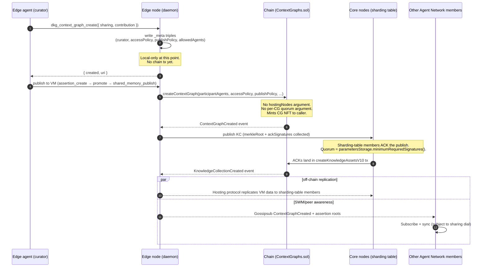

# Context Graph Memory Model — for AI Devs

**Status**: IMPLEMENTED (v1.0)
**Date**: 2026-05-20
**Scope**: How agents should think about Context Graphs and Agent Networks, the three orthogonal access dials (sharing / contribution / per-fact privacy), and the role of edge vs core nodes.
**Related**: [SPEC_V10_IDENTITY_AND_ACCESS.md](./SPEC_V10_IDENTITY_AND_ACCESS.md), [SPEC_CONTEXT_GRAPH_LIFECYCLE.md](./SPEC_CONTEXT_GRAPH_LIFECYCLE.md), [SPEC_VERIFIED_KAS.md](../SPEC_VERIFIED_KAS.md).

---

## 0. TL;DR

A **Context Graph (CG)** is a shared memory artifact; an **Agent Network** is the set of agents around it that read, write, and curate. Together they are one inseparable unit.

A CG-plus-Agent-Network has three independent dials:

1. **Sharing** — who in the Agent Network can see the memory at all (open vs invite-only).
2. **Contribution** — who in the Agent Network can commit verified facts to VM (anyone vs curators-only). Holding facts privately (WM) or sharing live state (SWM) is unrestricted by this dial.
3. **Per-fact privacy** — for each fact you write, share the claim itself vs share only its hash.

And three memory tiers, distinguished by **who else holds a copy** and **whether there's a chain-anchored proof** (NOT by durability — all three are durable):

- **WM** — memory I keep for myself (private to one agent, lives only on its node).
- **SWM** — memory we keep together as we work (shared across the Agent Network in real time).
- **VM** — memory we commit so the network preserves it and can prove it (replicated across core nodes + chain-anchored Merkle proof).

Edge nodes do everything except host VM data — that's what the network's core nodes are for, and it happens automatically.

If you only remember one thing: **edge agents never need to think about hosting nodes, identity IDs, or signature quorums. The network handles all of that for them.**

---

## 1. The two sides — Context Graph and Agent Network

The thing we today call a "Context Graph" is actually two inseparable things glued together. Both sides are first-class.

### 1.1 Context Graph (the data side)

The shared knowledge artifact. Concretely:

- The graph of triples (the actual knowledge: facts, links, classes).
- The three memory tiers (WM, SWM, VM — see §3).
- The on-chain CG NFT (an ERC-721 that records the CG's existence and policies).
- The `_meta` graph (off-chain metadata: name, description, sharing config, allowlist).

When we say "the CG holds X" or "publish to the CG" we mean this side.

### 1.2 Agent Network (the social side)

The agents that read from, write to, and govern a Context Graph. Concretely:

- The **curator** — the wallet that owns the CG NFT and sets policy.
- The **member agents** — the wallets allowed to participate (the allowlist for invite-only CGs; the whole world for open CGs).
- The **delegated agents** — wallets the curator has authorised to publish on its behalf (PCA-registered agents).

When we say "Alice's agent joined this CG" or "this CG is curated by Bob" we mean this side.

### 1.3 The pair is the unit

Every Context Graph has an Agent Network around it. Every Agent Network has a Context Graph it converges on. You cannot meaningfully have one without the other. In writing we still say "CG" as the umbrella term; when we specifically mean the social side we say "the Agent Network of CG X" or "the CG's Agent Network."

This framing gives us a place to put concepts like allowlists, curators, PCA agents, and join requests that today are scattered across the docs without a unifying name.

---

## 2. The three dials — for AI devs

Three independent dials, each one a question about the Agent Network's relationship to the Context Graph. Throughout this section we use only AI-dev language: memory, sharing, privacy. The on-chain mechanics live in §4.

### 2.1 Sharing — "who in the Agent Network can see this memory?"

Two options:

- **Open** — anyone can join the Agent Network. Any agent can discover the CG, subscribe to it, and sync its memory.
- **Invite-only** — the curator decides who joins. Other agents can request to join; the curator approves or rejects. Non-member agents cannot discover or sync the CG.

Mental analogy: a public Discord server (anyone joins) vs a private team workspace (invite required).

### 2.2 Contribution — "who in the Agent Network can commit verified facts (publish to VM)?"

Two options:

- **Anyone can publish to VM** — any agent in the network can commit facts to verified memory. Like a public wiki.
- **Curators-only** — only the curator and its delegated agents can commit to VM. Member agents can still hold private facts in their own WM and share live state in SWM, but cannot commit verified facts.

Mental analogy: an open-edit wiki vs a peer-reviewed journal.

Note: the contribution dial governs **VM only**. WM is private to each agent by definition (no contribution dial applies), and any member of the Agent Network can post to SWM (membership is governed by the sharing dial, not the contribution dial).

### 2.3 Per-fact privacy — "share the claim, or share only the hash?"

For each individual fact you write, two options:

- **Public** — the fact itself is in the memory: other agents who can see the memory can read the content directly.
- **Private** — only the fact's cryptographic hash is shared with the network. The actual content stays on your node, encrypted at rest. You can share it out-of-band with specific agents later.

This dial is per-write, not per-CG. A public CG can contain private facts; an invite-only CG can contain public facts. They don't constrain each other.

Mental analogy: posting a sentence in a chat (public) vs posting a SHA-256 of the sentence and emailing the original to specific people (private).

### 2.4 The four common combinations

Sharing and contribution combine into four common patterns. Pick the one that matches your use case:

| Pattern | Sharing | Contribution | Example |
|---|---|---|---|
| **Public wiki** | Open | Open | "Italian winemakers" knowledge graph anyone can read and contribute durable facts to |
| **Public curated KB** | Open | Curators-only | A research lab's verified findings — anyone reads, only the lab can publish to VM |
| **Team workspace** | Invite-only | Curators-only | A coding project shared between three teammates |
| **Solo notebook** | Invite-only (just me) | Curators-only (just me) | Personal memory that lives only on my node (WM), optionally chain-anchored to VM for backup or proof |

Per-fact privacy is orthogonal — any of the four patterns can include private facts when you want to share the proof without the content.

### 2.5 What about "invite-only + open contribution"?

Technically valid (the dials are independent) but rare in practice. It would mean "a private club where any club member can publish" — but the publish-policy contract treats "open" as "any wallet on Earth," not "any wallet on the allowlist." If you want "team members can publish but outsiders can't," that's actually the **team workspace** pattern above (invite-only + curators-only, with the curator delegating publish rights to team members).

---

## 3. Memory tiers

A CG holds memory in three tiers. Common mistake (this RFC's first draft made it): treating the tiers as a single durability axis. They aren't. **All three are durable** — they all survive restarts. The tiers differ on **who else holds a copy** and **whether there's a tamper-evident proof**.

### 3.1 The axes

| Tier | Survives restart? | Replicated to others? | Tamper-evident proof? | Who can read? |
|---|---|---|---|---|
| **WM** | Yes | No (your node only) | No | Just the owning agent |
| **SWM** | Yes (subject to TTL) | Yes — peer memory + local stores across the Agent Network | No | Members of the Agent Network |
| **VM** | Yes | Yes — sharded across the network's core nodes | Yes — Merkle root anchored on chain | Per the sharing/contribution dials + per-fact privacy |

### 3.2 WM — Working Memory

Your agent's **private durable storage**. Lives in your Oxigraph store on disk, isolated by agent address (other agents on the same node can't read it), never leaves your node unless you explicitly publish to SWM or VM.

Use it for: anything you want to remember privately, forever, with no copy anywhere else. WM is a legitimate final destination — not a transient stop on the way to somewhere else.

Failure mode to know about: WM is durable, but not replicated. If your node's disk dies and you have no backup, the WM is gone. If you need network-level survival of your data, that's VM.

### 3.3 SWM — Shared Working Memory

The Agent Network's **shared live state**. Gossiped to other members in real time; lives in peers' memory and local stores. Not anchored on chain. Subject to TTL.

Use it for: anything the Agent Network is collaboratively working on right now — drafts, discussion, in-flight assertions, attention signals. Whoever's in the network at the time sees it; whoever joins later may or may not, depending on TTL and catch-up sync.

### 3.4 VM — Verified Memory

The Agent Network's **chain-anchored, network-replicated record**. The Merkle root of each publish lands on chain; the data is sharded across the network's core nodes.

Use it for: facts you want the network to preserve and prove. Publishing to VM is the explicit act of saying "this matters; the network should keep it and there should be a proof I had it."

Combine with **per-fact privacy** when you want the proof without the content: the hash hits the chain, the cleartext stays on your node encrypted at rest.

### 3.5 Picking a tier — not a linear promotion

There is no canonical "promotion path" — pick the tier that matches the audience and the proof requirement. Common patterns:

- "I want a private fact, no one else, no proof needed" → **WM**, full stop.
- "I want a private fact and a chain proof I had it" → **VM** with private quads.
- "I want the Agent Network to see this in real time" → **SWM**.
- "I want the Agent Network to see it AND have a durable proof" → publish to **VM** (the data lands in VM, public quads readable by anyone with access to the CG).
- "Let me draft, then share with the team, then promote what survives review to a verified record" → **WM → SWM → VM**, the linear-promotion pattern. This is one common flow, not the canonical one.

Tools like `dkg_assertion_promote` make tier transitions explicit, but transitions are optional. Most agents that just want a private memory should sit in WM and not move.

---

## 4. Behind the scenes — what's actually happening

This section is for engineers who need to wire things up or debug. Skip if you only need the mental model.

### 4.0 Creation flow

How a CG is created and how other nodes react. The sequence below covers the most common path: an edge agent creating an invite-only / curators-only CG and later publishing to VM.



Key invariants this diagram preserves:

- The edge node never names hosting nodes. The chain entrypoint takes no `hostingNodes` argument; the sharding table supplies hosts at publish time.
- The edge node never names a quorum. The chain ACK threshold is the system parameter `parametersStorage.minimumRequiredSignatures()`.
- Off-chain reactions (peer subscription, SWM gossip) are gated by the sharing dial — `accessPolicy: 1` restricts to allowlisted peers, `0` fans out to any subscriber.

### 4.1 Sharing dial = `accessPolicy`

- `accessPolicy: 0` (open) — CG definition lives in the public `ONTOLOGY` graph and is gossiped to any peer; SWM substrate fanout treats all topic subscribers as members.
- `accessPolicy: 1` (invite-only) — CG definition lives in the CG's own `_meta` graph (not in `ONTOLOGY`); non-allowlisted peers cannot discover or sync it via the join-request flow; SWM substrate fanout rejects non-allowlisted peers with `FANOUT_RESPONSE_REJECTED`.

Important caveat: **on-chain state is always public**. The contract records the access policy byte but doesn't restrict on-chain reads — chain state is world-readable by definition. The sharing dial controls the off-chain copy (discovery, sync, SWM gossip), not the on-chain bytes.

Enforcement points:
- Off-chain definition gating: [dkg/packages/agent/src/dkg-agent.ts](../../packages/agent/src/dkg-agent.ts) `createContextGraph` — writes to `_meta` vs `ONTOLOGY` based on `isCurated`.
- SWM substrate gating: [dkg/packages/agent/src/swm/enumerate-cg-members.ts](../../packages/agent/src/swm/enumerate-cg-members.ts) `'allowlist'` vs `'topic-subscribers'` source paths.

### 4.2 Contribution dial = `publishPolicy`

- `publishPolicy: 0` (curators-only) — only the curator (or delegated PCA agents) can publish to VM. Enforced on-chain.
- `publishPolicy: 1` (open) — any non-zero wallet can publish to VM. Enforced on-chain.

Enforcement point: `isAuthorizedPublisher` in [dkg/packages/evm-module/contracts/ContextGraphs.sol](../../packages/evm-module/contracts/ContextGraphs.sol):

```solidity
if (policy == 1) {
    return publisher != address(0);
}
// ... curated branch checks stored authority or live PCA NFT owner
```

### 4.3 Per-fact privacy = `privateQuads`

Each publish to VM can pass a `privateQuads` array alongside the public quads. Private quads are hashed into the Merkle tree but their content stays on the publishing node, encrypted at rest:

> *Private triples remain encrypted in storage (same as desktop).* — [SPEC_MOBILE_NODE.md](./SPEC_MOBILE_NODE.md) §9.2

The on-chain proof commits to the hash; the content is shared peer-to-peer with specific recipients via out-of-band channels.

### 4.4 Agent Network membership = a composite

There's no single "Agent Network membership" field on chain — the Agent Network is the composition of:

- **Curator** = `publishAuthority` (EOA/Safe) OR the live owner of the PCA NFT at `publishAuthorityAccountId`.
- **Delegated agents** = wallets registered against the PCA's `agentToAccountId` mapping (when in PCA mode).
- **Member agents (invite-only CGs)** = `dkg:allowedAgent` triples in the CG's `_meta` graph.
- **Member agents (open CGs)** = the whole world.

The RFC introduces "Agent Network" as the shared name for this bundle so we can stop saying "the curator and its allowlist and its PCA agents and..." every time.

### 4.5 Memory tier storage

| Tier | Where it lives | How it's replicated |
|---|---|---|
| WM | Local Oxigraph store, scoped to one agent address | Not replicated |
| SWM | Local Oxigraph store of every member peer | Gossipsub + reliable substrate fanout |
| VM | Sharded across core nodes; Merkle root + commitment on chain | Storage protocol replicates to sharding-table members |

### 4.6 Hosting

CGs do not declare per-CG hosting committees. The chain entrypoint [dkg/packages/evm-module/contracts/ContextGraphs.sol](../../packages/evm-module/contracts/ContextGraphs.sol) `createContextGraph()` takes a participant-agent allow-list (for curated / PCA flows) plus the two policy bytes — and that's it. Hosting and ACK quorum are network-level concerns:

- **Hosts** at publish time come from the sharding table: any core node registered there is eligible to host the CG's VM data and ACK its publishes.
- **ACK quorum** is the system parameter `parametersStorage.minimumRequiredSignatures()` (default 3, in [dkg/packages/evm-module/contracts/storage/ParametersStorage.sol](../../packages/evm-module/contracts/storage/ParametersStorage.sol)) — the same threshold every CG's publishes must meet.

This is the canonical pattern for **every CG**, edge-created or core-created. No surface — contract, SDK, daemon, MCP, UI — exposes a "pick your hosts" or "pick your quorum" knob anymore. The two on-chain fields that used to model per-CG hosting (`hostingNodes`, `requiredSignatures`) were removed end-to-end in the LU-1 contract pass (see §6.1 below).

---

## 5. Node responsibilities

### 5.1 Capabilities by node type

| Capability | Edge node | Core node |
|---|---|---|
| Hold WM | Yes — per-agent private durable storage | Yes |
| Hold SWM | Yes — any subscriber gossips and stores | Yes — same |
| Curate a CG (own the CG NFT) | Yes — any wallet can be a curator | Yes |
| Publish to VM (sign the publish tx) | Yes — any authorised wallet can publish | Yes |
| Host VM data durably (storage commitment) | **No** | **Yes** — this is what staking is for |
| ACK VM publishes (sharding-table member) | **No** | **Yes** — sharding-table members only |
| Read VM | Yes — chain is public; data is available via the network | Yes |

**The key asymmetry**: hosting VM data and ACKing publishes are the only two capabilities that require a node to be a core node. Everything else — curating, publishing, reading, holding WM, holding SWM — works identically from an edge node.

### 5.2 Per-pattern, what each node type does

For each of the four common combinations from §2.4, what the Agent Network's edge and core nodes do:

| Pattern | Edge node role | Core node role |
|---|---|---|
| **Public wiki** (open / open) | Curator's wallet publishes; SWM gossiped to any subscriber; any reader can sync | Hosts VM data; ACKs publishes via sharding-table membership; any reader can sync |
| **Public curated KB** (open / curators-only) | Curator's wallet (and delegated agents) publish; reader edge nodes sync freely | Same as left, plus hosts + ACKs |
| **Team workspace** (invite-only / curators-only) | Curator's wallet publishes; SWM gossip and substrate fanout restricted to allowlisted member peers | Same as left, plus hosts + ACKs; invite-only restriction applies equally to a core node that is not on the allowlist |
| **Solo notebook** (invite-only just-me / curators-only just-me) | One edge node holds everything in WM. Nothing ever leaves the node unless the agent explicitly publishes to VM (e.g. for a chain-anchored backup) | Uninvolved unless the agent publishes to VM, in which case core nodes host the public part + the hashes of private quads |

**Per-fact privacy** (orthogonal): private quads stay on the publishing edge node, encrypted at rest; the network only sees the hash. Core nodes host the hash and the public part of the publish.

### 5.3 What the user never has to think about

When an edge-node agent creates a CG via `dkg_context_graph_create` (or any equivalent surface), the user sees the sharing and contribution dials and nothing else. They never:

- Pick hosting nodes.
- Provide identity IDs.
- Choose a signature quorum.
- Worry about whether their node is core or edge.
- Decide whether the CG can survive their laptop going offline (it always can, once published to VM).

Hosting and ACKs are network-managed: the sharding table supplies hosts at publish time and the ACK quorum is a system parameter (§4.6).

---

## 6. Implementation

The model above landed in four landing units. Each was a single coherent PR.

### 6.1 LU-1 — drop per-CG hosting from contracts and chain adapter

Removed entirely from the on-chain surface:

- The `hostingNodes` argument on `ContextGraphStorage.createContextGraph` and `ContextGraphs.createContextGraph`.
- The per-CG `requiredSignatures` argument on the same.
- The `setHostingNodes`, `updateQuorum`, `getContextGraphRequiredSignatures`, `getHostingNodes`, `isHostingNode` functions.
- The `HostingNodesSet` and `QuorumUpdated` events.
- The `MAX_HOSTING_NODES` constant and `_validateHostingNodes` helper.
- The `requiredSignatures` field on `KnowledgeAssetsLib.ContextGraph` (struct repacked).
- The matching fields on the `ContextGraphCreated` event and the `getContextGraph` return tuple.

The TypeScript chain adapter dropped the `participantIdentityIds: bigint[]` / `requiredSignatures: number` fields on `CreateOnChainContextGraphParams` and the `getContextGraphParticipants` method. ABIs in `packages/evm-module/abi/` and the pinned copies in `packages/chain/abi/` regenerated.

The publish path was already calling `parametersStorage.minimumRequiredSignatures()` for ACK quorum, so no publish-flow semantics changed.

### 6.2 LU-2 — agent SDK + daemon + verify rewire

`DKGAgent.createContextGraph()` and `DKGAgent.registerContextGraph()` in [dkg/packages/agent/src/dkg-agent.ts](../../packages/agent/src/dkg-agent.ts) no longer write `DKG_PARTICIPANT_IDENTITY_ID` / `RequiredSignatures` triples to `_meta`, no longer auto-add the creator's `identityId`, no longer fall back to `ensureIdentity()` at register time, and no longer forward the dead fields to the chain adapter. This is the change that lets edge agents register CGs (`ensureIdentity()` returns `0n` on edge nodes — the old fallback threw).

`DKGAgent.verify()` no longer reads a per-CG `requiredSignatures` from CG config; the quorum comes from `chain.getMinimumRequiredSignatures()` (system parameter), with an explicit caller-provided override still honoured as advisory.

`POST /api/context-graph/create` on the daemon strips `participantIdentityIds` / `requiredSignatures` from the request body with a one-line deprecation `console.warn` so older clients keep working. The CLI (`dkg context-graph create`) and the SDK HTTP client lost the corresponding flags and body fields.

`VerifyCollector` in the publisher accepts `requiredSignatures` as optional and defaults to the chain's `getMinimumRequiredSignatures()` when omitted.

### 6.3 LU-3 — MCP and UI surfaces

The MCP tool [dkg/packages/mcp-dkg/src/tools/setup.ts](../../packages/mcp-dkg/src/tools/setup.ts) `dkg_context_graph_create` gained two AI-dev-friendly dials:

- `sharing: 'open' | 'invite-only'` — defaults to `invite-only`; maps to `accessPolicy` `0` / `1`.
- `contribution: 'open' | 'curators-only'` — defaults to `curators-only`; maps to `publishPolicy` `1` / `0`.

The UI [dkg/packages/node-ui/src/ui/components/Modals/CreateProjectModal.tsx](../../packages/node-ui/src/ui/components/Modals/CreateProjectModal.tsx) promoted the Contribution radio out of "coming soon" and renamed the labels: "Access" → "Sharing", "Publish Policy" → "Contribution". Defaults match the MCP tool — invite-only + curators-only — so an operator who clicks Create without changing anything gets the safest CG.

The on-chain wire format (`accessPolicy` / `publishPolicy`) is unchanged. The dials are a translation layer.

### 6.4 LU-4 — docs

This RFC (rewritten), `CHANGELOG.md` entry, and a forward pointer from [SPEC_V10_IDENTITY_AND_ACCESS.md](./SPEC_V10_IDENTITY_AND_ACCESS.md) to this document. Devnet smoke is the release gate.

### 6.5 Verification

- Unit tests: contract suite (625 passing, evm-module), chain adapter suite (368 passing), agent suite (115 + e2e tests passing), publisher / cli / random-sampling suites all green against the new APIs.
- Devnet smoke: edge curator creates a CG with `sharing='invite-only' / contribution='curators-only'`, publishes to VM; core nodes from the sharding table ACK; on-chain proof lands. (Run via `scripts/devnet-test-publish.sh` against a 3-core, 1-edge topology.)
- Manual: from an MCP-driven Cursor session on an edge node, `dkg_context_graph_create({ sharing: 'invite-only', contribution: 'curators-only' })` succeeds without exposing the user to any identity-ID concept.

---

## 7. Open questions

To be resolved before this RFC is marked IMPLEMENTED.

1. **Doc name + folder.** Proposed: `dkg/docs/specs/SPEC_CG_MEMORY_MODEL.md` (this file). Alternatives: `SPEC_AGENT_MEMORY_MODEL.md`, or move to a new `dkg/docs/rfcs/` folder.
2. **Rename the underlying TS field names?** The current `accessPolicy` / `publishPolicy` enum names are the contract-level wire format and propagate through the SDK. Renaming to `sharingPolicy` / `contributionPolicy` would be cleaner conceptually but has wide blast radius (every SDK consumer, every test, every adapter). **Recommendation**: translate only at user-facing layers (MCP tool, UI copy, RFC docs). Keep the wire format unchanged. Revisit later if confusion persists.
3. **Relationship to [SPEC_V10_IDENTITY_AND_ACCESS.md](./SPEC_V10_IDENTITY_AND_ACCESS.md).** That spec is concerned with the identity layer (node identity vs agent identity, ID namespacing, token-based auth). This RFC sits above it and is concerned with the access model exposed to agents and AI devs. **Recommendation**: cross-link, not supersede. Add a forward pointer from §1.2 of the identity spec to this RFC's mental model.
4. **Should the "Agent Network" framing get a dedicated entity in the project ontology** (e.g. `dkg:AgentNetwork` as a `skos:Concept` with `dkg:contextGraph` / `dkg:hasCurator` / `dkg:hasMember` predicates)? Useful for downstream tooling and DKG-graph annotations. Out of scope for this RFC, but worth filing as a follow-up if the framing sticks.
5. **Closed gossipsub topics for invite-only CGs.** Today's invite-only enforcement is application-layer (substrate fanout rejects non-allowlisted peers). A non-allowlisted peer could subscribe to the gossipsub topic itself and harvest broadcasts that other peers gossip. Stronger gating would require libp2p-layer cryptographic restriction. Out of scope here; track as a separate security follow-up.

---

## 8. Out of scope

This RFC does not address:

- **Contract renames** (`accessPolicy` → `sharingPolicy` etc.) — see §7.2.
- **Per-agent chain signers** (so an edge agent's wallet, not the node's wallet, becomes the chain signer for the publish tx). Important follow-up; tracked separately.
- **Marketplace-style host selection** (curator pays specific nodes for hosting). Bigger spec; not on the roadmap right now.
- **Custom hosting committees** for high-assurance CGs that want a fixed M-of-N. The contract no longer supports per-CG hosting committees (see §6.1); a future high-assurance use case would need a separate spec and contract addition.
- **Off-chain access enforcement for invite-only CGs at the libp2p layer** — see §7.5.
- **Decoupled hosting and membership for curated CGs** — cores hosting encrypted bytes for CGs they're not member of, enabling edge curators to publish curated content to VM, outsiders to verify leaked / monetized triples, and edges to resync from always-on cores. Tracked as [SPEC_CG_HOSTING_MEMBERSHIP.md](./SPEC_CG_HOSTING_MEMBERSHIP.md).

---

## 9. Glossary

| Term | Meaning |
|---|---|
| **Context Graph (CG)** | The shared data + memory artifact (graph of triples, three memory tiers, on-chain NFT, `_meta` graph). |
| **Agent Network** | The set of agents that read from / write to / curate a Context Graph. The social side of a CG. |
| **WM** | Working Memory — per-agent private durable storage on the agent's own node. Not replicated; not chain-anchored. A legitimate final destination, not a transient scratchpad. |
| **SWM** | Shared Working Memory — the Agent Network's shared live state, gossiped in real time among members. Durable on each peer's store (subject to TTL); not chain-anchored. |
| **VM** | Verified Memory — chain-anchored, network-replicated record. Merkle root on chain; data sharded across core nodes. The "preserve and prove" tier. |
| **Sharing dial** | Open vs invite-only: who can join the Agent Network. Wire field: `accessPolicy`. |
| **Contribution dial** | Open vs curators-only: who in the Agent Network can publish to VM. Wire field: `publishPolicy`. |
| **Per-fact privacy** | Public quads vs private quads: per-publish choice to share content vs hash. Wire field: `privateQuads`. |
| **Curator** | The wallet that owns the CG NFT and governs the Agent Network. |
| **Delegated agent** | A wallet authorised by the curator (via PCA) to publish on its behalf. |
| **Edge node** | A personal DKG node, typically behind NAT. Cannot host VM data; can do everything else. |
| **Core node** | A staked DKG node in the sharding table. Hosts VM data, ACKs publishes, relays for edge nodes. |
| **Sharding table** | The on-chain registry of core nodes eligible to host VM data and ACK publishes. The chain's `parametersStorage.minimumRequiredSignatures()` sets the ACK quorum the publish must meet from members of this table. |
